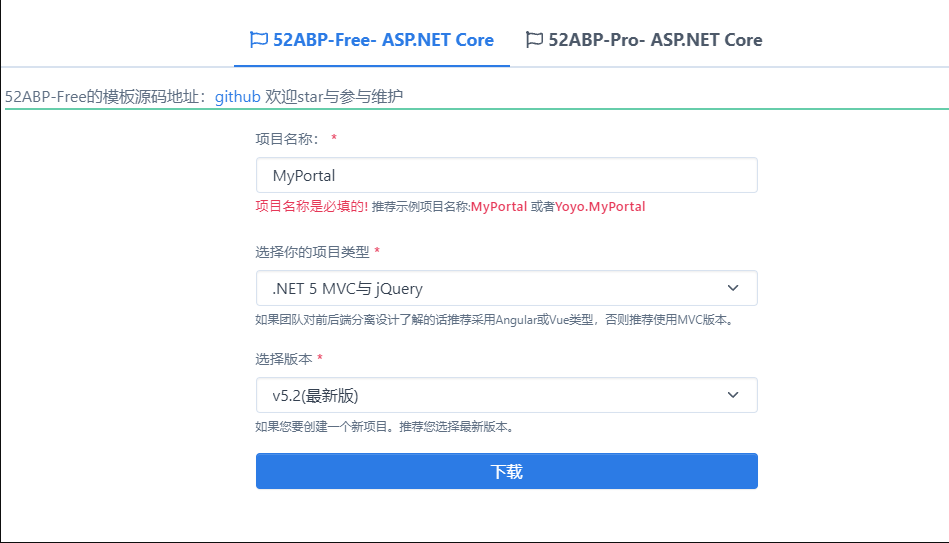
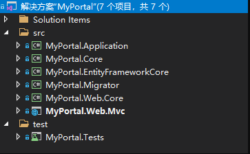
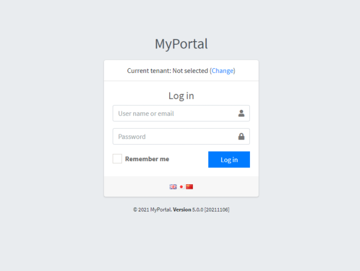
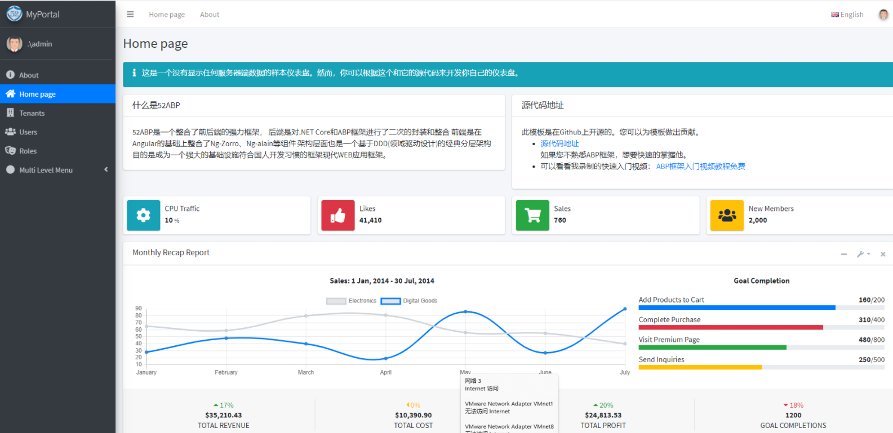
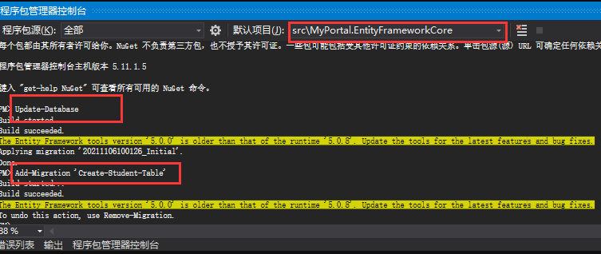
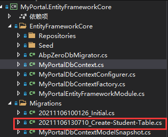
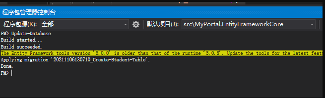
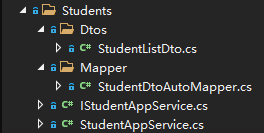
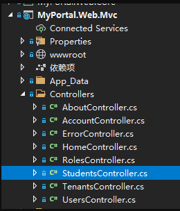
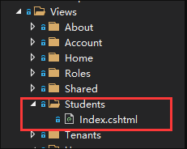

## 介绍


### 先决条件


## 创建应用程序

使用52abp启动模板(https://www.52abp.com/Download)创建一个名为“**MyPortal**”的 Web应用程序。



 
创建了一个多层架构的解决方案



 
包括7个以`MyPortal`开头的项目

- .Core项目针对领域/业务层（实体、领域服务）
- .Application项目是针对应用层的（DTO、应用服务）
- .EntityFramework项目用于EFCore集成
- .Migrator项目用于迁移数据库
- .WebCore用于Web服务公共层
- .Web.MVC用于ASP.NET MVC层
- .Tests项目用于测试


创建数据库

```shell
Add-Migration 'InitialDb'
Update-Database
```


运行应用程序

默认账号：admin

密码：bb123456



 
首页

 


## 开发应用程序

### 创建实体

我们在**Core**层创建一个Task实体

```csharp
using System;
using System.ComponentModel.DataAnnotations;
using System.ComponentModel.DataAnnotations.Schema;
using Abp.Domain.Entities.Auditing;

namespace MyPortal.Students
{
    /// <summary>
    /// 学生表
    /// </summary>
    [Table("Abp_Student")]
    public class Student : Entity
    {
        /// <summary>
        /// 名称最大长度
        /// </summary>
        public const int MaxNameLength = 50;

        /// <summary>
        /// 地址最大长度
        /// </summary>
        public const int MaxAddressLength = 200;

        /// <summary>
        /// 名称
        /// </summary>
        [Required]
        [MaxLength(MaxNameLength)]
        public string Name { get; set; }

        /// <summary>
        /// 年龄
        /// </summary>
        public int Age { get; set; }

        /// <summary>
        /// 地址
        /// </summary>
        [MaxLength(MaxAddressLength)]
        public string Address { get; set; }

    }
}

```

- `Task`派生自`AuditedEntity`,默认情况下包含`Id`属性为`int`,也可以指定`Entity<TPrimaryKey>`来选择不同的**PK**类型

### 将实体添加到DbContext

`.EntityFrameWorkCore`项目包含一个预定义的`DbContext`,注册`Task`实体

```csharp
using Microsoft.EntityFrameworkCore;
using Abp.Zero.EntityFrameworkCore;
using MyPortal.Authorization.Roles;
using MyPortal.Authorization.Users;
using MyPortal.MultiTenancy;
using MyPortal.Students;

namespace MyPortal.EntityFrameworkCore
{
    public class MyPortalDbContext : AbpZeroDbContext<Tenant, Role, User, MyPortalDbContext>
    {
        /* Define a DbSet for each entity of the application */

        public DbSet<Student> Students { get; set; }

        public MyPortalDbContext(DbContextOptions<MyPortalDbContext> options)
            : base(options)
        {
        }
    }
}

```

### 创建数据库迁移

创建数据库迁移`Abp_Tasks`表，选择默认项目`.EntityFrameWorkCore`

```shell
Add-Migration 'Create_Abp_Tasks'
```



 
生成的迁移类：



 
```csharp
using System;
using Microsoft.EntityFrameworkCore.Migrations;

namespace MyPortal.Migrations
{
    public partial class CreateStudentTable : Migration
    {
        protected override void Up(MigrationBuilder migrationBuilder)
        {
            migrationBuilder.CreateTable(
                name: "Abp_Student",
                columns: table => new
                {
                    Id = table.Column<int>(type: "uniqueidentifier", nullable: false),
                    Name = table.Column<string>(type: "nvarchar(50)", maxLength: 50, nullable: false),
                    Age = table.Column<int>(type: "int", nullable: false),
                    Address = table.Column<string>(type: "nvarchar(200)", maxLength: 200, nullable: true),
                   
                },
                constraints: table =>
                {
                    table.PrimaryKey("PK_Abp_Student", x => x.Id);
                });
        }

        protected override void Down(MigrationBuilder migrationBuilder)
        {
            migrationBuilder.DropTable(
                name: "Abp_Student");
        }
    }
}

```

### 创建数据库

程序包管理控制台

```shell
Update-Database
```



 
执行命令后会在`SQL Server`中创建一个名为`52AbpFree_db`的数据库，包含定义的实体表和迁移记录


注意：数据库连接字符串在`.Web.Mvc`项目中的`appsettings.json`中配置

```json
 "ConnectionStrings": {
    "Default": "Data Source=(localdb)\\MSSQLLocalDB;Initial Catalog=52AbpFree_db;Integrated Security=True;Connect Timeout=30;Encrypt=False;TrustServerCertificate=False;ApplicationIntent=ReadWrite;MultiSubnetFailover=False"
  }
```

### 创建服务

应用服务层用于向表示层提供逻辑处理，表示层调用应用服务层，并以数据传输对象`DTO`作为参数，使用领域对象执行业务逻辑，并将`DTO`返回表示层。

我们在`.Application` 创建一个`StudentAppService`和对应的`IStudentAppService`,以执行相关的应用程序逻辑。

首先定义一个服务接口：

```csharp
using System.Collections.Generic;
using System.Threading.Tasks;
using Abp.Application.Services;
using MyPortal.Students.Dtos;

namespace MyPortal.Students
{
    /// <summary>
    /// 学生应用服务接口
    /// </summary>
    public interface IStudentAppService : IApplicationService
    {
        /// <summary>
        /// 获取全部学生
        /// </summary>
        /// <returns></returns>
        Task<List<StudentListDto>> GetAllStudents();
    }
}

```

定义服务接口不是固定的，但是按照约定，所有的应用服务都应该实现`IApplicationService`。在接口中，我们定义了`GetAllStudents`方法。

并为此定义了一下`DTO`对象：

```csharp
using System;
using System.ComponentModel.DataAnnotations;
using Abp.Domain.Entities.Auditing;

namespace MyPortal.Students.Dtos
{
    public class StudentListDto : Entity
    {
        /// <summary>
        /// 名称
        /// </summary>
        [Required]
        [MaxLength(Student.MaxNameLength)]
        public string Name { get; set; }

        /// <summary>
        /// 年龄
        /// </summary>
        public int Age { get; set; }

        /// <summary>
        /// 地址
        /// </summary>
        [MaxLength(Student.MaxAddressLength)]
        public string Address { get; set; }
    }
}

```

并且我们还需要创建对象映射：

```csharp
using AutoMapper;
using MyPortal.Students.Dtos;

namespace MyPortal.Students.Mapper
{
    public static class StudentDtoAutoMapper
    {
        public static void CreateMappings(IMapperConfigurationExpression configuration)
        {
            configuration.CreateMap<Student, StudentListDto>().ReverseMap();
        }
    }
}
```

并在`MyPortalApplicationModule`模块中注册:

```csharp
 public override void PreInitialize()
 { 
      ...
      Configuration.Modules.AbpAutoMapper().Configurators.Add(configuration =>
      {
           StudentDtoAutoMapper.CreateMappings(configuration);
      });
      ...
  }
```

现在我们可以实现`IStudentAppService`:

```csharp
using System.Collections.Generic;
using System.Threading.Tasks;
using Abp.Application.Services;
using Abp.Domain.Repositories;
using Microsoft.EntityFrameworkCore;
using MyPortal.Students.Dtos;

namespace MyPortal.Students
{
    public class StudentAppService: ApplicationService,IStudentAppService
    {
        private readonly IRepository<Student> _studentRepository;
        
        public StudentAppService(IRepository<Student> studentRepository)
        {
            _studentRepository = studentRepository;
        }

        /// <summary>
        /// 获取全部学生
        /// </summary>
        /// <returns></returns>
        public async Task<List<StudentListDto>> GetAllStudents()
        {
            var students = await _studentRepository.GetAll().ToListAsync();
            return ObjectMapper.Map<List<StudentListDto>>(students);
        }
    }
}
```

- **StudentAppService**继承自**ApplicationService**。
- 使用构造函数注入**IRepository**
- **ObjectMapper**用于将Student列表映射到DTO列表中

目录结构：



 


### 测试StudentAppService


### 学生列表视图

#### 添加新的菜单项

在**MyPortal.Web**项目中`Startup -> MyPortalNavigationProvider`中添加新的菜单项

```csharp
using Abp.Application.Navigation;
using Abp.Authorization;
using Abp.Localization;
using MyPortal.Authorization;

namespace MyPortal.Web.Startup
{
    /// <summary>
    /// This class defines menus for the application.
    /// </summary>
    public class MyPortalNavigationProvider : NavigationProvider
    {
        public override void SetNavigation(INavigationProviderContext context)
        {
            context.Manager.MainMenu
                .AddItem(
                    new MenuItemDefinition(
                        PageNames.About,
                        L("About"),
                        url: "About",
                        icon: "fas fa-info-circle"
                    )
                )
                .AddItem(
                    new MenuItemDefinition(
                        PageNames.Home,
                        L("HomePage"),
                        url: "",
                        icon: "fas fa-home",
                        requiresAuthentication: true
                    )
                ).AddItem(
                    new MenuItemDefinition(
                        PageNames.Tenants,
                        L("Tenants"),
                        url: "Tenants",
                        icon: "fas fa-building",
                        permissionDependency: new SimplePermissionDependency(PermissionNames.Pages_Tenants)
                    )
                ).AddItem(
                    new MenuItemDefinition(
                        PageNames.Users,
                        L("Users"),
                        url: "Users",
                        icon: "fas fa-users",
                        permissionDependency: new SimplePermissionDependency(PermissionNames.Pages_Users)
                    )
                )
                .AddItem(
                    new MenuItemDefinition(
                        PageNames.Roles,
                        L("Roles"),
                        url: "Roles",
                        icon: "fas fa-theater-masks",
                        permissionDependency: new SimplePermissionDependency(PermissionNames.Pages_Roles)
                    )
                )
                .AddItem(
                    new MenuItemDefinition(
                        "Students",
                        L("Students"),
                        url: "Students",
                        icon: "fa fa-tasks"
                    )
                )
                );
        }

        private static ILocalizableString L(string name)
        {
            return new LocalizableString(name, MyPortalConsts.LocalizationSourceName);
        }
    }
}
```

#### 创建Controller和View

在**Web.MVC**项目下新建新的控制器类**StudentsController**:



 
```csharp
using System.Runtime.CompilerServices;
using System.Threading.Tasks;
using Microsoft.AspNetCore.Mvc;
using MyPortal.Controllers;
using MyPortal.Students;

namespace MyPortal.Web.Controllers
{
    public class StudentsController: MyPortalControllerBase
    {
        private readonly IStudentAppService _studentAppService;

        public StudentsController(IStudentAppService studentAppService)
        {
            _studentAppService = studentAppService;
        }

        public async Task<ActionResult> Index()
        {
            var students = await _studentAppService.GetAllStudents();
            
            return View(students);
        }
    }
}

```

- **StudentsController**继承自**MyPortalControllerBase**
- **Index()**返回一个视图



 
- 注入**IStudentAppService**并获取所有`Student`,将结果返回给视图

#### 学生列表视图

