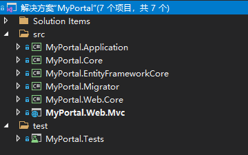
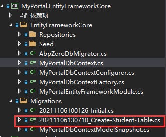

## 介绍

本文介绍使用ASP.NET Core、Entity FrameWork Core和[52ABP](https://www.52abp.com)创建WEB.MVC项目。

在本文中将使用以下技术创建一个简单的跨平台**分层**Web应用程序：

- .NET Core作为基础跨平台应用程序开发框架
- [52ABP](https://www.52abp.com)作为启动模板和应用程序框架
- ASP.NET Core 作为Web框架
- Entity FrameWork Core 作为ORM框架
- Bootstrap作为HHML和CSS框架
- JQuery作为客户端Ajax和DOM库

还包括52ABP启动模板中包含的：

- AutoMapper
- 分层架构
- 领域驱动设计(DDD)
- 依赖注入(DI)

### 先决条件

- .NET SDK 5.0

- Visual Studio 2019
- SQL Server

## 创建应用程序

使用52abp启动模板(https://www.52abp.com/Download)创建一个名为“**MyPortal**”的 Web应用程序。


创建了一个多层架构的解决方案



包括7个以`MyPortal`开头的项目

- .Core项目针对领域/业务层（实体、领域服务）
- .Application项目是针对应用层的（DTO、应用服务）
- .EntityFramework项目用于EFCore集成
- .Migrator项目用于迁移数据库
- .WebCore用于Web服务公共层
- .Web.MVC用于ASP.NET MVC层
- .Tests项目用于测试


创建数据库

```shell
Add-Migration 'InitialDb'
Update-Database
```

运行应用程序

默认账号：admin

密码：bb123456


首页


## 开发应用程序

### 创建实体

我们在**Core**层创建一个Task实体

```csharp
using System.ComponentModel.DataAnnotations;
using System.ComponentModel.DataAnnotations.Schema;
using Abp.Domain.Entities;

namespace MyPortal.Students
{
    /// <summary>
    /// 学生表
    /// </summary>
    [Table("Abp_Student")]
    public class Student : Entity
    {
        /// <summary>
        /// 名称最大长度
        /// </summary>
        public const int MaxNameLength = 50;

        /// <summary>
        /// 地址最大长度
        /// </summary>
        public const int MaxAddressLength = 200;

        /// <summary>
        /// 名称
        /// </summary>
        [Required]
        [StringLength(MaxNameLength)]
        public string Name { get; set; }

        /// <summary>
        /// 年龄
        /// </summary>
        public int Age { get; set; }

        /// <summary>
        /// 地址
        /// </summary>
        [StringLength(MaxAddressLength)]
        public string Address { get; set; }

    }
}

```

- `Task`派生自`AuditedEntity`,默认情况下包含`Id`属性为`int`,也可以指定`Entity<TPrimaryKey>`来选择不同的**PK**类型

### 将实体添加到DbContext

`.EntityFrameWorkCore`项目包含一个预定义的`DbContext`,注册`Task`实体

```csharp
using Microsoft.EntityFrameworkCore;
using Abp.Zero.EntityFrameworkCore;
using MyPortal.Authorization.Roles;
using MyPortal.Authorization.Users;
using MyPortal.MultiTenancy;
using MyPortal.Students;

namespace MyPortal.EntityFrameworkCore
{
    public class MyPortalDbContext : AbpZeroDbContext<Tenant, Role, User, MyPortalDbContext>
    {
        /* Define a DbSet for each entity of the application */

        public DbSet<Student> Students { get; set; }

        public MyPortalDbContext(DbContextOptions<MyPortalDbContext> options)
            : base(options)
        {
        }
    }
}

```

### 创建数据库迁移

创建数据库迁移`Abp_Tasks`表，选择默认项目`.EntityFrameWorkCore`

```shell
Add-Migration 'Create_Abp_Tasks'
```


生成的迁移类：



```csharp
using System;
using Microsoft.EntityFrameworkCore.Migrations;

namespace MyPortal.Migrations
{
    public partial class CreateStudentTable : Migration
    {
        protected override void Up(MigrationBuilder migrationBuilder)
        {
            migrationBuilder.CreateTable(
                name: "Abp_Student",
                columns: table => new
                {
                    Id = table.Column<int>(type: "uniqueidentifier", nullable: false),
                    Name = table.Column<string>(type: "nvarchar(50)", maxLength: 50, nullable: false),
                    Age = table.Column<int>(type: "int", nullable: false),
                    Address = table.Column<string>(type: "nvarchar(200)", maxLength: 200, nullable: true),
                   
                },
                constraints: table =>
                {
                    table.PrimaryKey("PK_Abp_Student", x => x.Id);
                });
        }

        protected override void Down(MigrationBuilder migrationBuilder)
        {
            migrationBuilder.DropTable(
                name: "Abp_Student");
        }
    }
}

```

### 创建数据库

程序包管理控制台

```shell
Update-Database
```


执行命令后会在`SQL Server`中创建一个名为`52AbpFree_db`的数据库，包含定义的实体表和迁移记录


注意：数据库连接字符串在`.Web.Mvc`项目中的`appsettings.json`中配置

```json
 "ConnectionStrings": {
    "Default": "Data Source=(localdb)\\MSSQLLocalDB;Initial Catalog=52AbpFree_db;Integrated Security=True;Connect Timeout=30;Encrypt=False;TrustServerCertificate=False;ApplicationIntent=ReadWrite;MultiSubnetFailover=False"
  }
```

### 创建服务

应用服务层用于向表示层提供逻辑处理，表示层调用应用服务层，并以数据传输对象`DTO`作为参数，使用领域对象执行业务逻辑，并将`DTO`返回表示层。

我们在`.Application` 创建一个`StudentAppService`和对应的`IStudentAppService`,以执行相关的应用程序逻辑。

首先定义一个服务接口：

```csharp
using Abp.Application.Services;
using MyPortal.Students.Dtos;

namespace MyPortal.Students
{
    /// <summary>
    /// 学生应用服务接口
    /// </summary>
    public interface IStudentAppService : IAsyncCrudAppService<StudentDto, int, PagedStudentResultRequestDto,
        CreateStudentDto, StudentDto>
    {

    }
}

```

定义服务接口不是固定的，但是按照约定，所有的应用服务都应该实现`IApplicationService`。

并为此定义了以下`DTO`对象：

- **StudentDto**:用于返回查询
- **PagedStudentResultRequestDto**：用于分页和搜索过滤
- **CreateStudentDto**：用于新增或修改

```csharp
using System.ComponentModel.DataAnnotations;
using Abp.Application.Services.Dto;
using Abp.AutoMapper;

namespace MyPortal.Students.Dtos
{
    [AutoMap(typeof(Student))]
    public class StudentDto:EntityDto
    { 
        /// <summary>
        /// 名称
        /// </summary>
        [Required]
        [StringLength(Student.MaxNameLength)]
        public string Name { get; set; }

        /// <summary>
        /// 年龄
        /// </summary>
        public int Age { get; set; }

        /// <summary>
        /// 地址
        /// </summary>
        [StringLength(Student.MaxAddressLength)]
        public string Address { get; set; }

    }
}

```

```csharp
using System.ComponentModel.DataAnnotations;
using Abp.Application.Services.Dto;
using Abp.AutoMapper;

namespace MyPortal.Students.Dtos
{
    [AutoMapTo(typeof(Student))]
    public class CreateStudentDto:EntityDto
    {
        /// <summary>
        /// 名称
        /// </summary>
        [Required]
        [StringLength(Student.MaxNameLength)]
        public string Name { get; set; }

        /// <summary>
        /// 年龄
        /// </summary>
        public int Age { get; set; }

        /// <summary>
        /// 地址
        /// </summary>
        [StringLength(Student.MaxAddressLength)]
        public string Address { get; set; }

    }
}
```

```csharp
using Abp.Application.Services.Dto;

namespace MyPortal.Students.Dtos
{
    public class PagedStudentResultRequestDto : PagedResultRequestDto
    {
        public string Keyword { get; set; }
    }
}
```

**注意**：[AutoMapFrom]属性用来创建`Student`=>`Dto`的**AutoMapper**映射


现在我们可以实现`IStudentAppService`:

```csharp


using System.Linq;
using Abp.Application.Services;
using Abp.Domain.Repositories;
using Abp.Extensions;
using Abp.Linq.Extensions;
using MyPortal.Students.Dtos;

namespace MyPortal.Students
{
    public class StudentAppService : AsyncCrudAppService<Student, StudentDto, int, PagedStudentResultRequestDto, CreateStudentDto, StudentDto>, IStudentAppService
    {
        public StudentAppService(IRepository<Student, int> repository) : base(repository)
        {

        }

        protected override IQueryable<Student> CreateFilteredQuery(PagedStudentResultRequestDto input)
        {
            return Repository.GetAll()
                .WhereIf(!input.Keyword.IsNullOrWhiteSpace(), x => x.Name.Contains(input.Keyword));
        }

    }
}

```

- **StudentAppService**继承自**AsyncCrudAppService**
- 使用构造函数注入**IRepository**

**AsyncCrudAppService**帮我们实现了基本的增删改查操作：


目录结构：


### 学生列表视图

#### 添加新的菜单项

在**MyPortal.Web**项目中`Startup -> MyPortalNavigationProvider`中添加新的菜单项

```csharp
using Abp.Application.Navigation;
using Abp.Authorization;
using Abp.Localization;
using MyPortal.Authorization;

namespace MyPortal.Web.Startup
{
    /// <summary>
    /// This class defines menus for the application.
    /// </summary>
    public class MyPortalNavigationProvider : NavigationProvider
    {
        public override void SetNavigation(INavigationProviderContext context)
        {
            context.Manager.MainMenu
                .AddItem(
                    new MenuItemDefinition(
                        PageNames.About,
                        L("About"),
                        url: "About",
                        icon: "fas fa-info-circle"
                    )
                )
                .AddItem(
                    new MenuItemDefinition(
                        PageNames.Home,
                        L("HomePage"),
                        url: "",
                        icon: "fas fa-home",
                        requiresAuthentication: true
                    )
                ).AddItem(
                    new MenuItemDefinition(
                        PageNames.Tenants,
                        L("Tenants"),
                        url: "Tenants",
                        icon: "fas fa-building",
                        permissionDependency: new SimplePermissionDependency(PermissionNames.Pages_Tenants)
                    )
                ).AddItem(
                    new MenuItemDefinition(
                        PageNames.Users,
                        L("Users"),
                        url: "Users",
                        icon: "fas fa-users",
                        permissionDependency: new SimplePermissionDependency(PermissionNames.Pages_Users)
                    )
                )
                .AddItem(
                    new MenuItemDefinition(
                        PageNames.Roles,
                        L("Roles"),
                        url: "Roles",
                        icon: "fas fa-theater-masks",
                        permissionDependency: new SimplePermissionDependency(PermissionNames.Pages_Roles)
                    )
                )
                // 学生列表菜单
                .AddItem(
                    new MenuItemDefinition(
                        PageNames.Students, // 菜单名称
                        L("Students"), // 显示名称
                        url: "Students", // Url地址 对应Controller名称
                        icon: "fa fa-tasks" // 图标
                    )
                )
                .AddItem(
                    new MenuItemDefinition(
                        "MultiLevelMenu",
                        L("MultiLevelMenu"),
                        icon: "fas fa-circle"
                    )
                );
        }

        private static ILocalizableString L(string name)
        {
            return new LocalizableString(name, MyPortalConsts.LocalizationSourceName);
        }
    }
}
```


#### 创建Controller和View

在**Web.MVC**项目下新建新的控制器类**StudentsController**:


```csharp
using System.Runtime.CompilerServices;
using System.Threading.Tasks;
using Abp.Application.Services.Dto;
using Microsoft.AspNetCore.Mvc;
using MyPortal.Controllers;
using MyPortal.Students;

namespace MyPortal.Web.Controllers
{
    public class StudentsController: MyPortalControllerBase
    {
        private readonly IStudentAppService _studentAppService;

        public StudentsController(IStudentAppService studentAppService)
        {
            _studentAppService = studentAppService;
        }

        public ActionResult Index() => View();

        public async Task<ActionResult> EditModal(int studentId)
        {
            var tenantDto = await _studentAppService.GetAsync(new EntityDto(studentId));
            return PartialView("_EditModal", tenantDto);
        }
    }
}

```

- **StudentsController**继承自**MyPortalControllerBase**
- **Index()**返回一个视图


- 使用构造函数注入**IStudentAppService**

#### 学生列表视图

学生展示列表如下：

```html
@using MyPortal.Web.Startup
@{
    ViewBag.Title = L("Students");
    ViewBag.CurrentPageName = PageNames.Students;
}
@section scripts
{
    <environment names="Development">
        <script src="~/view-resources/Views/Students/Index.js" asp-append-version="true"></script>
    </environment>

    <environment names="Staging,Production">
        <script src="~/view-resources/Views/Students/Index.min.js" asp-append-version="true"></script>
    </environment>
}
<section class="content-header">
    <div class="container-fluid">
        <div class="row">
            <div class="col-sm-6">
                <h1>@L("Students")</h1>
            </div>
            <div class="col-sm-6">
                <a href="javascript:;" data-toggle="modal" data-target="#StudentCreateModal" class="btn bg-blue float-sm-right">
                    <i class="fa fa-plus-square"></i>
                    @L("CreateNewStudent")
                </a>
            </div>
        </div>
    </div>
</section>
<section class="content">
    <div class="container-fluid">
        <div class="row">
            <div class="col-12">
                <div class="card">
                    <div class="card-header">
                        <div class="row">
                            <div class="col-md-6">
                                <!--Use for bulk actions-->
                            </div>
                            <div class="col-md-6">
                                @await Html.PartialAsync("~/Views/Students/Index.AdvancedSearch.cshtml")
                            </div>
                        </div>
                    </div>
                    <div class="card-body">
                        <div class="table-responsive">
                            <table id="StudentsTable" class="table table-striped table-bordered">
                                <thead>
                                    <tr>
                                        <th></th>
                                        <th>@L("Name")</th>
                                        <th>@L("Age")</th>
                                        <th>@L("Address")</th>
                                        <th style="width: 150px">@L("Actions")</th>
                                    </tr>
                                </thead>
                                <tbody></tbody>
                            </table>
                        </div>
                    </div>
                </div>
            </div>
        </div>
    </div>
</section>

@await Html.PartialAsync("~/Views/Students/_CreateModal.cshtml")

<div class="modal fade" id="StudentEditModal" tabindex="-1" role="dialog" aria-labelledby="StudentEditModalLabel" data-backdrop="static">
    <div class="modal-dialog modal-lg" role="document">
        <div class="modal-content">
        </div>
    </div>
</div>

```

我们加入了**新增**、**编辑**、**删除**以及**搜索**的按钮，将在后续补充完整

可以看到，我们为此视图引入了对应的`js`文件，并放在**wwwroot**静态资源目录下


并使用`Jquery`来渲染我们的表格：

```javascript
(function ($) {
    var _studentService = abp.services.app.student,
        l = abp.localization.getSource('MyPortal'),
        _$modal = $('#StudentCreateModal'),
        _$form = _$modal.find('form'),
        _$table = $('#StudentsTable');

    var _$studentsTable = _$table.DataTable({
        paging: true,
        serverSide: true,
        ajax: function (data, callback, settings) {
            var filter = $('#StudentSearchForm').serializeFormToObject(true);
            filter.maxResultCount = data.length;
            filter.skipCount = data.start;

            abp.ui.setBusy(_$table);
            _studentService.getAll(filter).done(function (result) {
                callback({
                    recordsTotal: result.totalCount,
                    recordsFiltered: result.totalCount,
                    data: result.items
                });
            }).always(function () {
                abp.ui.clearBusy(_$table);
            });
        },
        buttons: [
            {
                name: 'refresh',
                text: '<i class="fas fa-redo-alt"></i>',
                action: () => _$studentsTable.draw(false)
            }
        ],
        responsive: {
            details: {
                type: 'column'
            }
        },
        columnDefs: [
            {
                targets: 0,
                className: 'control',
                defaultContent: '',
            },
            {
                targets: 1,
                data: 'name',
                sortable: false
            },
            {
                targets: 2,
                data: 'age',
                sortable: false
            },
            {
                targets: 3,
                data: 'address',
                sortable: false,
            },
            {
                targets: 4,
                data: null,
                sortable: false,
                autoWidth: false,
                defaultContent: '',
                render: (data, type, row, meta) => {
                    return [
                        `   <button type="button" class="btn btn-sm bg-secondary edit-student" data-student-id="${row.id}" data-toggle="modal" data-target="#StudentEditModal">`,
                        `       <i class="fas fa-pencil-alt"></i> ${l('Edit')}`,
                        '   </button>',
                        `   <button type="button" class="btn btn-sm bg-danger delete-student" data-student-id="${row.id}" data-student-name="${row.name}">`,
                        `       <i class="fas fa-trash"></i> ${l('Delete')}`,
                        '   </button>'
                    ].join('');
                }
            }
        ]
    });
})(jQuery);

```

- **abp.services.app.student**用来获取`StudentAppService`
- `l = abp.localization.getSource('MyPortal')`获取本地化资源

- **columnDefs**中定义表格字段

页面效果如下：


#### 本地化

我们在视图中使用了**L**方法，它用于**本地化**字符串。可以在`.Core`项目下的本地资源中找到它并配置：


我们将页面需要的字符串添加到对应语言的**XML**文件下：

```xml
    <text name="Students" value="学生列表" />
    <text name="Address" value="地址" />
    <text name="Age" value="年龄" />
    <text name="EditStudent" value="编辑学生" />
    <text name="CreateNewStudent" value="添加学生" />
```

#### 过滤学生视图

我们新建一个视图文件`Index.AdvancedSearch.cshtml`

```html
<div class="abp-advanced-search">
    <form id="StudentSearchForm" class="form-horizontal">
        <div class="input-group">
            <div class="input-group-prepend">
                <button type="button" class="btn bg-blue btn-search">
                    <span class="fas fa-search" aria-hidden="true"></span>
                </button>
            </div>
            <input type="text" name="Keyword" class="form-control txt-search" />
        </div>
    </form>
</div>
```

导入并使用：

```csharp
@await Html.PartialAsync("~/Views/Students/Index.AdvancedSearch.cshtml")
```

对应的，在`index.js`文件中加入**搜索触发事件**：

```javascript
  	$('.btn-search').on('click', (e) => {
        _$studentsTable.ajax.reload();
    });

    $('.txt-search').on('keypress', (e) => {
        if (e.which == 13) {
            _$studentsTable.ajax.reload();
            return false;
        }
    });
```

在`StudentAppService`中重写过滤查询方法：

```csharp
protected override IQueryable<Student> CreateFilteredQuery(PagedStudentResultRequestDto input)
        {
            return Repository.GetAll()
                .WhereIf(!input.Keyword.IsNullOrWhiteSpace(), x => x.Name.Contains(input.Keyword));
        }
```

查看效果：


### 新增学生视图

首先创建一个**新增学生**的模态框视图：

```html
@using MyPortal.Web.Models.Common.Modals
@model MyPortal.Web.Models.Students.StudentListViewModel
@{
    Layout = null;
}
<div class="modal fade" id="StudentCreateModal" tabindex="-1" role="dialog" aria-labelledby="StudentCreateModalLabel" data-backdrop="static">
    <div class="modal-dialog modal-lg" role="document">
        <div class="modal-content">
            @await Html.PartialAsync("~/Views/Shared/Modals/_ModalHeader.cshtml", new ModalHeaderViewModel(L("CreateNewStudent")))
            <form name="roleCreateForm" role="form" class="form-horizontal">
                <div class="modal-body">
                    <div class="form-group row required">
                        <label class="col-md-3 col-form-label" for="name">@L("Name")</label>
                        <div class="col-md-9">
                            <input id="name" type="text" name="Name" class="form-control" required maxlength="50" minlength="1">
                        </div>
                    </div>
                    <div class="form-group row required">
                        <label class="col-md-3 col-form-label" for="age">@L("Age")</label>
                        <div class="col-md-9">
                            <input id="age" type="number" name="Age" class="form-control" required max="130" min="0">
                        </div>
                    </div>
                    <div class="form-group row">
                        <label class="col-md-3 col-form-label" for="address">@L("Address")</label>
                        <div class="col-md-9">
                            <textarea id="address" name="Address" class="form-control"></textarea>
                        </div>
                    </div>
                </div>
                @await Html.PartialAsync("~/Views/Shared/Modals/_ModalFooterWithSaveAndCancel.cshtml")
            </form>
        </div>
    </div>
</div>
```

为此，我们需要新建一个**视图模型类**:

```csharp
using System.Collections.Generic;
using MyPortal.Students.Dtos;

namespace MyPortal.Web.Models.Students
{
    public class StudentListViewModel
    {
        public IReadOnlyList<StudentDto> Students { get; set; }
    }
}

```


最后我们在`index.js`中加入**创建学生**的请求方法

```javascript
    _$form.find('.save-button').click(function (e) {
        e.preventDefault();

        if (!_$form.valid()) {
            return;
        }

        var student = _$form.serializeFormToObject();

        abp.ui.setBusy(_$modal);

        _studentService
            .create(student)
            .done(function () {
                _$modal.modal('hide');
                _$form[0].reset();
                abp.notify.info(l('SavedSuccessfully'));
                _$studentsTable.ajax.reload();
            })
            .always(function () {
                abp.ui.clearBusy(_$modal);
            });
    });
```

查看效果：

点击**添加学生**按钮，弹出**模态框**


我们输入数据，并点击保存：


可以看，表格中已经将我们刚刚新增的数据展示出来了


### 编辑学生视图

我们先创建一个**编辑页面**视图：

```html
@using MyPortal.Web.Models.Common.Modals
@model MyPortal.Students.Dtos.StudentDto
@{
    Layout = null;
}
@await Html.PartialAsync("~/Views/Shared/Modals/_ModalHeader.cshtml", new ModalHeaderViewModel(L("EditStudent")))
<form name="StudentEditForm" role="form" class="form-horizontal">
    <input type="hidden" name="Id" value="@Model.Id" />
    <div class="modal-body">
        <div class="form-group row required">
            <label class="col-md-3 col-form-label" for="name">@L("Name")</label>
            <div class="col-md-9">
                <input id="name" type="text" class="form-control" name="Name" value="@Model.Name" required maxlength="50" minlength="1">
            </div>
        </div>
        <div class="form-group row required">
            <label class="col-md-3 col-form-label" for="age">@L("Age")</label>
            <div class="col-md-9">
                <input id="age" type="number" class="form-control" name="Age" value="@Model.Age" required maxlength="128">
            </div>
        </div>
        <div class="form-group row">
            <label class="col-md-3 col-form-label" for="address">@L("Address")</label>
            <div class="col-md-9">
                <input id="address" type="text" class="form-control" name="Address" value="@Model.Address" required maxlength="200">

            </div>
        </div>
    </div>
    @await Html.PartialAsync("~/Views/Shared/Modals/_ModalFooterWithSaveAndCancel.cshtml")
</form>

<script src="~/view-resources/Views/Students/_EditModal.js" asp-append-version="true"></script>

```

并创建一个**编辑视图**的`_EditModal.js`:

```javascript
(function ($) {
    var _studentService = abp.services.app.student,
        l = abp.localization.getSource('MyPortal'),
        _$modal = $('#StudentEditModal'),
        _$form = _$modal.find('form');

    function save() {
        if (!_$form.valid()) {
            return;
        }

        var student = _$form.serializeFormToObject();

        abp.ui.setBusy(_$form);
        _studentService.update(student).done(function () {
            _$modal.modal('hide');
            abp.notify.info(l('SavedSuccessfully'));
            abp.event.trigger('student.edited', student);
        }).always(function () {
            abp.ui.clearBusy(_$form);
        });
    }

    _$form.closest('div.modal-content').find(".save-button").click(function (e) {
        e.preventDefault();
        save();
    });

    _$form.find('input').on('keypress', function (e) {
        if (e.which === 13) {
            e.preventDefault();
            save();
        }
    });

    _$modal.on('shown.bs.modal', function () {
        _$form.find('input[type=text]:first').focus();
    });
})(jQuery);
```

在`Index`页面，当我们点击编辑时，需要先查询当前实体，然后填充到编辑视图中去：

在`index.js`中加入以下代码：

```javascript
    $(document).on('click', '.edit-student', function (e) {
        var studentId = $(this).attr('data-student-id');

        abp.ajax({
            url: abp.appPath + 'Students/EditModal?studentId=' + studentId,
            type: 'POST',
            dataType: 'html',
            success: function (content) {
                $('#StudentEditModal div.modal-content').html(content);
            },
            error: function (e) { }
        });
    });
```

对应的，在**StudentController**中需要添加**EditModal**方法，并接收一个**studentId**参数，如下：

根据学生Id查询当前编辑的学生，并将值返回给编辑的模态框

```csharp
		public async Task<ActionResult> EditModal(int studentId)
        {
            var tenantDto = await _studentAppService.GetAsync(new EntityDto(studentId));
            return PartialView("_EditModal", tenantDto);
        }
```

效果：

我们将前面新增的数据`jiejie`的年龄更改为`202`


保存后刷新列表并且右下角弹出**保存成功**，编辑功能就完成了


### 删除数据

删除需要我们传入要删除的学生Id,我们只需要在`index.js`中加入以下代码：

```javascript
    function deleteStudent(studentId, studentName) {
        abp.message.confirm(
            abp.utils.formatString(
                l('AreYouSureWantToDelete'),
                studentName
            ),
            null,
            (isConfirmed) => {
                if (isConfirmed) {
                    _studentService
                        .delete({
                            id: studentId
                        })
                        .done(() => {
                            abp.notify.info(l('SuccessfullyDeleted'));
                            _$studentsTable.ajax.reload();
                        });
                }
            }
        );
    }
```

点击删除，弹出提示框：


点击确定，刷新列表并弹出删除成功提示


### 源代码

https://github.com/JontyMin/52abp_examples/tree/main/src/MyPortal/src/myportal-aspnet-core
