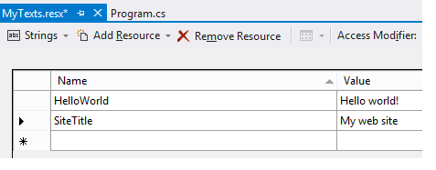
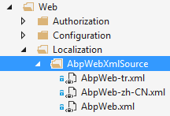

##  6.3 ABP表现层 - 本地化

### 6.3.1 简介

任何应用的用户界面至少有一种语言。多数应用有超过一种语言，ABP为应用程序提供了一个灵活的本地化系统。

### 6.3.2 程序语言

ABP框架为程序提供了一个灵活的本地化配置模块。首先需要的是声明支持哪些语言，模块预初始化如下：

```csharp
Configuration.Localization.Languages.Add(new LanguageInfo("en", "English", "famfamfam-flag-england", true));

Configuration.Localization.Languages.Add(new LanguageInfo("tr", "Türkçe", "famfamfam-flag-tr"));
```

在服务器端，你能够注入并使用 **ILocalizationManager**。在客户端，你可以使用 **abp.localization** javascript API从当前的语言列表中获取你需要的语言配置文件。**famfamfam-flag-england** 是css文件，可以根据你的需要来更改它，然后你可以使用它在UI上显示相关的旗帜。

ABP模板使用该系统显示 **language-switch** 的下拉框给用户，了解更多请创建模板查看源代码。

### 6.3.3 本地化源文件

本地化文本可存储在不同的资源文件中，你也可以在同一个应用程序中使用多个来源(如果你有超过一个模块，每个模块可以定义各自的本地化资源，或者一个模块能够定义多个资源)。**ILocalizationManager** 接口可实现本地化，然后注册到ABP的本地化配置文件。可通过xml和资源文件来配置。

每个本地化资源必须有一个 **唯一的资源名**，下面是一些预定义的本地化资源类型：

#### 1. XML文件(XML files)

本地化配置文件可存储在XML文件。如下所示：

```html
<?xml version="1.0" encoding="utf-8" ?>
<localizationDictionary culture="en">
  <texts>
    <text name="TaskSystem" value="Task System" />
    <text name="TaskList" value="Task List" />
    <text name="NewTask" value="New Task" />
    <text name="Xtasks" value="{0} tasks" />
    <text name="CompletedTasks" value="Completed tasks" />
    <text name="EmailWelcomeMessage">Hi,
Welcome to Simple Task System! This is a sample
email content.</text>
  </texts>
</localizationDictionary>
```

XML文件必须使用 **UTF-8** 编码，**culture="en"** 表示这个XML文件包含的是英文文本。对于文本节点：**name** 属性被用来识别一个文本，你可以用 **value** 属性或者 **inner text(内部文本)** (例如最后一个)来设置本地化文本的值。我们会对每种语言分别创建XML文件，如下所示：


**SimpleTaskSystem** 是资源文件的名字，SimpleTaskSystem.xml是默认的本地化语言.
当某个文本被请求的时候，ABP会从当前的XML资源文件中去取得本地化文本(通过 Thread.CurrentThread.**CurrentUICulture** 来找到当前所使用的语言)。如果当前所使用的语言不存在，那么将会使用默认的XML的语言资源。

##### 为XML本地化资源注册

XML文件能够被存储在 **文件系统中** 或者能被嵌入进一个程序集中。

对于 **文件系统** 存储XML文件，我们可以向下面一样注册一个XML本地化资源：

```csharp
Configuration.Localization.Sources.Add(
    new DictionaryBasedLocalizationSource(
        "SimpleTaskSystem",
        new XmlFileLocalizationDictionaryProvider(
            HttpContext.Current.Server.MapPath("~/Localization/SimpleTaskSystem")
            )
        )
    );
```

我们应该在模块的 **PreInitialize** 方法中来配置，详情请参照[模块系统](1.3ABP总体介绍-模块系统.md)。ABP会从给定的目录中找到所有的XML文件并且注册这些本地化资源。

对于 **嵌入式** XML文件，我们应该标记所有的XML文件为 **嵌入式资源(Embedded resource)** (选择XML文件，打开属性窗口(F4)并且更改生成操作为嵌入式资源)。然后你可以像下面一样注册本地化资源：

```csharp
Configuration.Localization.Sources.Add(
    new DictionaryBasedLocalizationSource(
        "SimpleTaskSystem",
        new XmlEmbeddedFileLocalizationDictionaryProvider(
            Assembly.GetExecutingAssembly(),
            "MyCompany.MyProject.Localization.Sources"
            )
        )
    );
```

**XmlEmbeddedFileLocalizationDictionaryProvider** 会获得一个包含XML文件的程序集(GetExecutingAssembly简单地指向当前的程序集)和XML文件的名称空间(程序集名称+xml文件的文件夹层次).

>注意：当给嵌入式XML文件添加语言后缀时，不要用 **"."** 例如："MySource.tr.xml", 而是应该用破折号 **"-"** 例如：**"MySource-tr.xml"**，因为在程序寻找资源文件的时候点号会导致资源文件找不到等异常。

#### 2. JSON文件

JSON文件可以被用来存储本地化资源文本，正如下面所展示的一个简单的JSON本地化示例：

```javascript
{
  "culture": "en",
  "texts": {
    "TaskSystem": "Task system",
    "Xtasks": "{0} tasks"
  }
}
```

JSON文件应使用 **UTF-8** 编码，**culture="en"** 表示这个JSON文件包含的是英文文本。我们会对每种语言分别创建JSON文件，如下所示：


这里的 **MySourceName** 是资源名称， MySourceName.json被定义为 **默认语言**。这类似于XML资源文件的定义。

##### 对JSON本地化资源的注册

JSON文件能够被存储在 **文件系统中** 或者能被嵌入进一个程序集中。

对于 **文件系统** 存储JSON文件，我们可以向下面一样注册一个JSON本地化资源：

```csharp
Configuration.Localization.Sources.Add(
    new DictionaryBasedLocalizationSource(
        "MySourceName",
        new JsonFileLocalizationDictionaryProvider(
            HttpContext.Current.Server.MapPath("~/Localization/MySourceName")
            )
        )
    );
```

我们应该在模块的 **PreInitialize** 方法中来配置，详情请参照[模块系统](1.3ABP总体介绍-模块系统.md)。ABP会从给定的目录中找到所有的JSON文件并且注册这些本地化资源。

对于 **嵌入式** JSON文件，我们应该标记所有的JSON文件为 **嵌入式资源(Embedded resource)** (选择JSON文件，打开属性窗口(F4)并且更改生成操作为嵌入式资源)。然后你可以像下面一样注册本地化资源：

```csharp
Configuration.Localization.Sources.Add(
    new DictionaryBasedLocalizationSource(
        "MySourceName",
        new JsonEmbeddedFileLocalizationDictionaryProvider(
            Assembly.GetExecutingAssembly(),
            "MyCompany.MyProject.Localization.Sources"
            )
        )
    );
```

**JsonEmbeddedFileLocalizationDictionaryProvider** 会获得一个包含JSON文件的程序集(GetExecutingAssembly简单地指向当前的程序集)和JSON文件的名称空间(程序集名称+JSON文件的文件夹层次).

>注意：当给嵌入式JSON文件添加语言后缀时，不要用 **"."** 例如："MySource.tr.json", 而是应该用破折号 **"-"** 例如：**"MySource-tr.json"**，因为在程序寻找资源文件的时候点号会导致资源文件找不到等异常。

##### 关于XML和JSON本地化资源的混合使用的小技巧

如果你想在你的项目中同时使用xml，json的本地化资源那么该怎么用呢？

> 首先注意：你的Core项目中的Localization底下的资源文件夹的的命名方式应该是：
> 
> 文件夹得命名方式必须要首字母不同例如：
> 
>    JsonSource
>    
>       myproject.json
>       
>       myproject-zh-cn.json
>       
>    XmlSource
>    
>       myproject.xml
>       
>       myproject-zh-cn.xml
>       
>或者

>    JSource
>    
>    XSource

>因为ABP框架的判断逻辑是

> resourceName ： ABP框架通过程序集去取得的_assembly.GetManifestResourceNames()
> 
> _rootNamespace ： 是你自己给予的
> 
> resourceName.StartsWith(_rootNamespace)
> 
> 详细请查看类XmlEmbeddedFileLocalizationDictionaryProvider

在你的模块类中写上这样的代码：

```csharp
public override void PreInitialize()
{
    
    Configuration.Localization.Sources.Add(
        new DictionaryBasedLocalizationSource(
            AuthConsts.LocalizationSourceName,
            new XmlEmbeddedFileLocalizationDictionaryProvider(
                Assembly.GetExecutingAssembly(),
                "MyCompany.MyProject.Localization.XmlSource"
                )
            )
        );

    Configuration.Localization.Sources.Extensions.Add(
        new LocalizationSourceExtensionInfo(
            AuthConsts.LocalizationSourceName, 
            new JsonEmbeddedFileLocalizationDictionaryProvider(
                    Assembly.GetExecutingAssembly(),
                    "MyCompany.MyProject.Localization.JsonSource"
               )));  
    
}
```

#### 3. 资源文件

当然也可以将本地化配置存储在.net的资源文件中。我们可以为每种语言创建一个配置文件。如下：


MyTexts.resx包含了默认的语言配置文件，MyTexts.tr.resx包含了土耳其语言配置文件。当打开MyTexts.resx:



配置方法如下：

```csharp
Configuration.Localization.Sources.Add(
    new ResourceFileLocalizationSource(
        "MySource",
        MyTexts.ResourceManager
        ));
```

这里设置的唯一名字是 **MySource**，在模块初始化过程中，**MyTexts.ResourceManager** 将被作为本地化文本导入到资源管理器中。这个是在模块的预加载事件中完成的。

#### 4. 自定义资源(Custom source)

自定义的本地化资源可以被存储到不同的资源中，例如数据库。你可以直接实现 **ILocalizationSource** 接口，或者为了实现更容易，你可以使用 **DictionaryBasedLocalizationSource** 类(JSON和XML本地化资源就是使用了它)。Module Zero实现了本地化资源存入数据库。

### 6.3.4 当前语言是如何确定的？

#### ASP.NET Core

ASP.NET Core有它自己的机制来决定当前的语言。Abp.AspNetCore包中自动的添加了ASP.NET Core的 **UseRequestLocalization** 中间件请求管道。它也添加了一些特定的提供器。在这里，列出了所有的提供器的有序列表，为Http请求决定出当前的语言：

+ **QueryStringRequestCultureProvider** (ASP.NET Core的默认提供器)：使用 **culture & ui-culture** URL 查询字符串值，如果存在；例如："culture=es-MX&ui-culture=es-MX"。

+ **AbpUserRequestCultureProvider** (ABP的提供器)：如果通过[IAbpSession](2.2ABP公共结构-会话管理.md)获知当前用户(用户已经登录)，并在此之前明确的选择了一种语言(并保存该选择到[ISettingManager](2.5ABP公共结构-设置管理.md))，那么使用该用户首选的语言。如果是已知用户(用户已经登录)，但是没有选择任何语言，而 **.AspNetCore.Culture** cookie或者header有值，那么使用该信息来设置用户的语言设置，并使用该值作为当前语言。如果用户未知(用户未登录)，这个提供器不会做任何事情。

+ **AbpLocalizationHeaderRequestCultureProvider** (ABP的提供器)：使用 **.AspNetCore.Culture** 请求头值，如果存在。例如："c=en|uic=en-US"。

+ **CookieRequestCultureProvider** (ASP.NET Core的默认提供器)：使用 **.AspNetCore.Culture** cookie值，如果存在。例如："c=en|uic=en-US"。

+ **AbpDefaultRequestCultureProvider** (ABP的提供器)：如果是一个对语言的 **default / application / tenant 设置值(setting value)**，那么使用该设置值。

+ **AcceptLanguageHeaderRequestCultureProvider** (ASP.NET Core的默认提供器)：使用 **Accept-Language** 请求头值，如果存在(通过浏览器自动发送)。例如： "tr-TR,tr;q=0.8,en-US;q=0.6,en;q=0.4"。

当你调用 **app.UseAbp()** 方法时 **UseRequestLocalization** 中间件会被自动的添加。如果你的应用程序使用了身份认证，那么建议你在身份认证中间件之后，手动的添加它(在Startup类的Configure方法中)。这样做的话，本地化中间件就能够获知当前用户来决定最合适的语言。例如：

```csharp
public void Configure(IApplicationBuilder app, IHostingEnvironment env, ILoggerFactory loggerFactory)
{
    app.UseAbp(options =>
    {
        //禁用请求本地化自动添加
        options.UseAbpRequestLocalization = false;
    });

    //...身份认证中间件

    //手动添加请求本地化
    app.UseAbpRequestLocalization();

    //...其它中间件

    app.UseMvc(routes =>
    {
        //...
    });
}
```

在大多数情况下，你不用关心这个，如果你使用了ABP的本地化系统。为了能更好的了解它，请参阅ASP.NET Core [本地化文档](https://docs.microsoft.com/en-us/aspnet/core/fundamentals/localization)。

#### ASP.NET MVC 5.x

对于每个Web请求ABP会自动的确定当前语言，并设置 **当前线程的culture(以及UI的culture)**。下面是ABP确定当前语言的方式：

+ 尝试去取得指定的请求头值，默认名称是："Abp.Localization.CultureName" 。

+ 如果没有找到，尝试取得一个指定的cookie值，默认名称是："Abp.Localization.CultureName" 。

+ 如果没有找到，尝试取得默认的culture设置(设置的名称是：**"Abp.Localization.DefaultLanguageName"**，这个常量定义在：Abp.Localization.LocalizationSettingNames.DefaultLanguage，可以使用[设置管理](2.5ABP公共结构-设置管理.md)来改变它)。

+ 如果没有找到，尝试取得浏览器的默认语言(HttpContext.Request.UserLanguages)。

如果有需要，你可以在模块的PreInitialize方法中，改变指定的cookie名称(也就是请求头的名称)。如下所示：

```csharp
Configuration.Modules.AbpWeb().Localization.CookieName = "YourCustomName";
```

### 6.3.5 获得一个本地化的文本

在创建了一个资源并注册它到ABP的本地化系统后，我们能够很容易的本地化文本。

#### 1. 服务端(In server side)

在服务端，我们能够注入 **ILocalizationManager** 并使用它的 **GetString** 方法。

```csharp
var s1 = _localizationManager.GetString("SimpleTaskSystem", "NewTask");
```

GetString方法从本地化资源中取得字符串，这个是基于当前线程的 **UI Culture(current thread's UI culture)**。如果没有找到，那么会使用 **默认语言**。

如果给定的字符串没有被定义过，那么它会人性化的返回 **给定的字符串** 并且使用 **[]** 包装，如： **[给定的字符串]**。这个行为是可配置的，你可以在模块的 **PreInitialize** 方法中使用 **Configuration.Localization** 来配置。

别使用重复的资源名字，你首先要 **取得资源**，然后从资源中取得字符串：

```csharp
var source = _localizationManager.GetSource("SimpleTaskSystem");
var s1 = source.GetString("NewTask");
```

这会返回当前语言的文本，GetString有一些重载方法来取得不同语言的文本，以及通过参数来格式化它们。

如果我们不能注入ILocalizationManager(例如：在静态上下文中我们不能使用依赖注入)，我们可以使用 **LocalizationHelper** 静态类。但是，我们更应该在任何可能的地方使用 **ILocalizationManager**；**LocalizationHelper** 是静态类，静态类是不好测试的(单元测试)。

如果你需要在某个[应用服务](4.1ABP应用层-应用服务.md)，MVC Controller，Razor View 或者其它派生自 **AbpServiceBase**的类中使用本地化，那么你可以使用 **L** 方法。


#### 2. MVC控制器(In MVC controllers)

通过MVC控制器或视图来本地化：

```csharp
public class HomeController : SimpleTaskSystemControllerBase
{
    public ActionResult Index()
    {
        var helloWorldText = L("HelloWorld");
        return View();
    }
}
```

**L** 方法用于本地化字符串，前提是需要提供一个资源名称。在SimpleTaskSystemControllerBase类中我们已经做好了，如下所示：

```csharp
public abstract class SimpleTaskSystemControllerBase : AbpController
{
    protected SimpleTaskSystemControllerBase()
    {
        LocalizationSourceName = "SimpleTaskSystem";
    }
}
```

注意：它派生自AbpController。因此，你可以容易的使用 **L** 方法获取本地化文本。

#### 3. 在MVC视图(In MVC views)

在视图中你也可以使用 **L** 方法：

```html
<div>
    <form id="NewTaskForm" role="form">
        <div class="form-group">
            <label for="TaskDescription">@L("TaskDescription")</label>
            <textarea id="TaskDescription" data-bind="value: task.description" class="form-control" rows="3" placeholder="@L("EnterDescriptionHere")" required></textarea>
        </div>
        <div class="form-group">
            <label for="TaskAssignedPerson">@L("AssignTo")</label>
            <select id="TaskAssignedPerson" data-bind="options: people, optionsText: 'name', optionsValue: 'id', value: task.assignedPersonId, optionsCaption: '@L("SelectPerson")'" class="form-control"></select>
        </div>
        <button data-bind="click: saveTask" type="submit" class="btn btn-primary">@L("CreateTheTask")</button>
    </form>
</div>
```

在实际应用中，你应当从基类中派生你自己的视图并设置资源名:

```csharp
public abstract class SimpleTaskSystemWebViewPageBase : SimpleTaskSystemWebViewPageBase<dynamic>
{

}

public abstract class SimpleTaskSystemWebViewPageBase<TModel> : AbpWebViewPage<TModel>
{
    protected SimpleTaskSystemWebViewPageBase()
    {
        LocalizationSourceName = "SimpleTaskSystem";
    }
}
```

还需要在web.config设置基础视图：

```html
<pages pageBaseType="SimpleTaskSystem.Web.Views.SimpleTaskSystemWebViewPageBase">
```

如果你使用ABP模板来创建解决方案的话，所有的这些都已经做好了。

#### 在JavaScript中

由于使用了ABP，这使得我们在在脚本中使用了相同的本地化资源。首先你应该在你的页面中(最好是_Layout.cshtml)添加动态ABP脚本，如下所示：

```html
<script src="/AbpScripts/GetScripts" type="text/javascript"></script>
```

ABP在客户端自动生成我们需要的JavaScript代码来获取本地化配置文件。然后你可以在JavaScript中很容易地获取本地化文本：

```JavaScript
var s1 = abp.localization.localize('NewTask', 'SimpleTaskSystem');
```

NewTask是一个配置文件中的某一行的名字，SimpleTaskSystem是一个配置文件的名字:

```JavaScript
var source = abp.localization.getSource('SimpleTaskSystem');
var s1 = source('NewTask');
```

##### 格式化参数

本地化方法也可以使用格式化参数，如下所示：

```csharp
abp.localization.localize('RoleDeleteWarningMessage', 'MySource', 'Admin');
//shortcut if source is got using getSource as shown above
source('RoleDeleteWarningMessage', 'Admin');
```

如果使用RoleDeleteWarningMessage = 'Role {0} will be deleted’，本地化文件中的文本将变成 'Role Admin will be deleted'.

##### 默认的本地化资源

你可以设置默认的本地化资源并且在 **abp.localization.localize** 方法中不传入资源名称。

```javascript
abp.localization.defaultSourceName = 'SimpleTaskSystem';
var s1 = abp.localization.localize('NewTask');
```

defaultSourceName 是全局设置，并且一次只能使用一个本地化资源。

### 6.3.6 扩展的本地化资源

假设我们使用的某个模块定义自己的本地化资源。我们可能需要更改本地化文本，新增文本或者翻译成其它语言。ABP允许你使用扩展的本地化资源。我们当前使用的是XML和JSON文件(事实上任何实现了 **IDictionaryBasedLocalizationSource** 接口的本地化资源都可以使用)。

ABP也定义了一些本地化资源。例如：**Abp.Web** nuget包中定义了一个叫做 **Abp.Web** 的本地化资源：



默认英文版XML资源如下所示：

```xml
<?xml version="1.0" encoding="utf-8" ?>
<localizationDictionary culture="en">
  <texts>
    <text name="InternalServerError" value="An internal error occurred during your request!" />
    <text name="ValidationError" value="Your request is not valid!" />
    ...
  </texts>
</localizationDictionary>
```

我们定义了一些XML文件来扩展AbpWeb资源。假设我们仅想更改 **InternalServerError** 的文本。我们可以像下面一样定义XML文件：

```xml
<?xml version="1.0" encoding="utf-8" ?>
<localizationDictionary culture="en">
  <texts>
    <text name="InternalServerError" value="Sorry :( It seems there is a problem. Let us to solve it and please try again later." />
  </texts>
</localizationDictionary>
```

然后我们可以在模块的 **PreInitialize** 方法中注册它：

```csharp
Configuration.Localization.Sources.Extensions.Add(
    new LocalizationSourceExtensionInfo("AbpWeb",
        new XmlFileLocalizationDictionaryProvider(
            HttpContext.Current.Server.MapPath("~/Localization/AbpWebExtensions")
            )
        )
    );
```

如果我们想要创建嵌入式XML资源文件，我们可以使用 **XmlEmbeddedFileLocalizationDictionaryProvider**。ABP使用我们的XML文件中的文本重写(合并)了基类的本地化资源文本。我们也可以添加新的语言文件。

>注意：我们可以使用JSON文件来扩展XML文件，反之亦然。

### 6.3.7 获取语言

**ILanguageManager** 可以被用来获取所有可用的语言列表和当前语言。

#### 最佳实践

XML文件，JSON文件以及资源文件有它们自己的优缺点。我们建议使用XML或者JSON文件来代替资源文件，原因如下：

+ XML/JSON文件更容易编辑，扩展。

+ XML/JSON文件，在取得本地化文本的时候需要字符串键，而不是像资源文件的编译时属性。这可能是一个弱点。但是，这便于以后的资源更改。甚至我们能够把本地化资源存储到数据库而不需要更改本地化资源以及代码(**Module-zero** 实现了这个功能来创建基于数据库和每个租户的本地化资源)。

如果你使用XML或JOSN，那么不建议你使用name来对texts排序。而是使用创建时间来排序。因为，当某些人翻译一种语言为另一种语言时，这样做会使他/她能够很容易的看出那些翻译是新添加的。


