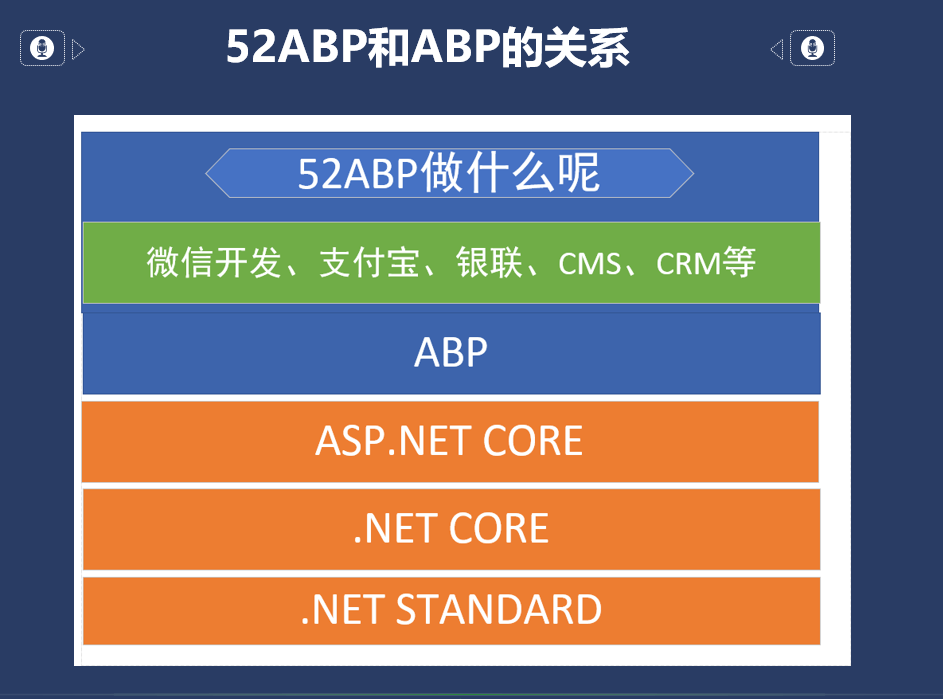

# ABP(ASP.NET Boilerplate)和52ABP的功能对比表,52ABP和ABP的关系

> 本文作者：52ABP开发团队  
> 文章会随着版本进行更新，关注我们获取最新版本  
> 本文出处：[https://www.52abp.com/wiki/52abp/latest](https://www.52abp.com/wiki/52abp/latest)  
> 源代码： https://www.github.com/52abp  

## 52ABP和ABP的关系
 
ASP.NET Boilerplate是一个开源Web应用程序框架，提供了免费的启动模板。

52ABP是一款基于ABP之上开发出来的适用于国内的市场和环境的项目模板。

它不扎根于基础设施，他更多做的事情是让大家在开发功能的时候更加的方便。

所以他不会和 ABP 框架冲突，建议大家可以直接使用 52ABP 框架进行开发，因为 52ABP 有一整套的开发设施，项目模板生成器，代码生成器、文档、视频等内容。
可以节约大家的时间和精力。
 
 

我们在B站也制作了视频，有更加详细的介绍：
[《.NET CORE 开发框架ABP的系统性学习路线图-20180904直播剪辑版》](https://www.bilibili.com/video/av31334354/?p=3)
链接地址：https://www.bilibili.com/video/av31334354/?p=3

## ABP(ASP.NET Boilerplate)免费模板和52ABP-Pro的对比表

在这里，您可以看到ASP.NET Boilerplate的免费模板和52ABP-PRO之间的差异。

下表<strong style="color: red">仅显示差异，而不是所有功能</strong>。

<table class="table" id="TemplateComparisonTable">
 <thead>
        <tr>
          <th>
            功能表</th>
          <th>免费的启动模板	</th>
          <th>52ABP-PRO</th>
        </tr>
        </thead>
        <tbody>
        <tr>
        <td colspan="3"><strong>基础设施</strong></td>
        </tr>

 <tr>
        <td>Abp框架功能	</td>
        <td><i class="fa fa-check text-success"></i></td><td><i class="fa fa-check text-success"></i></td></tr>
        <tr>
        <td>Abp.Zero模块集成	</td>
        <td><i class="fa fa-check text-success"></i></td><td><i class="fa fa-check text-success"></i></td></tr>
        <tr>
        <td>多租户	</td>
        <td><i class="fa fa-check text-success"></i></td><td><i class="fa fa-check text-success"></i></td></tr>
        <tr>
        <td colspan="3"><strong>用户界面（帐户/登录）        </strong></td>
        </tr>
        <tr>
        <td>登录</td>
        <td><i class="fa fa-check text-success"></i></td>
        <td><i class="fa fa-check text-success"></i></td></tr>
        <tr>
        <td>注册</td>
        <td><i class="fa fa-check text-success"></i></td>
        <td><i class="fa fa-check text-success"></i></td>
        </tr>
        <tr>
        <td>基于令牌的身份验证	</td>
        <td><i class="fa fa-check text-success"></i></td>
        <td><i class="fa fa-check text-success"></i></td>
        </tr>
        <tr>
        <td>社交、快捷登录</td>
        <td><i class="fa fa-minus text-secondary"></i></td>
        <td><i class="fa fa-check text-success"></i></td>	
        </tr>
        <tr>
        <td>LDAP（Active Directory）/ ADFS登录	</td>
        <td><i class="fa fa-minus text-secondary"></i></td>
        <td><i class="fa fa-check text-success"></i></td>	</tr>
        <tr>
        <td>忘记密码	</td>
        <td><i class="fa fa-minus text-secondary"></i></td>
        <td><i class="fa fa-check text-success"></i></td></tr>
        <tr>
        <td>电子邮件地址和电话号码激活	</td>
        <td><i class="fa fa-minus text-secondary"></i></td>
        <td><i class="fa fa-check text-success"></i></td></tr>
        <tr>
        <td>重置密码</td>
        <td><i class="fa fa-minus text-secondary"></i></td>
        <td><i class="fa fa-check text-success"></i></td></tr>
        <tr>
        <td>双因素身份验证	</td>
        <td><i class="fa fa-minus text-secondary"></i></td>
        <td><i class="fa fa-check text-success"></i></td></tr>
        <tr>
      
          
<td>用户锁定	</td>
        <td><i class="fa fa-minus text-secondary"></i></td>
        <td><i class="fa fa-check text-success"></i></td></tr>
        <tr>
        <td>用户个人资料/个人资料图片/更改密码	</td>
        <td><i class="fa fa-minus text-secondary"></i></td>
        <td><i class="fa fa-check text-success"></i></td></tr>
        <tr>   <td>显示登录足迹</td>
        <td><i class="fa fa-minus text-secondary"></i></td>
        <td><i class="fa fa-check text-success"></i></td></tr>
        <tr>
        <td>租户注册	</td>
        <td><i class="fa fa-minus text-secondary"></i></td>
        <td><i class="fa fa-check text-success"></i></td></tr>
        <tr>
        <td>Identity Server 4集成	</td>
        <td><i class="fa fa-minus text-secondary"></i></td>
        <td><i class="fa fa-check text-success"></i></td></tr>
        <tr>
        <td>密码复杂性设置	</td>
        <td><i class="fa fa-minus text-secondary"></i></td>
        <td><i class="fa fa-check text-success"></i></td></tr>
        <tr>
        <td colspan="3"><strong>用户界面（应用程序）</strong></td>
        </tr>
          <tr>
        <td>用户管理</td>
        <td>基本功能
        <td>高级功能</td>
          </tr>
          <tr>
        <td>角色管理</td>
        <td>基本功能
          <td>高级功能</td>
          </tr>
          <tr>
        <td>租户管理</td>
        <td>基本功能
          <td>高级功能</td>
          </tr>
          <tr>
        <td>授权管理</td>
        <td>基于角色（简单）	</td>
        <td>可授权给角色和用户   </td>
          </tr>
          <tr>
        <td>示例租户仪表板</td>
        <td>仅限客户端</td>
        <td>服务器端集成</td>
</tr>     
          
<tr>
<td>SaaS应用程序的版本和功能管理</td>
<td><i class="fa fa-minus text-secondary"></i></td>
<td><i class="fa fa-check text-success"></i></td></tr>
  <tr>
<td>租户订阅，付款和结算系统	</td>
<td><i class="fa fa-minus text-secondary"></i></td>
<td><i class="fa fa-check text-success"></i></td>	</tr>
<tr>
<td>租户和用户模拟操作	</td>
<td><i class="fa fa-minus text-secondary"></i></td>
<td><i class="fa fa-check text-success"></i></td></tr>
<tr>
<td>组织单位管理	</td>
<td><i class="fa fa-minus text-secondary"></i></td>
<td><i class="fa fa-check text-success"></i></td></tr>
<tr>
<td>语言（本地化）管理	</td>
<td><i class="fa fa-minus text-secondary"></i></td>
<td><i class="fa fa-check text-success"></i></td></tr>
<tr>
<td>审计日志报告	</td>
<td><i class="fa fa-minus text-secondary"></i></td>
<td><i class="fa fa-check text-success"></i></td></tr>
  <tr>
<td>实时通知	</td>
<td><i class="fa fa-minus text-secondary"></i></td>
<td><i class="fa fa-check text-success"></i></td>	</tr>
  <tr>
<td>聊天功能集成 SignalR</td>
<td><i class="fa fa-minus text-secondary"></i></td>
<td><i class="fa fa-minus text-success"></i></td>	</tr>
 
<td>应用程序设置</td>
<td><i class="fa fa-minus text-secondary"></i></td>
<td><i class="fa fa-check text-success"></i></td></tr>
<tr>

<td>显示网站日志/清除缓存	</td>
<td><i class="fa fa-minus text-secondary"></i></td>
<td><i class="fa fa-check text-success"></i></td></tr>
<tr>
<td>自定义租户徽标和CSS	</td>
<td><i class="fa fa-minus text-secondary"></i></td>
<td><i class="fa fa-check text-success"></i></td></tr>
<tr>

<td>UI 主题</td>
<td>HtmlStream (免费主题)</td>
<td>Keen (高级主题)</td>
  </tr>
  <tr>      
    <td>Angular UI 主题</td>
    <td>Ng-Alain (免费主题)</td>
    <td>Ng-Alain-Pro(高级主题)</td>
      </tr>
<tr>
<td colspan="3"><strong>用户界面（门户网站）
</strong></td>
</tr>
<tr>
<td>门户网站展示</td>
<td><i class="fa fa-minus text-secondary"></i></td>
<td><i class="fa fa-check text-success"></i></td></tr>
<tr>      
  <td>门户网站主题</td>
  <td>无</td>
  <td>Front(高级主题)</td>
    </tr>

 

<tr>
<td colspan="3"><strong>快速开发</strong></td>
</tr>
<tr>
<td>代码生成器</td>
<td><i class="fa fa-minus text-secondary"></i></td>
<td><i class="fa fa-check text-success"></i></td></tr>
<tr>
<td colspan="3"><strong>支持</strong></td>
</tr>
<tr>
<td>社区支持</td>
<td><i class="fa fa-check text-success"></i></td><td><i lass="fa fa-check text-success"></i></td></tr>
<tr>
<td>专属QQ群和配套项目文档及企业代码仓库</td>
<td><i class="fa fa-minus text-secondary"></i></td>
<td><i class="fa fa-check text-success"></i></td></tr>
<tr>
<td>&nbsp;</td>
<td><a class="btn btn-primary text-center   btn-sm" ref="https://www.52abp.com/Download/Index" target="_blank">下载使用</a></td>
<td><a class="btn btn-success text-center btn-sm" ref="https://www.52abp.com/Purchase">价格</a></td>
</tr>
</tbody>
</table>

    

来文档中心了解更多：https://www.52abp.com/wiki/ 

### 微信关注我们不走丢

 
