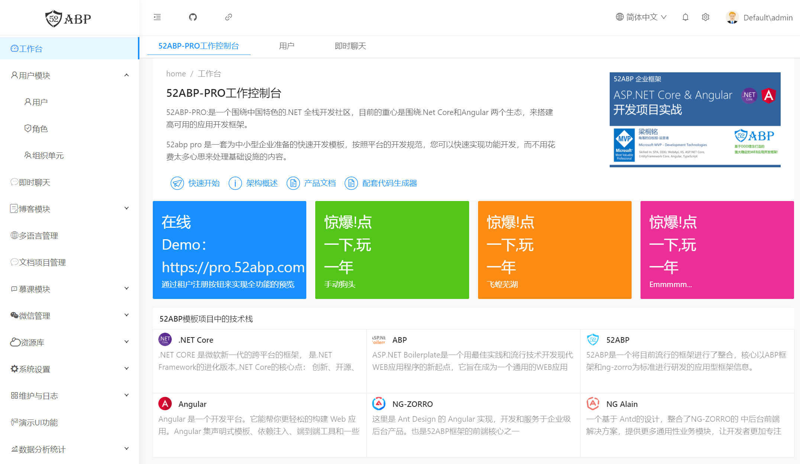

# 创建并运行一个ABP项目


我们需要创建并下载名为**YoyoSoft.PhoneBookDemo**的解决方案，可参考[快速启动52ABP——Pro项目](/docs/Getting-Started-Angular.md)文档。

 在Visual Studio中打开解决方案后，我们将看到一个由八个项目组成的多层架构体系的解决方案：


 

现在可以执行数据库迁移工具，操作流程可参考[快速启动52ABP——Pro项目](/docs/Getting-Started-Angular.md)文档。创建数据库后，运行系统即可登录应用程序。

完成并登录到应用程序后，我们将看到一个工作台页面，如下所示:




 

现在从应用程序注销。 我们将使我们的应用程序成为**单租户**（后面我们将其转换为多租户模式）。 

现在在YoyoSoft.PhoneBookDemo.Web.Host项目中打开appsettings.json文件，并禁用多租户，如下所示：

```json
  // 多租户配置
  "MultiTenancy": { 
    "IsEnabled": false
  },

```

然后重启应用程序即可。
 
 
## 下篇文章

- [为电话薄应用添加一个菜单栏](2.Adding-New-Menu-Item.md)