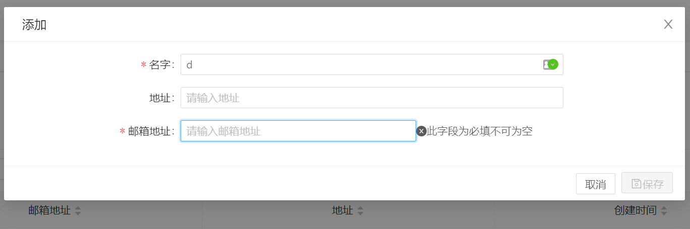
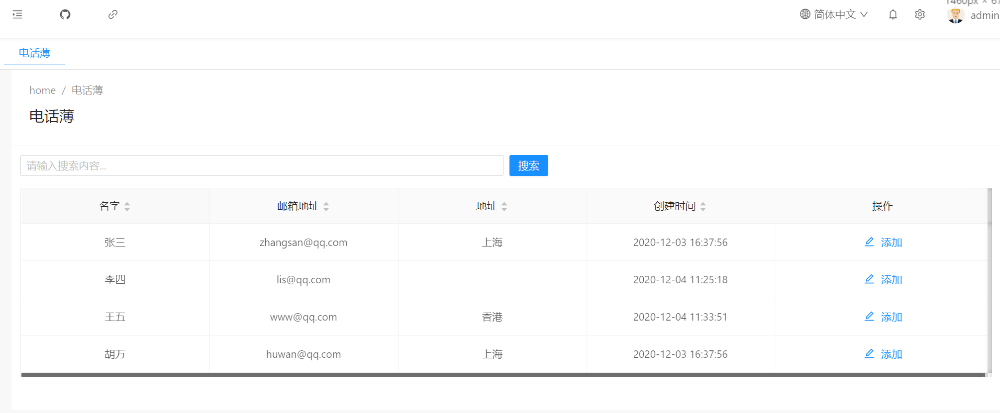

# 在Angular客户端创建一个模态框完成添加功能

我们将创建一个模态框来添加联系人的信息。52ABP-PRO使用的是Ng-zorro的库，当然也可以添加其他库比如Bootstrap。

效果如下：





首先，我们应该使用**nswag/refresh.bat**重新生成服务代理。这将生成从客户端调用PersonAppService.CreatePerson方法所需的代码。

> 请注意，在生成代理脚本之前，需要重新编译并运行服务器端应用程序。


我们从在客户端`src\app\main\phonebook\create-person\`路径文件夹中创建一个名为`create-person.component.ts`的新组件，代码如下:


```typescript
import { Component, OnInit, Injector, Input, ViewChild, AfterViewInit } from '@angular/core';
import { ModalComponentBase } from '@shared/component-base/modal-component-base';

import { finalize } from 'rxjs/operators';
import { CreatePersonInput, PersonServiceProxy } from '../../../../shared/service-proxies/service-proxies';

@Component({
  selector: 'app-create-person',
  templateUrl: './create-person.component.html',
  styleUrls: ['create-person.component.less'],
})
export class CreatePersonComponent extends ModalComponentBase {
  repliedPersonId: any;

  entity: CreatePersonInput = new CreatePersonInput();

  /**
   * 构造函数，在此处配置依赖注入
   */
  constructor(injector: Injector, private _PersonService: PersonServiceProxy) {
    super(injector);
  }

  /**
   * 保存方法,提交form表单
   */
  submitForm(): void {
    this.saving = true;
    console.log(this.entity);

    this._PersonService
      .createPerson(this.entity)
      .pipe(finalize(() => (this.saving = false)))
      .subscribe(() => {
        this.notify.success(this.l('SavedSuccessfully'));
        this.saving = false;
        this.success();
      });
  }
}

```

让我解释一下该类文件中的核心部分：

- 创建了一个选择器 **app-create-person**，它将被作为自定义的联系人HTML元素在页面中被调用。
- 继承了AppComponentBase，以利用它已经定义好的方法（在此示例中定义`this.saving`和`this.notify`）。
- 定义一个方法`submitForm`，当我们成功保存数据后，**this.success()**方法会关闭模态窗的时候触发。
- 创建人员时，注入PersonServiceProxy来调用服务器端方法。

以上代码，简单易懂，已经内置了很多场景需要使用的方法和情况。接下来我们会使用Angular中的form表单验证，可以参考文档[验证表单输入](https://angular.cn/guide/form-validation))。
 


如组件中所声明的，现在我们需要在同一文件夹中创建`create-person.component.html`文件：
  

```html
<form nz-form #validateForm="ngForm" (ngSubmit)="submitForm()" nzLayout="horizontal" autocomplete="off">
  <!-- 模态框头部 -->
  <div class="modal-header">
    <div class="modal-title">
      <i class="iconfont icon-medicine-box mr-sm"></i>

      <span>{{ l('Create') }}</span>
    </div>
  </div>
  <!-- 模态框内容 -->
  <fieldset>
    <!-- 提示信息 -->
    <nz-form-item nz-row>
      <nz-form-label [nzSm]="6" [nzXs]="24" nzRequired nzFor="name">
        {{ l('Name') }}
      </nz-form-label>
      <nz-form-control nz-col [nzSm]="14" [nzXs]="24" required nzHasFeedback>
        <!--  控件位置 -->
        <input
          nz-input
          name="name"
          type="text"
          #personName="ngModel"
          [(ngModel)]="entity.name"
          placeholder="请输入名字"
          required
        />
      </nz-form-control>

      <nz-form-control nzExtra *ngIf="personName.control.dirty && personName.control.errors">
        <ng-container *ngIf="personName.control.hasError('required')">{{ l('ThisFieldIsRequired') }} </ng-container>
      </nz-form-control>
    </nz-form-item>

    <nz-form-item nz-row>
      <nz-form-label nz-col [nzSm]="6" [nzXs]="24" nzFor="address">
        {{ l('Address') }}
      </nz-form-label>
      <nz-form-control nz-col [nzSm]="14" [nzXs]="24" nzHasFeedback>
        <input nz-input name="address" #address="ngModel" [(ngModel)]="entity.address" placeholder="请输入地址" />
      </nz-form-control>
    </nz-form-item>

    <nz-form-item nz-row>
      <nz-form-label nz-col [nzSm]="6" [nzXs]="24" nzRequired nzFor="EmailAddress">
        {{ l('EmailAddress') }}
      </nz-form-label>
      <nz-form-control nz-col [nzSm]="14" [nzXs]="24" nzHasFeedback>
        <input
          nz-input
          name="EmailAddress"
          #personEmailAddress="ngModel"
          [(ngModel)]="entity.emailAddress"
          placeholder="请输入邮箱地址"
          type="email"
          required
        />
      </nz-form-control>
      <nz-form-control nzExtra *ngIf="personEmailAddress.control.dirty && personEmailAddress.control.errors">
        <ng-container *ngIf="personEmailAddress.control.hasError('required')"
          >{{ l('ThisFieldIsRequired') }}
        </ng-container>
      </nz-form-control>
    </nz-form-item>

  </fieldset>
  <!-- 模态框底部 -->
  <div class="modal-footer">
    <button nz-button [nzType]="'default'" type="button" (click)="close()">
      <i class="iconfont icon-close-circle-o"></i> {{ l('Cancel') }}
    </button>
    <button nz-button [nzType]="'primary'" type="submit" [disabled]="!validateForm.form.valid" [nzLoading]="saving">
      <i class="iconfont icon-save"></i> {{ l('Save') }}
    </button>
  </div>
</form>

```

对于所有模态框，上面的代码大部分都是相似的。重要的部分是我们如何使用ngModel指令将模型绑定到视图。很多动作效果，ng-zorro已经帮我们内置了。

像所有组件一样，Angular需要将其与模块关联，所以我们需要将其添加到main.module.ts的声明数组中，如下所示：


```typescript
 //其他代码


import { PhoneBookComponent } from './phonebook/phonebook.component';
import { CreatePersonComponent } from './phonebook/create-or-edit-person/create-person.component';

@NgModule({
 
 //其他代码
  declarations: [DashboardComponent, AboutComponent, AdvertisingComponent, PhoneBookComponent, CreatePersonComponent],
  entryComponents: [AdvertisingComponent, CreatePersonComponent],
   //其他代码

})
export class MainModule { }

```

我们需要在**联系人列表页面**上放置一个 **添加** 按钮，以在单击该按钮时弹出模态框。因此，我们在phonebook.component.html中进行了以下更改：

```html
    <!-- 表头 -->
    <thead class="text-center">
      <tr>
       
       //其他代码
       
          <th nzWidth="230px" class="text-center">
            <span>{{ l('Actions') }}</span>
          </th>
      </tr>
    </thead>
    <!-- 表格内容 -->
    <tbody>
      <tr *ngFor="let item of ajaxTable.data">
         //其他代码
        <td class="text-center">
          <!-- 添加 -->
          <ng-container>
            <a (click)="createPerson()">
              <i class="iconfont icon-plus "></i>

              <span>{{ l('Create') }}</span>
            </a>
          </ng-container>
        </td>
      </tr>
    </tbody>
```


在phonebook.component.html我们增加了按钮，接下来，修改`phonebook.component.ts`。增加一个触发模态框的方法。
```ts

//其他代码
  createPerson(): void {
    this.modalHelper.static(CreatePersonComponent).subscribe(res => {
      if (res) {
        this.getPeople();
      }
    });
  }
```


我们在html页面中，仅显示了部分重要代码。在ts文件中，我们增加了一个createPerson()，当点击添加按钮的时候，会通过模态框帮助器，打开`CreatePersonComponent`组件。当方法被回调后。则会调用`this.getPeople()`方法，刷新我们的列表页面。
 





## 接下来

- [ABP框架中为我们的电话薄应用程序添加权限验证内容](12.Authorization-PhoneBook.md)