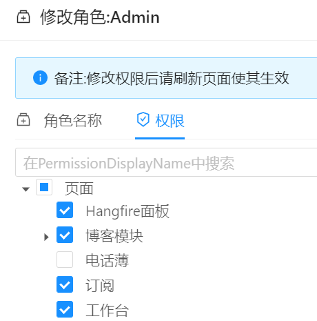
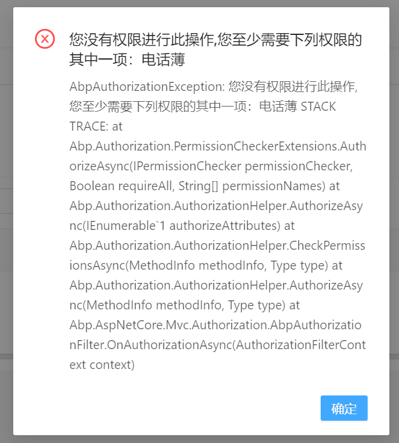
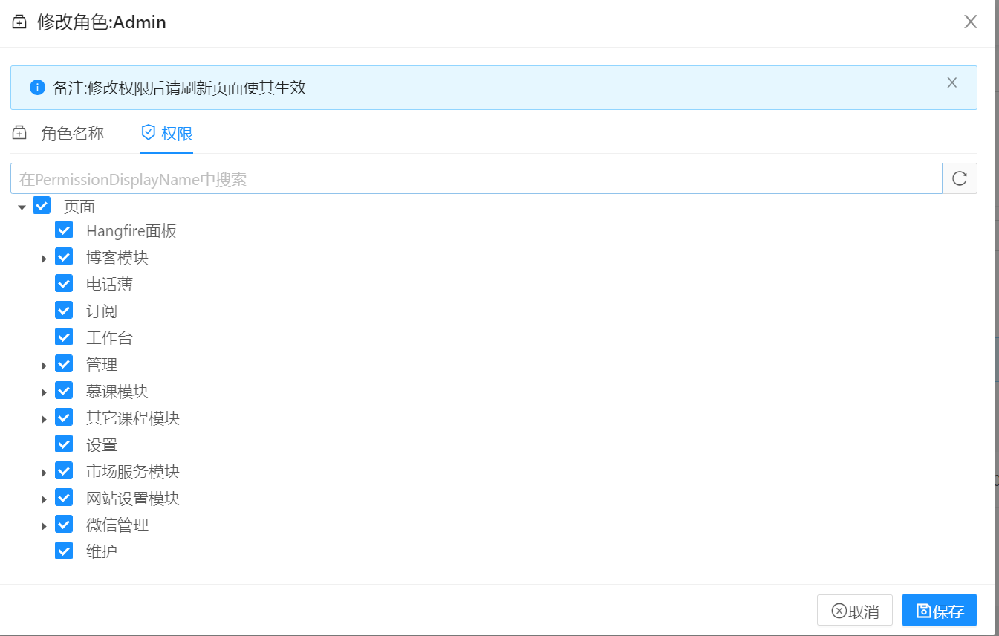

# 如何在ABP框架中定义权限验证内容


现在我们的功能中，由于没有定义任何的授权拦截。因此任何人都可以进入电话薄页面。

接下来，我们需要定义两个权限：


 
- 进入电话簿页面的权限。
- 创建新联系人的权限。


 
## 如何在ABP框架中定义权限

转到服务器端的`AppProAuthorizationProvider`类，它的路径位置`.Core\`项目中，的路径`Authorization\AppProAuthorizationProvider.cs`，并添加一个新权限，如下所示:

 
 

```csharp

//其他代码
pages.CreateChildPermission(AppPermissions.Pages_Tenant_PhoneBook, L("PhoneBook"), multiTenancySides: MultiTenancySides.Tenant);

```
权限应具有唯一的名称。我们在`AppPermissions`类中将权限名称定义为常量字符串。这是一个简单的常量字符串：
 
```csharp
public const string Pages_Tenant_PhoneBook = "Pages.Tenant.PhoneBook";
```

此权限的唯一名称是“**Pages.Tenant.PhoneBook**”。虽然你可以设置任何字符串（只要保证它是唯一的），但建议按照这个约定来进行执行。


权限可以具有可本地化的显示名称：此处为“**PhoneBook**”。最后，我们将此设置为租户级别权限。


## 添加AbpAuthorize属性

AbpAuthorize属性可以用作类级别或方法级别，以保护应用程序服务或服务方法免受未授权用户的攻击。

由于所有服务器端代码都位于`PersonAppService`类中，因此我们可以直接在PersonAppService类上声明一个权限验证。如果你对这块不是很了解，可以学习下[权限认证](https://www.52abp.com/Wiki/abp-cn/latest/4.4ABP%E5%BA%94%E7%94%A8%E5%B1%82-%E6%9D%83%E9%99%90%E8%AE%A4%E8%AF%81.md)。

如下所示：


```csharp

    /// <summary>
    /// Person的应用服务
    /// </summary>
    [AbpAuthorize(AppPermissions.Pages_Tenant_PhoneBook)]
    public class PersonApplicationService : PhoneBookDemoAppServiceBase, IPersonApplicationService
    {
    //...
    }
```


`admin`角色默认情况下具有所有功能的静态权限，但是这些权限在用户界面上是可以进行编辑的。
转到`角色`页面，编辑名为“ `admin`”的角色，转到“`权限`”选项卡并撤消“`电话簿`”权限并保存，如下。



现在，让我们尝试通过菜单栏，使用未经所需许可的方式进入电话簿页面，则提示无权限。




以上的报错信息是包含了堆栈错误信息，方便与我们开发人员进行调试。

## Angular客户端下配置路由权限

关于权限拦截，我们缺少一种情况的判断，那就是，虽然服务器拦截了，但是我们的客户端还没有拦截，我们通过直接url访问的形式，我们仍然可以进入页面。

为了防止这种情况，请打开`main-routing.module.ts`并更改路由定义，如下所示：


```json
      { path: 'phonebook', component: PhoneBookComponent, data: { permission: 'Pages.Tenant.PhoneBook' } },
```

**AuthRouteGuard**类会自动检查路由许可，如果当前用户未授予指定的权限，则阻止进入视图页面。现在可以重新尝试进入电话薄页面，它会将你重新引导回工作台页面。


## 隐藏未授权的菜单栏目

现在用户虽然无法进入电话薄页面了，但是菜单项仍然存在！我们还应该隐藏“电话簿”菜单项。
很简单，打开`src\abpPro\AppMainMenus.ts`并更改PhoneBook菜单定义，如下所示：

```json

    {
      text: '',
      i18n: 'PhoneBook',
      icon: 'iconfont icon-book',
      acl: 'Pages.Tenant.PhoneBook',
      link: '/app/main/phonebook',
      sort: 4,
    },

```

## 为用户授予权限

那么，我们现在如何进入页面？很简单，请转到“角色管理”页面并编辑管理员角色：




我们看到一个名为“**电话簿**”的新权限已添加到权限选项卡。因此，我们可以选择并保存角色。

然后需要刷新整个页面以刷新当前用户的权限。当然我们也可以将此权限授予特定用户。
现在，我们可以再次进入“电话簿”页面。

## 定义添加联系人的权限

虽然页面权限很有用，而且可能一直需要，但是我们更需要定义其他权限才能在页面上执行某些特定操作，例如创建新用户。


## 定义添加联系人权限

 

再次打开`AppProAuthorizationProvider.cs`文件类，调整代码如下：

 

```csharp

  var phoneBook =  pages.CreateChildPermission(AppPermissions.Pages_Tenant_PhoneBook, L("PhoneBook"));
  phoneBook.CreateChildPermission(AppPermissions.Pages_Tenant_PhoneBook_CreatePerson, L("CreateNewPerson"));

```

之前已定义了PhoneBook的权限。在第二行代码中，我们将创建第一个PhoneBook的子权限。记住要在AppPermissions类中创建一个常量：

```csharp
public const string Pages_Tenant_PhoneBook_CreatePerson = "Pages.Tenant.PhoneBook.CreatePerson";

```


## 添加联系人的AbpAuthorize属性

这次，我们只为CreatePerson方法声明AbpAuthorize属性：

```csharp
[AbpAuthorize(AppPermissions.Pages_Tenant_PhoneBook_CreatePerson)]
public async Task CreatePerson(CreatePersonInput input)
{
    //...
}
```

### 隐藏未授权按钮

如果我们运行应用程序并尝试创建一个联系人，单击“保存”按钮后会出现授权错误，这是因为我们没有权限了。但是最好的方案应该是隐藏"创建联系人"按钮。这做起来不难。

打开

但是，如果我们没有权限，最好完全隐藏“创建新人”按钮。很简单：

打开**phonebook.component.html**视图并添加权限`Pages.Tenant.PhoneBook.CreatePerson`条件，如下所示：


```html

  <td class="text-center">
          <!-- 添加 -->
          <ng-container                 >
            <a (click)="createPerson()" *ngIf="isGranted('Pages.Tenant.PhoneBook.CreatePerson')"  >
              <i class="iconfont icon-plus mr-sm"></i>
              <span>{{ l('Create') }}</span>
            </a>
          </ng-container>
        </td>

```

这样，没有 **添加联系人**权限的人，就不会看到这个按钮了。

### 添加联系人授权

要再次显示该按钮，我们可以转到**角色**或**用户管理**并授予相关权限，如下所示：


如上所示，**Create new person**权限是“**电话簿**”的子级权限。

> 请记住,保存后刷新页面以更新权限。

 
## 下一篇

- [删除一个联系人](13.Deleting-Person.md)