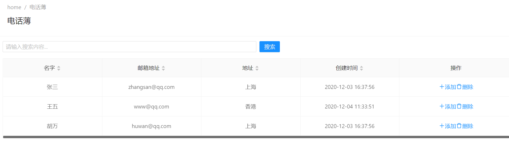
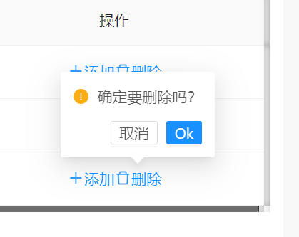

# 删除一个联系人

 
让我们在人员列表中添加一个**删除按钮**，如下所示：




现在我们开始制作这个功能。

## 调整视图页面

现在我们更改**phonebook.component.html**页面，以添加一个**删除按钮**（相关代码在此处显示）。

```html
  <td class="text-center">
          <!-- 添加 -->
          <ng-container>
            <a (click)="createPerson()" *ngIf="isGranted('Pages.Tenant.PhoneBook.CreatePerson')">
              <i class="iconfont icon-plus mr-sm"></i>

              <span>{{ l('Create') }}</span>
            </a>
          </ng-container>

         <!-- 删除 -->
          <ng-container *ngIf="isGranted('Pages.Tenant.PhoneBook.DeletePerson')">
            <a nz-popconfirm [nzPopconfirmTitle]="l('ConfirmDeleteWarningMessage')" (nzOnConfirm)="delete(item)"
              [nzOkText]="l('Ok')" [nzCancelText]="l('Cancel')">
              <i class="iconfont icon-delete mr-sm"></i>
              <span>{{ l('Delete') }}</span>
            </a>
          </ng-container>

        </td>
```

我们仅添加了一个按钮，单击该按钮将调用**delete**方法（待会儿完善这个方法）。您可以像上面“创建”方法一样。当然我们也会完善**删除联系人**权限。
  
## 完善PersonApplicationService

让我们离开客户端，向服务器端添加DeletePerson方法。我们将其添加到服务接口IPersonAppService ::

```csharp
Task DeletePerson(EntityDto input);
```
如果我们仅获得一个id值，则EntityDto是ABP的快捷方式。实现（在PersonAppService中）非常简单：


  
```csharp
[AbpAuthorize(AppPermissions.Pages_Tenant_PhoneBook_DeletePerson)]
public async Task DeletePerson(EntityDto input)
{
    await _personRepository.DeleteAsync(input.Id);
}
```

## 客户端代理服务的代码生成

由于我们更改了服务器端服务，因此我们应该通过NSwag重新生成客户端服务代理。使服务器端运行，并像以前一样使用refresh.bat。


## 在组件中添加删除方法

现在，我们可以将delete方法添加到phonebook.component.ts中：

 
 
 
```typescript

 delete(entity: EntityDtoOfGuid) {
    this.message.confirm(this.l('ConfirmDeleteWarningMessage', entity.id), undefined, (isConfirmed) => {
      if (isConfirmed) {
        this._personService
          .deletePerson(entity.id)
          .pipe(finalize(() => (this.saving = false)))
          .subscribe(() => {
            this.getPeople();

            this.notify.success(this.l('SuccessfullyDeleted'));
          });
      }
    });
  }
```

当我们单击删除按钮时，它首先显示一条确认消息：




如果单击“**是**”，它会调用`PersonAppService`的delete方法，并在操作成功时显示通知。
 
## 下一篇

* [Filtering People](Developing-Step-By-Step-Angular-Filtering-People)