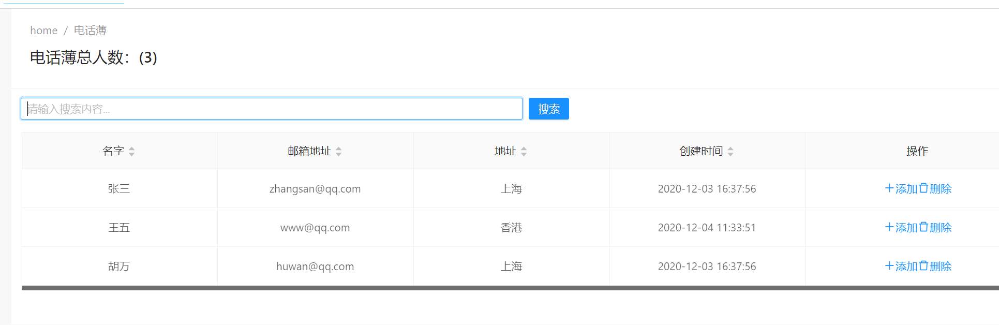

# 模糊搜索联系人信息

现在我们要实现一个搜索功能，当然在之前的代码段中，我们已经实现了它，下面增加一个统计总用户数的功能。





接下来返回 **phonebook.component.html**视图中，补充代码如下。

```html
<page-header [title]="l('PhoneBook') + '总人数：(' + ajaxTable.data.length + ')'"></page-header>

<nz-card [nzBordered]="false">
  <div class="mb-md">
    <div nz-row nzGutter="8">
      <!-- 模糊搜索框 -->
      <div nz-col nzSpan="8" nzMd="12" nzXs="24" nzSm="24">
        <input
          type="text"
          nz-input
          [(ngModel)]="filter"
          (keyup.enter)="getPeople()"
          [placeholder]="l('SearchWithThreeDot')"
        />
      </div>
      <!-- 查询和刷新按钮 -->
      <div nz-col nzSpan="8" nzMd="12" nzXs="24" nzSm="24">
        <button nz-button nzType="primary" type="submit" (click)="getPeople()">
          <span>{{ l('Search') }}</span>
        </button>
      </div>
    </div>
  </div>
<!-- //其他代码内容 -->
</nz-card>

```


我们添加了一个总人数的统计，并且支持回车键进行数据的查询。


## 下一篇

- [在ABP框架中实现一对多的关联关系](15.Creating-Phone-Entity.md)