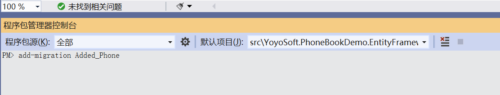

# 针对Phone实体信息的数据库迁移

我们的实体模型已更改，因此我们需要添加新的迁移。在**.EntityFramework**项目的目录中运行以下命令：



```bash
add-migration Added_Phone_Tables

```

命令执行成功后，会创建一个新的迁移记录文件代码，通过它会创建**ltmPhones**表: 

```csharp

     public partial class Added_Phone_Tables : Migration
    {
        protected override void Up(MigrationBuilder migrationBuilder)
        {
            migrationBuilder.CreateTable(
                name: "LtmPhones",
                columns: table => new
                {
                    Id = table.Column<long>(nullable: false)
                        .Annotation("SqlServer:Identity", "1, 1"),
                    CreationTime = table.Column<DateTime>(nullable: false),
                    CreatorUserId = table.Column<long>(nullable: true),
                    LastModificationTime = table.Column<DateTime>(nullable: true),
                    LastModifierUserId = table.Column<long>(nullable: true),
                    IsDeleted = table.Column<bool>(nullable: false),
                    DeleterUserId = table.Column<long>(nullable: true),
                    DeletionTime = table.Column<DateTime>(nullable: true),
                    PersonId = table.Column<Guid>(nullable: false),
                    Type = table.Column<byte>(nullable: false),
                    Number = table.Column<string>(maxLength: 16, nullable: false)
                },
                constraints: table =>
                {
                    table.PrimaryKey("PK_LtmPhones", x => x.Id);
                    table.ForeignKey(
                        name: "FK_LtmPhones_LtmPersons_PersonId",
                        column: x => x.PersonId,
                        principalTable: "LtmPersons",
                        principalColumn: "Id",
                        onDelete: ReferentialAction.Cascade);
                });

            migrationBuilder.CreateIndex(
                name: "IX_LtmPhones_PersonId",
                table: "LtmPhones",
                column: "PersonId");
        }

        protected override void Down(MigrationBuilder migrationBuilder)
        {
            migrationBuilder.DropTable(
                name: "LtmPhones");
        }
    }

```


在更新数据库之前，我们可以打开初始化数据库的类**DefaultPeopleInfoCreator**，将其重命名为**DefaultPeopleAndPhoneCreator**，然后添加示例联系人的电话号码 ：


 

```csharp
internal class DefaultPeopleAndPhoneCreator
    {
        private readonly PhoneBookDemoDbContext _context;

        public DefaultPeopleAndPhoneCreator(PhoneBookDemoDbContext context)
        {
            _context = context;
        }

        public void Create()
        {
            var zhangsan = _context.Persons.FirstOrDefault(p => p.EmailAddress == "zhangsan@qq.com");
            if (zhangsan == null)
            {
                _context.Persons.Add(
                    new Person
                    {
                        Name = "张三",
                        Address = "上海",
                        EmailAddress = "zhangsan@qq.com",
                        Phones = new List<Phone>
                        {
                            new Phone {Type = PhoneType.Home, Number = "13688922902"},
                            new Phone {Type = PhoneType.Mobile, Number = "15828413122"}
                        }
                    });
            }

            var huwan = _context.Persons.FirstOrDefault(p => p.EmailAddress == "huwan@qq.com");
            if (huwan == null)
            {
                _context.Persons.Add(
                    new Person
                    {
                        Name = "胡万",
                        Address = "上海",
                        EmailAddress = "huwan@qq.com",
                        Phones = new List<Phone>
                        {
                        new Phone {Type = PhoneType.Business, Number = "1378898"},
                    new Phone {Type = PhoneType.Mobile, Number = "123456789"}
                }
                    });
            }
        }
    }
```

我们向张三添加了两个电话号码，向胡万添加了一个电话号码。但是如果我们现在运行应用程序，电话号码是不会进行数据初始化的。这是因为person表中的数据已经存在。

不过我们当前属于开发阶段，由于尚未部署，因此可以删除数据库（或从管理界面中删除条目）并重新创建它。重新运行应用程序即可。试试吧。


 

## 接下来

- [在ABP中的多表联动查询的实现](17.Changing-GetPeople-Method.md)