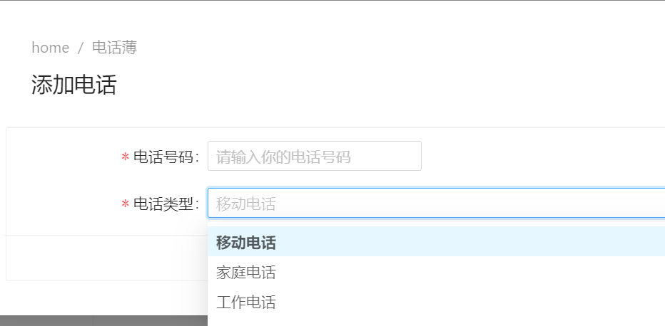

# 添加并查看联系人的电话信息

最后的完成效果如下：

查看电话号码列表


当我们点击**添加电话**按钮时候，则会弹出对话框，输入我们的电话号码以及类型，即可保存。



保存后，页面会自动加载完成。

## 页面视图代码

以下是 **phonebook.component.html** 页面中的完整代码:

```html
<page-header [title]="l('PhoneBook') + ' - 总人数：(' + people.length + ')'"></page-header>

<nz-card [nzBordered]="false">
  <div class="mb-md">
    <div nz-row nzGutter="8">
      <!-- 模糊搜索框 -->
      <div nz-col nzSpan="8" nzMd="12" nzXs="24" nzSm="24">
        <input
          type="text"
          nz-input
          [(ngModel)]="filter"
          (keyup.enter)="getPeople()"
          [placeholder]="l('SearchWithThreeDot')"
        />
      </div>
      <!-- 查询和刷新按钮 -->
      <div nz-col nzSpan="8" nzMd="12" nzXs="24" nzSm="24">
        <button nz-button nzType="primary" type="submit" (click)="getPeople()">
          <span>{{ l('Search') }}</span>
        </button>
        <button
          nz-button
          nzType="primary"
          type="submit"
          (click)="createPerson()"
          *ngIf="isGranted('Pages.Tenant.PhoneBook.CreatePerson')"
        >
          <i class="iconfont icon-plus"></i>
          <span>{{ l('CreateNewPerson') }}</span>
        </button>
      </div>
    </div>
  </div>

  <nz-table
    #ajaxTable
    nzBordered="true"
    [nzData]="people"
    [nzShowSizeChanger]="true"
    [nzShowQuickJumper]="true"
    [nzNoResult]="noDataTemplate"
    [nzFrontPagination]="false"
    [nzScroll]="{ x: '1300px', y: '550px' }"
  >
    <!-- 暂无数据组件 -->
    <ng-template #noDataTemplate>
      <no-data></no-data>
    </ng-template>

    <!-- 表头 -->
    <thead class="text-center">
      <tr>
        <th nzWidth="60px"><span>查看电话号码</span></th>

        <th nzLeft="0px" class="text-center" nzWidth="200px" nzShowSort nzSortKey="Name">
          <span>{{ l('Name') }}</span>
        </th>

        <th class="text-center" nzWidth="200px" nzShowSort nzSortKey="EmailAddress">
          <span>{{ l('EmailAddress') }}</span>
        </th>
        <th class="text-center" nzWidth="200px" nzShowSort nzSortKey="Address">
          <span>{{ l('Address') }}</span>
        </th>

        <th class="text-center" nzShowSort nzWidth="200px" nzSortKey="CreationTime">
          <span>{{ l('CreationTime') }}</span>
        </th>
        <th nzWidth="230px" class="text-center">
          <span>{{ l('Actions') }}</span>
        </th>
      </tr>
    </thead>
    <!-- 表格内容 -->
    <tbody>
      <ng-container *ngFor="let item of ajaxTable.data">
        <tr>
          <td [nzExpand]="expandSet.has(item.id)" (nzExpandChange)="onExpandChange(item.id, $event)"></td>

          <td nzLeft="0px" class="text-center">
            <ellipsis lines="1" tooltip>
              <span nz-tooltip [nzTooltipTitle]="item.name">
                {{ item.name }}
              </span>
            </ellipsis>
          </td>

          <td class="text-center">
            <ellipsis lines="1" tooltip>
              <span nz-tooltip [nzTooltipTitle]="item.emailAddress">
                {{ item.emailAddress }}
              </span>
            </ellipsis>
          </td>
          <td class="text-center">
            <ellipsis lines="1" tooltip>
              <span nz-tooltip [nzTooltipTitle]="item.address">
                {{ item.address }}
              </span>
            </ellipsis>
          </td>

          <td class="text-center">
            <ellipsis lines="1" tooltip>
              <span nz-tooltip [nzTooltipTitle]="item.creationTime | _moment">
                {{ item.creationTime | _moment }}
              </span>
            </ellipsis>
          </td>
          <td class="text-center">
            <!-- 添加 -->
            <ng-container>
              <a *ngIf="isGranted('Pages.Tenant.PhoneBook.EditPerson')" (click)="editPerson(item)">
                <i nz-icon nzType="edit"></i>
                <span>{{ l('EditPerson') }}</span>
              </a>
              <nz-divider nzType="vertical"></nz-divider>

              <a
                *ngIf="isGranted('Pages.Tenant.PhoneBook.DeletePerson')"
                nz-popconfirm
                [nzPopconfirmTitle]="l('ConfirmDeleteWarningMessage')"
                (nzOnConfirm)="delete(item)"
                [nzOkText]="l('Ok')"
                [nzCancelText]="l('Cancel')"
              >
                <i class="iconfont icon-delete"></i>
                <span>{{ l('DeletePerson') }}</span>
              </a>
            </ng-container>
          </td>
        </tr>

        <tr [nzExpand]="expandSet.has(item.id)">
          <ul>
            <li *ngFor="let phone of item.phones">
              <span class="mr-sm">电话号码：{{ phone.number }}</span>
              <span class="mr-sm">电话号码类型： {{ phone.phoneTypeStr }}</span>
              <a class="mr-sm" *ngIf="isGranted('Pages.Tenant.PhoneBook.EditPerson')" (click)="addPhoneInPerson(item)">
                <i nz-icon nzType="plus"></i> {{ l('AddPhones') }}</a
              >
              <a class="mr-sm" *ngIf="isGranted('Pages.Tenant.PhoneBook.EditPerson')" (click)="deletePhone(phone.id)">
                <i nz-icon nzType="delete"></i> {{ l('DeletePhone') }}</a
              >
            </li>
          </ul>
        </tr>
      </ng-container>
    </tbody>
  </nz-table>
</nz-card>


```


我们在页面视图中了使用了 nztable的展开属性  **nzExpand**，给将电话薄列表展开了。
同时为了满足功能，我们增加了一些新的弹出模态框和方法来完成功能。

## TS组件中的代码

在phonebook.component.ts文件中，我们增加了一些方法。同时因为我们的后端接口发生了变化，所以我们需要运行`\refresh.bat`以刷新代理服务类。因为我们可以添加新的应用服务类，所以不需要进行模块服务的注册。


```ts

import { Component, ChangeDetectionStrategy, Injector, OnInit } from '@angular/core';
import { appModuleAnimation } from '@shared/animations/routerTransition';
import { AppComponentBase } from '@shared/component-base';
import { AddPhoneInput, EntityDtoOfGuid, PersonListDto, PersonServiceProxy, PhoneType } from '@shared/service-proxies';
import { finalize } from 'rxjs/operators';
import { CreatePersonComponent } from './create-person/create-person.component';
import { CommonLookupServiceProxy } from '../../../shared/service-proxies/service-proxies';
import { AddphoneComponent } from './addphone/addphone.component';

@Component({
  templateUrl: './phonebook.component.html',
  styleUrls: ['./phonebook.component.less'],
  animations: [appModuleAnimation()],
  changeDetection: ChangeDetectionStrategy.Default,
})
export class PhoneBookComponent extends AppComponentBase implements OnInit {

  constructor(
    injector: Injector,
    private _personService: PersonServiceProxy,


  ) {
    super(injector);
  }

  people: PersonListDto[] = [];
  editingPerson: PersonListDto = null;

  filter = '';
  newPhone: AddPhoneInput = null;

  expandSet = new Set<string>();

  ngOnInit(): void {
    this.getPeople();
  }

  getPeople(): void {
    this._personService.getPeople(this.filter).subscribe((result) => {
      this.people = result.items;
    });
  }

  createPerson(): void {
    this.modalHelper.static(CreatePersonComponent).subscribe(res => {
      if (res) {
        this.getPeople();
      }
    });
  }

  addPhoneInPerson(person: PersonListDto) {
    this.modalHelper.static(AddphoneComponent, { personId: person.id }).subscribe(res => {
      if (res) {
        this.getPeople();
      }
    });
  }


  onExpandChange(id: any, checked: boolean): void {
    if (checked) {
      this.expandSet.add(id);
    } else {
      this.expandSet.delete(id);
    }
  }

  // 删除电话
  deletePhone(phoneId: number) {
    this.message.confirm(this.l('ConfirmDeleteWarningMessage', phoneId), undefined, (isConfirmed) => {
      if (isConfirmed) {
        this._personService.deletePhone(phoneId).pipe(finalize(() => (this.saving = false)))
          .subscribe(() => {
            this.getPeople();

            this.notify.success(this.l('SuccessfullyDeleted'));
          });
      }
    });
  }

  /** 删除联系人 */
  delete(entity: EntityDtoOfGuid) {
    this.message.confirm(this.l('ConfirmDeleteWarningMessage', entity.id), undefined, (isConfirmed) => {
      if (isConfirmed) {
        this._personService
          .deletePerson(entity.id)
          .pipe(finalize(() => (this.saving = false)))
          .subscribe(() => {
            this.getPeople();

            this.notify.success(this.l('SuccessfullyDeleted'));
          });
      }
    });
  }

}

```

我们增加了`editingPerson`和`expandSet`属性用于添加电话和编辑联系人以及展开子项信息的时候满足业务。

## AddPhone前端组件

添加电话信息这个功能不难，我们在路径`src\app\main\phonebook\addphone`中添加组件如下：

- addphone.component.less
- addphone.component.html
- addphone.component.ts

这里的实现功能形式，我们采用基于na-alain的组件功能的 **动态表单** 文档地址[@delon/form](https://ng-alain.com/form/getting-started/zh)。


### addphone.component.html视图的代码

```html

<page-header [title]="l('AddPhones')"></page-header>

<nz-card [nzLoading]="loading">
  <sf #validateForm [schema]="schema" [formData]="entity" button="none">
    <!-- 模态框底部 -->
    <div class="modal-footer">
      <button nz-button type="button" (click)="close()">
        <i class="iconfont icon-close-circle-o"></i> {{ l('Cancel') }}
      </button>
      <button
        nz-button
        type="submit"
        [nzType]="'primary'"
        (click)="submitForm(validateForm.value)"
        [disabled]="!validateForm.valid"
        [nzLoading]="saving"
      >
        <i class="iconfont icon-save" *ngIf="!saving"></i> {{ l('Save') }}
      </button>
    </div>
  </sf>
</nz-card>


```

### addphone.component.ts的代码

```js
import { Component, Injector, OnInit, ViewChild } from '@angular/core';
import { SFComponent, SFRadioWidgetSchema, SFSchema, SFSchemaEnumType, SFSelectWidgetSchema } from '@delon/form';
import { ModalComponentBase } from '@shared/component-base';
import { AddPhoneInput, PersonServiceProxy } from '@shared/service-proxies';
import { finalize } from 'rxjs/operators';
import { PhoneType } from '../../../../shared/service-proxies/service-proxies';

@Component({
  selector: 'app-addphone',
  templateUrl: './addphone.component.html',
  styleUrls: ['./addphone.component.less']
})
export class AddphoneComponent extends ModalComponentBase  {

  constructor(injector: Injector, private _PersonService: PersonServiceProxy) {
    super(injector);
  }


  personId: any;
  entity: AddPhoneInput = new AddPhoneInput();


  // /**动态表单 */

  @ViewChild('validateForm') sf: SFComponent;
  schema: SFSchema = {
    properties: {
      number: {
        type: 'number',
        title: this.l('PhoneNumber'),
        minLength: 10,
        maxLength: 16,
        ui: {
          widgetWidth: 200,
          placeholder: this.l('PhoneNumberInputDesc'),
        },
      },

      type: {
        type: 'string',
        title: this.l('PhoneType'),
        enum: [
          { label: this.l('PhoneType_Mobile'), value: 'Mobile', otherData: 1 },
          { label: this.l('PhoneType_Home'), value: 'Home' },
          { label: this.l('PhoneType_Business'), value: 'Business' },
        ],
        default: 'Mobile',
        ui: {
          widgetWidth: 200,
          widget: 'select',
          change: (value, orgData) => console.log(value, orgData),
        } as SFSelectWidgetSchema,

      }

    },
    required: ['number', 'type'],
    ui: {
      errors: {
        required: this.l('ThisFieldIsRequired'),
        minLength: this.l('MinLength', 10),

      },
    },
  };
 


  /**
 * 保存方法,提交form表单
 */
  submitForm(item: any): void {
    this.saving = true;
    console.log(item);
    item.personId = this.personId;
    console.log(this.personId);
    console.log(this.entity);


    this._PersonService
      .addPhone(item)
      .pipe(finalize(() => (this.saving = false)))
      .subscribe(() => {
        this.notify.success(this.l('SavedSuccessfully'));
        this.saving = false;
        this.success();
      });
  }
 

}


```

看了之后，你是否发现代码量少的不可以意思，并且52abp-pro基于它进行了内部整合后，基本上可以说无缝开发功能。并且Ng-alain也有强大的api支持。52abp-pro提供了封装的更加强大的sample-table功能。可以查询sample-table文档。

### 本地化的配置

```json

  "PhoneBook": "电话薄",
    "CreateNewPerson": "添加新联系人",
    "DeletePerson": "删除联系人",
    "EditPerson": "编辑联系人",
    "DeletePhone": "删除电话",
    "AddPhones": "添加电话",
    "PhoneType_Mobile": "移动电话",
    "PhoneType": "电话类型",
    "PhoneType_Business": "工作电话",
    "PhoneType_Home": "家庭电话",
    "PhoneNumberInputDesc": "请输入你的电话号码",

```

 为了便于我们多语言化的满足，我们也需要进行json的配置。


## 接下来

[完成编辑联系人信息](20.Compleate-EditPerson.md)
