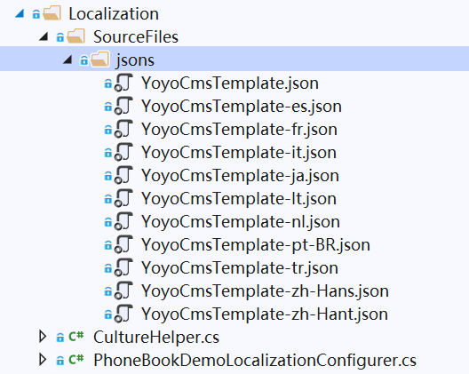

# 为电话薄应用添加一个菜单栏


现在为我们的电话薄应用添加一个菜单栏，用于后面功能的导航，命名为"PhoneBook"。

## 定义一个菜单栏

在Angular文件夹的路径`src\abpPro\`文件夹中包含两个定义菜单的文件：

- AppMenus.ts
- AppMainMenus.ts

他们都继承自`AbpProMenus.ts`文件，这里包含了我们应用程序中所有的菜单配置信息。
当我们修改这些类的时候，菜单也会自动更改。

现在我们在`AppMainMenus`类中，定义一个PhoneBook菜单。

```js
export class AppMainMenus {
  static Menus: AbpProMenus[] = [
    {
      text: '',
      i18n: 'PhoneBook',
      icon: 'iconfont icon-book',
      link: '/app/main/phonebook',
      sort: 4,
    },
  ]
}
```

菜单属性说明：

- text 表示菜单的名称，它会覆盖i18n中的值
- i18n 表示兼容多语言本地化的菜单标题内容。
- icon 是菜单的图标信息，52ABP提供了图标大全，预览地址Icon图标大全：https://pro.52abp.com//assets/iconfont/demo_index.html
- link 表示关联到路由信息，app表示应用程序，main表示关联的模块地址，phonebook为我们定义在该mainmodule下唯一的标识信息。
- sort 表示排序的序号内容。


## 多语言本地化的菜单显示名称

一个好的应用框架，会考虑到多语言及本地化的解决方案。
在html页面中可以使用**L("PhoneBook")**方法来显示我们的本地化名称。

**L**是一个辅助方法，它可以获取一个本地化的密钥，并返回一个**LocalizableString**对象，详情可以`root.module.ts`参考中的`convertAbpLocaleToNgAlianLocale()`方法。

本地化的字符串内容均保存在`YoyoSoft.PhoneBookDemo.Core`项目下的`Localization\SourceFiles\jsons\` 文件夹内的json文件。



我们打开`YoyoCmsTemplate.json`(默认的英语本地化内容),添加以下行：

```json
// 英语本地化
    "PhoneBook": "PhoneBook",

```
如果其他的本地化语言中没有定义`PhoneBook`的字典信息，则会显示默认的字典信息。

现在我们定义一个简体中文的本地化内容，`YoyoCmsTemplate-zh-Hans.json`(简体中文本地化内容)，

```json

//中文本地化
"PhoneBook": "电话薄"

```  

## 接下来
 

- [创建一个前端PhoneBook组件](3.Creating-PhoneBook-Component.md)