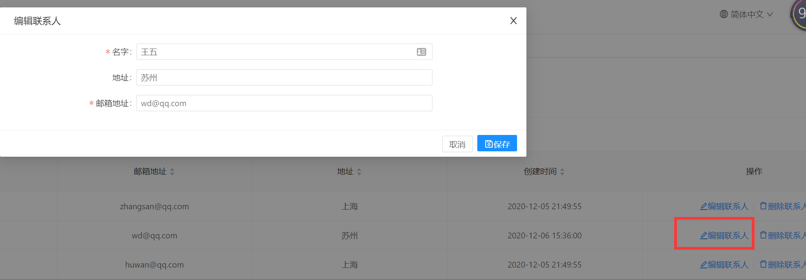

# 完成编辑联系人信息

目前我们已经实现了添加、删除联系人功能。以及查询电话薄和添加、删除电话的功能。还欠缺一个编辑联系人的功能。



## 编辑联系人的后端代码

首先在`IPersonApplicationService`中定义两个方法。

```csharp
Task<GetPersonForEditOutput> GetPersonForEdit(NullableIdDto<Guid> input);
Task EditPerson(PersonEditDto input);
```

然后在`PersonApplicationService`中实现两个方法：

```csharp

 [AbpAuthorize(AppPermissions.Pages_Tenant_PhoneBook_EditPerson)]
        public async Task<GetPersonForEditOutput> GetPersonForEdit(NullableIdDto<Guid> input)
        {
            var output = new GetPersonForEditOutput();
            PersonEditDto editDto;

            if (input.Id.HasValue)
            {
                var entity = await _personRepository.GetAsync(input.Id.Value);
                editDto = ObjectMapper.Map<PersonEditDto>(entity);
            }
            else
            {
                editDto = new PersonEditDto();
            }

            output.Person = editDto;
            return output;
        }

        [AbpAuthorize(AppPermissions.Pages_Tenant_PhoneBook_EditPerson)]
        public async Task EditPerson(PersonEditDto input)
        {
            var entity = await _personRepository.GetAsync(input.Id.Value);

            //将input属性的值赋值到entity中
            ObjectMapper.Map(input, entity);
            await _personRepository.UpdateAsync(entity);
        }
```

我们需要创建两个Dto，用于数据进行传输和转换。

```csharp
public class GetPersonForEditOutput
    {
        public PersonEditDto Person { get; set; }
    }

     /// <summary>
    /// 联系人编辑Dto
    /// </summary>
    public class PersonEditDto
    {
        public  Guid? Id { get; set; }

        [Required]
        [MaxLength(Person.MaxNameLength)]
        public string Name { get; set; }

        /// <summary>
        /// 地址信息
        /// </summary>
        [MaxLength(Person.MaxAddressLength)]
        public string Address { get; set; }

        [EmailAddress]
        [MaxLength(Person.MaxEmailAddressLength)]
        public string EmailAddress { get; set; }

    }

```    

最后，将AutoMapper的配置添加到CustomerAppDtoMapper.cs中，如下所示：

```c#
configuration.CreateMap<PersonEditDto, Person>().ReverseMap();
```


## 创建前端组件edit-person


我们将现在的`phonebook`文件夹中，创建`edit-person`组件如下：


- edit-person.component.html
- edit-person.component.less
- edit-person.component.ts

edit-person.component.html 视图的代码如下：

```html
<form nz-form #validateForm="ngForm" (ngSubmit)="submitForm()" nzLayout="horizontal" autocomplete="off">
  <!-- 模态框头部 -->
  <div class="modal-header">
    <div class="modal-title">
      <i class="iconfont icon-medicine-box mr-sm"></i>

      <span>{{ l('EditPerson') }}</span>
    </div>
  </div>
  <!-- 模态框内容 -->
  <fieldset>
    <!-- 提示信息 -->
    <nz-form-item nz-row>
      <nz-form-label [nzSm]="6" [nzXs]="24" nzRequired nzFor="name">
        {{ l('Name') }}
      </nz-form-label>
      <nz-form-control nz-col [nzSm]="14" [nzXs]="24" required nzHasFeedback>
        <!--  控件位置 -->
        <input
          nz-input
          name="name"
          type="text"
          #personName="ngModel"
          [(ngModel)]="entity.name"
          placeholder="请输入名字"
          required
        />
      </nz-form-control>

      <nz-form-control nzExtra *ngIf="personName.control.dirty && personName.control.errors">
        <ng-container *ngIf="personName.control.hasError('required')">{{ l('ThisFieldIsRequired') }} </ng-container>
      </nz-form-control>
    </nz-form-item>

    <nz-form-item nz-row>
      <nz-form-label nz-col [nzSm]="6" [nzXs]="24" nzFor="address">
        {{ l('Address') }}
      </nz-form-label>
      <nz-form-control nz-col [nzSm]="14" [nzXs]="24" nzHasFeedback>
        <input nz-input name="address" #address="ngModel" [(ngModel)]="entity.address" placeholder="请输入地址" />
      </nz-form-control>
    </nz-form-item>

    <nz-form-item nz-row>
      <nz-form-label nz-col [nzSm]="6" [nzXs]="24" nzRequired nzFor="EmailAddress">
        {{ l('EmailAddress') }}
      </nz-form-label>
      <nz-form-control nz-col [nzSm]="14" [nzXs]="24" nzHasFeedback>
        <input
          nz-input
          name="EmailAddress"
          #personEmailAddress="ngModel"
          [(ngModel)]="entity.emailAddress"
          placeholder="请输入邮箱地址"
          type="email"
          required
        />
      </nz-form-control>
      <nz-form-control nzExtra *ngIf="personEmailAddress.control.dirty && personEmailAddress.control.errors">
        <ng-container *ngIf="personEmailAddress.control.hasError('required')"
          >{{ l('ThisFieldIsRequired') }}
        </ng-container>
      </nz-form-control>
    </nz-form-item>
  </fieldset>
  <!-- 模态框底部 -->
  <div class="modal-footer">
    <button nz-button [nzType]="'default'" type="button" (click)="close()">
      <i class="iconfont icon-close-circle-o"></i> {{ l('Cancel') }}
    </button>
    <button nz-button [nzType]="'primary'" type="submit" [disabled]="!validateForm.form.valid" [nzLoading]="saving">
      <i class="iconfont icon-save"></i> {{ l('Save') }}
    </button>
  </div>
</form>

```

edit-person.component.ts的代码如下：

```typescript

import { Component, Injector, OnInit } from '@angular/core';
import { ModalComponentBase } from '@shared/component-base';
import { PersonServiceProxy } from '@shared/service-proxies';
import { finalize } from 'rxjs/operators';
import { PersonEditDto } from '../../../../shared/service-proxies/service-proxies';

@Component({
  selector: 'app-edit-person',
  templateUrl: './edit-person.component.html',
  styleUrls: ['./edit-person.component.less'],
})
export class EditPersonComponent extends ModalComponentBase implements OnInit {
  /**
   * 构造函数，在此处配置依赖注入
   */
  constructor(injector: Injector, private _PersonService: PersonServiceProxy) {
    super(injector);
  }

  entity: PersonEditDto = new PersonEditDto();
  personId: any = null;

  ngOnInit() {
    if (this.personId) {
      this._PersonService.getPersonForEdit(this.personId).subscribe((result) => {
        this.entity = result.person;
      });
    }
  }

  /**
   * 保存方法,提交form表单
   */
  submitForm(): void {
    this.saving = true;
    console.log(this.entity);

    this._PersonService
      .editPerson(this.entity)
      .pipe(finalize(() => (this.saving = false)))
      .subscribe(() => {
        this.notify.success(this.l('SavedSuccessfully'));
        this.saving = false;
        this.success();
      });
  }
}

```

然后在main.module.ts组件中注册组件

```ts
@NgModule({
  imports: [CommonModule, HttpClientModule, SharedModule, AbpModule, CustomNgZorroModule, MainRoutingModule],
  declarations: [DashboardComponent, AboutComponent, AdvertisingComponent, PhoneBookComponent, EditPersonComponent, CreatePersonComponent, AddphoneComponent],
  entryComponents: [AdvertisingComponent, CreatePersonComponent, AddphoneComponent, EditPersonComponent],
  providers: [],
})


```

在视图组件phonebook.component.ts中添加editPerson方法，如下

```ts
// 编辑联系人
  editPerson(entity: PersonListDto) {
    console.log(entity);
    this.modalHelper.static(EditPersonComponent, { personId: entity.id }).subscribe(res => {
      if (res) {
        this.getPeople();
      }
    });

  }
```

这样我们的编辑联系人功能就完成了。
 


## 最后的一个疑问

我们现在实现编辑联系人的功能，我们创建了一个**EditPerson**组件来实现。我们在一些复用性很强的环境下，其实是可以实现一个组件完成编辑和添加功能的。

因为我们可以使用一个组件实现添加和编辑联系人的功能，添加和编辑人的信息的时候，只需要去判断Id是否存在即可。

这个功能我们在后面配合我们的代码生成器来进行实现，平时需要半天一天的工作量，[使用代码生成器10分钟完成一个需要2天的功能](使用代码生成器完成一个需要2天的功能.md)

## 接下来

[如何改造既有功能让它支持多租户功能](21.Multi-Tenancy.md)

