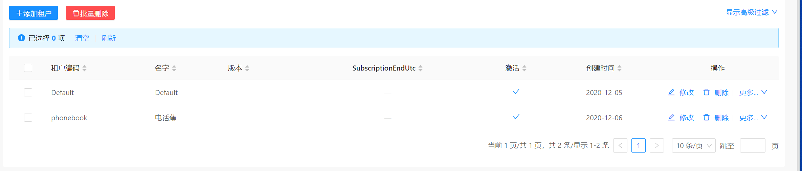
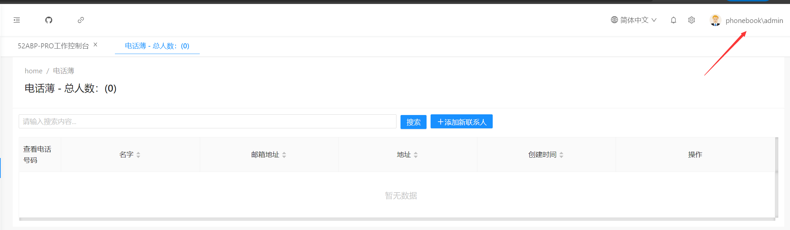
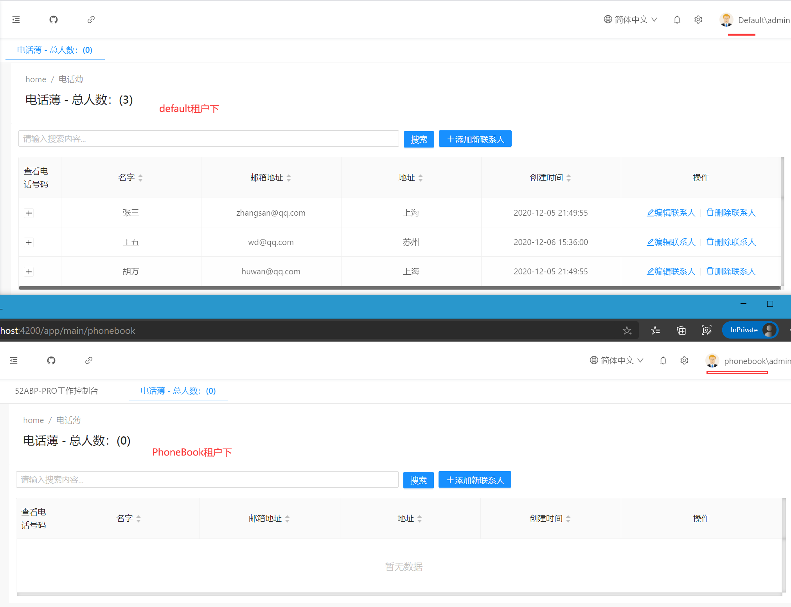

# 运行应用程序验证多租户下的数据隔离

好的，到目前为止，我们的一个基于多租户打造的电话薄项目已经完成了。

现在我们运行程序，登录**Host**宿主账号。

登录后，打开 **租户管理**创建一个新**租户**，命名为"phonebook"，如下图：

我给这个租户取名为`phonebook`，创建完成后当前应用程序就有两个租户了。

 
 接下来，你可以打开两个不同的浏览器，分别登录`default`和`phonebook`两个租户，我们切换租户到`phonebook`下，登录后，访问电话薄项目它的联系人信息为空.

而在`default`租户下的电话薄数据还存在。

以上便实现了多租户的数据隔离，而整个的开发方式也很简单。

## 接下来

- [52ABPPRO源代码下载和总结](23.Develop-Angular-The-End.md)