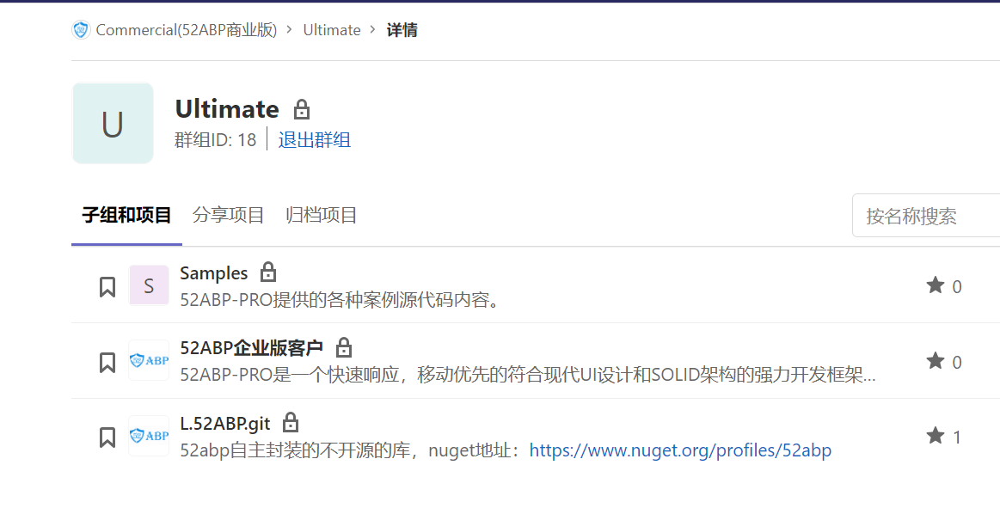

# 52ABPPRO源代码下载和总结

在本系列教程文档中，我们制作了一个基于多租户、多语言的完整应用实例。可以说是一般合格的最佳开发实践。里面涵盖了52abp和abp系统中的大部分功能，希望你看了这个案例后，在开发属于自己应用程序的时候会更加的方便。

同时，我也知道不同的人开发功能起来，会使用不同的方法。在ABP框架中，它只是提供了一种体系结构，不会限制您找到属于自己的开发方式。他们是可以共存的。

## 代码生成器

我们推荐您使用 **代码生成器**工具，配合52ABP-PRO框架进行开发，它的存在会大幅提升您的开发速度。

具体你可以参考文档：[52ABP-PRO代码生成器介绍](/docs/52ABP-Power-Tools-Intro.md)

 

## 当前案例的源代码下载

首先您是[**付费客户**](https://www.52abp.com/Purchase),购买后。您可以从私有gitlab仓库中获得示例项目：[https://code.52abp.com/commercial/ultimate/samples](https://code.52abp.com/commercial/ultimate/samples)

