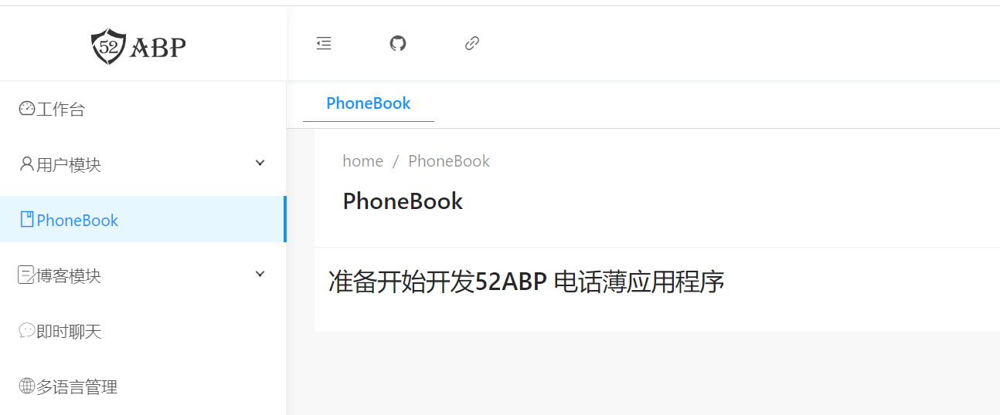

# 创建一个前端PhoneBook组件

在**src\app\main**文件夹中创建一个**phonebook**文件夹，并在文件夹中创建一个typescript文件(**phonebook.component.ts**)，添加以下代码：

```ts
import { Component, ChangeDetectionStrategy, Injector } from '@angular/core';
import { appModuleAnimation } from '@shared/animations/routerTransition';
import { AppComponentBase } from '@shared/component-base';

@Component({
  templateUrl: './phonebook.component.html',
  styleUrls: ['./phonebook.component.less'],
  animations: [appModuleAnimation()],
  changeDetection: ChangeDetectionStrategy.OnPush,
})
export class PhoneBookComponent extends AppComponentBase {
  constructor(
    injector: Injector,
  ) {
    super(injector);
  }
}
```

**PhoneBookComponent**继承自**AppComponentBase**，它提供了一些常见的功能和字段（例如本地化和访问控制、路由守卫），你可以不用继承它，但推荐你继承它，因为有了基类，可以使我们的代码工作可以更轻松。


## 样式表

我们正在使用LESS文件来样式化组件。我们创建了一个名为phonebook.component.less的文件（位于phonebook文件夹中），其内容为空。

你可以在里面写自定义样式，我们的组件采用的是NgZorro，可以参考它的样式内容。
 

```typescript
@Component({
  templateUrl: './phonebook.component.html',
  styleUrls: ['./phonebook.component.less'],
  animations: [appModuleAnimation()],
})
```


## 组件路由注册

现在，打开 **main-routing.module.ts**模块，我们需要在此处定义路由和导入我们的**PhoneBookComponent**类：

```js
import { PhoneBookComponent } from './phonebook/phonebook.component';

```
然后在Route类中，添加子项：

```js
      { path: 'phonebook', component: PhoneBookComponent },
```

> 注意，path的值`phonebook`需要与Menu菜单项中的link对应。

在我们定义的**phonebook**文件夹中，我还需要创建html文件：`phonebook.component.html`
和样式表文件Less: `phonebook.component.less`。

在`phonebook.component.html`文件中，添加以下代码：

```js
<page-header [title]="l('PhoneBook')"></page-header>

<nz-card [nzBordered]="false">
  <div class="mb-md">
    <h2>准备开始开发52ABP 电话薄应用程序</h2>
  </div>
</nz-card>
```


## 将组件注册到模块

现在，打开**main.module.ts**模块，将声明的 **PhoneBookComponent**组件注册到**MainModule**中，代码如下：

```bash
import { NgModule } from '@angular/core';
import { CommonModule } from '@angular/common';
import { MainRoutingModule } from './main-routing.module';
import { DashboardComponent } from './dashboard/dashboard.component';
import { HttpClientModule } from '@angular/common/http';
import { SharedModule } from '@shared/shared.module';
import { AbpModule } from 'abp-ng2-module';
import { AboutComponent } from './about/about.component';
import { AdvertisingComponent } from './advertising/advertising.component';
import { CustomNgZorroModule } from '@shared/ng-zorro';
import { PhoneBookComponent } from './phonebook/phonebook.component';
@NgModule({
  imports: [CommonModule, HttpClientModule, SharedModule, AbpModule, CustomNgZorroModule, MainRoutingModule],
  declarations: [
  DashboardComponent, 
  AboutComponent, 
  AdvertisingComponent, 
  PhoneBookComponent
  ],
  entryComponents: [AdvertisingComponent],
  providers: [],
})
export class MainModule {}
```


添加了导入语句，并将`PhoneBookComponent`添加到了声明数组。

现在将`PhoneBookComponent`添加到了声明(declarations)集合，我们可以刷新页面以查看新添加的页面。



 > 注意：当对应用程序中的任何文件进行任何更改时，Angular-cli都会自动重新编译并刷新页面。
 
 
## 接下来

- [在ABP框架中定义Person实体类](4.Creating-Person-Entity.md)
