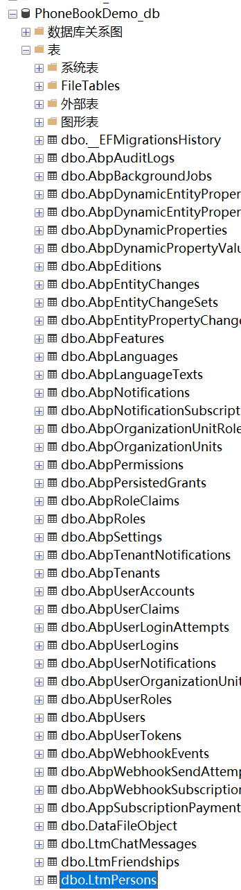

# 同步Person实体到数据库中创建映射表

我们使用 **Entity Framework** 的 Code-First开发模式来执行，数据库表的迁移功能，来迁移数据库。

 由于我们添加了**Person** 实体，因此我们的DbContext上下文模型也发生了改变。
  因此，我们应该添加一个新的迁移记录，来创建数据库中的新表。
  
 
打开“程序包管理控制台”，选择**EntityFrameworkCore**，运行

`Add-Migration Added_Persons_Table`   ，命令如下：

 


执行成功后，会生成迁移文件，代码如下。

如果你想知道关于迁移功能的使用，请看 [Entity Framework Core 迁移功能](https://www.52abp.com/yoyomooc/50.entity-framework-core-migrations)
 
 ```csharp
 namespace YoyoSoft.PhoneBookDemo.Migrations
{
     public partial class Added_Persons_Table : Migration
    {
        protected override void Up(MigrationBuilder migrationBuilder)
        {
            migrationBuilder.CreateTable(
                name: "LtmPersons",
                columns: table => new
                {
                    Id = table.Column<Guid>(nullable: false),
                    CreationTime = table.Column<DateTime>(nullable: false),
                    CreatorUserId = table.Column<long>(nullable: true),
                    LastModificationTime = table.Column<DateTime>(nullable: true),
                    LastModifierUserId = table.Column<long>(nullable: true),
                    IsDeleted = table.Column<bool>(nullable: false),
                    DeleterUserId = table.Column<long>(nullable: true),
                    DeletionTime = table.Column<DateTime>(nullable: true),
                    Name = table.Column<string>(maxLength: 50, nullable: false),
                    EmailAddress = table.Column<string>(maxLength: 250, nullable: true),
                    Address = table.Column<string>(maxLength: 250, nullable: true)
                },
                constraints: table =>
                {
                    table.PrimaryKey("PK_LtmPersons", x => x.Id);
                });
        }

        protected override void Down(MigrationBuilder migrationBuilder)
        {
            migrationBuilder.DropTable(
                name: "LtmPersons");
        }
    }
}
 
 ```

我们不必对此文件的格式和规则了解太多。但建议你对它还是要有所了解，现在回到程序包管理器控制台，输入 **Update-Database** 命令，它会将迁移记录应用到数据库中。更新后，我们可以看到 `LtmPersons`表，已经添加到了数据库中。

 


但是这个新表是空的。在框架中，有一些类可以为用户和设置一些初始数据：

 


因此我们可以添加一个初始化 Person 数据的类文件`DefaultPeopleInfoCreator`，它会更新数据到数据库中，代码如下。

```csharp

namespace YoyoSoft.PhoneBookDemo.Seed.Host
{
    internal class DefaultPeopleInfoCreator
    {
        private readonly PhoneBookDemoDbContext _context;

        public DefaultPeopleInfoCreator(PhoneBookDemoDbContext context)
        {
            _context = context;
        }

        public void Create()
        {
            var zhangsan = _context.Persons.FirstOrDefault(p => p.EmailAddress == "zhangsan@qq.com");
            if (zhangsan == null)
            {
                _context.Persons.Add(
                    new Person
                    {
                        Name = "张三",
                        Address = "上海",
                        EmailAddress = "zhangsan@qq.com"
                    });
            }

            var huwan = _context.Persons.FirstOrDefault(p => p.EmailAddress == "huwan@qq.com");
            if (huwan == null)
            {
                _context.Persons.Add(
                    new Person
                    {
                        Name = "胡万",
                        Address = "上海",
                        EmailAddress = "huwan@qq.com"
                    });
            }
        }
    }
}
```

 这些类型的默认数据很好，因为我们也可以在**单元测试**中使用这些数据。

当然，我们应该注意**种子数据**，因为此代码将始终在**PhoneBookEntityFrameworkCoreModule**的每个**PostInitialize**中执行。


此类（**DefaultPeopleInfoCreator**）在**InitialHostDbBuilder**类中创建并调用。

这个是为了便于我们更好和更规范的管理源代码。 

```csharp

 public class InitialHostDbBuilder
    {
      // 其他代码
        public void Create()
        {
       
  // 其他代码
            new DefaultPeopleInfoCreator(_context).Create();

            _context.SaveChanges();
        }
    }
```   
 
 现在重新运行我们的项目，然后成功后，重新打开我们的`LtmPersons`数据库表，会发现两条数据，已经添加到其中了。


  

  

## 接下来

- [在ABP框架中创建Person的应用服务](6.Creating-Person-Application-Service.md)			
