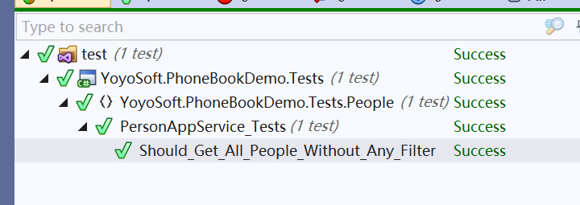

# ABP框架中为Person应用服务创建单元测试

如果您对自动化测试不感兴趣，则可以跳过此部分。

通过编写**单元测试**，我们可以测试`PersonAppService.GetPeople`方法而无需创建用户界面。

我们在解决方案的`.Tests`项目中编写单元测试。

## 单元测试中的多租户

由于我们禁用了多租户，因此我们也应该将其禁用以用于单元测试。

重建并运行单元测试后，您将看到跳过了一些测试（这些测试与多租户相关）。

让我们创建第一个测试来验证方法的返回内容,代码如下。


```csharp

namespace YoyoSoft.PhoneBookDemo.Tests.People
{
    public class PersonAppService_Tests:PhoneBookDemoTestBase
    {
        private readonly IPersonApplicationService _personAppService;

        public PersonAppService_Tests()
        {
            _personAppService = Resolve<IPersonApplicationService>();
        }

        [Fact]
        public void Should_Get_All_People_Without_Any_Filter()
        {
            //执行方法
            var persons = _personAppService.GetPeople(new GetPeopleInput());

            //断言
            persons.Items.Count.ShouldBe(2);
        }
    }
}

```

我们从`AppTestBase`派生的`PhoneBookDemoTestBase`测试基类。`PhoneBookDemoTestBase`类会初始化所有系统，创建内存中的伪数据库，将我们之前创建的 **种子数据** 播种到数据库中，并以admin身份登录到应用程序中。

因此，这实际上是一个**集成测试**，因为它测试从**EntityFramwork**映射到**应用程序服务**，其中包含了用户验证和授权的行为，以及涉及的服务器端代码。


在构造函数中，我们从依赖注入容器中获取（解析）一个IPersonAppService。它创建了它的依赖项的PersonAppService类。然后我们可以在测试方法中使用它。


由于我们使用的是xUnit，因此我们向每个测试方法添加`Fact`属性。

在测试方法中，我们调用`GetPeople`方法并检查返回的列表中是否有**两个人**，因为我们知道初始数据库中有两个人。


让我们在“**测试资源管理器**”中运行所有单元测试，看看它是否有效：


  
如您所见，它成功运行。现在，我们知道**PersonAppService**无需任何过滤器即可正常运行。

让我们添加一个新的单元测试，通过设置查询条件来获取信息：
 

```csharp
    [Fact]
            public void Should_Get_People_With_Filter()
            {
                //执行方法
                var persons = _personAppService.GetPeople(
                    new GetPeopleInput
                    {
                        Filter = "zhangsan@qq.com"
                    });

                //断言的结果
                persons.Items.Count.ShouldBe(1);
                persons.Items[0].Name.ShouldBe("张三");
                persons.Items[0].EmailAddress.ShouldBe("zhangsan@qq.com");
            }
```


由于我们知道有什么种子数据，因此可以轻松检查返回的结果。因此，种子数据的设定很重要。

当我们更改初始数据时，即使我们的服务方法正确，我们的测试也可能失败，因为数据发生了变动。

因此， 最好编写尽可能独立于初始数据的单元测试。

在当前的单元测试中，我们可以检查传入的数据，以查看每个人的姓名，电子邮件中是否包含"zhangsan@qq.com"的信息。

因此，即使我们在种子数据中添加新的人员，则测试信息仍然有效。


单元测试有很多技术，在这里保持简单。这是因为通过ABP框架的模板使通过基类和预构建测试代码编写单元测试和集成测试变得非常容易。


 
## 下一篇

- [在Angular组件中实现查询People的方法](8.Using-GetPeople-Method-from-Angular.md)