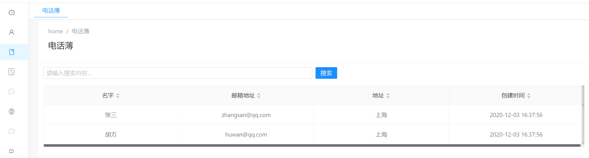

# 在Angular组件中实现查询People的方法


现在，我们可以切换到Angular客户端，并使用GetPeople方法在UI上显示人员列表。

## 生成服务代理类

首先，运行（最好使用Ctrl + F5它会更快）服务器端应用程序（.Web.Host项目）。
然后在Angular客户端上运行`nswag/refresh.bat`文件以重新生成服务代理类（它们用于调用服务器端服务方法）。

由于添加了新服务，因此应将其添加到`src/shared/service-proxies/service-proxy.module.ts`中。
打开service-proxy.module.ts，然后将**ApiServiceProxies.PersonServiceProxy**添加到providers数组中即可。

> 仅当我们添加新服务时才需要执行此步骤。如果我们更改现有服务，则不需要它。

## Angular-Cli守护失效

有时`angular-cli`无法理解文件更改。在这种情况下，请将其停止，然后重新运行`npm start`命令。

## 完善PhoneBookComponent的TS类
 
 修改**phonebook.component.ts**，补充代码如下：

 ```typescript
import { Component, ChangeDetectionStrategy, Injector, OnInit } from '@angular/core';
import { appModuleAnimation } from '@shared/animations/routerTransition';
import { AppComponentBase } from '@shared/component-base';
import { PersonListDto, PersonServiceProxy } from '@shared/service-proxies';

@Component({
  templateUrl: './phonebook.component.html',
  styleUrls: ['./phonebook.component.less'],
  animations: [appModuleAnimation()],
})
export class PhoneBookComponent extends AppComponentBase implements OnInit {

  people: PersonListDto[] = [];
  filter: string = '';

  constructor(
    injector: Injector,
    private _personService: PersonServiceProxy


  ) {
    super(injector);
  }

  ngOnInit(): void {
    this.getPeople();
  }

  getPeople(): void {
    this._personService.getPeople(this.filter).subscribe((result) => {
      this.people = result.items;
    });
  }

}

 ``` 

 我们注入**PersonServiceProxy**，调用其getPeople方法并接收其获取结果。
 
 在**ngOnInit**函数（在Angular的OnInit接口中定义）中执行此操作。 将返回的项目分配给PersonListDto类成员。

## 在Angular视图中渲染数据

现在，我们可以从视图`phonephone.component.html`中循环遍历people成员：

```html
<page-header [title]="l('PhoneBook')"></page-header>

<nz-card [nzBordered]="false">
  <div class="mb-md" style="background: #ececec; padding: 30px">
    <div nz-row [nzGutter]="8">
      <div nz-col [nzSpan]="8" *ngFor="let person of people">
        <nz-card [nzTitle]="person.name">
          <h4>{{ person.name + ' ' + person.address }}</h4>
          <p>{{ person.emailAddress }}</p>
        </nz-card>
      </div>
    </div>
  </div>
</nz-card>

```
我们使用了 **ngFor** 指令对 people的数据集合进行了遍历循环，样式排版采用了NgZorro的设计，效果如下：


可以看到，我们已成功从数据库查询出的人员列表到页面上了。
  

## 关于显示表格数据


我们通常使用基于JavaScript的所提供的第三方表格组件来进行数据的渲染。但是在这里我们更多的想展示数据的渲染机制和内容，因此没有采用数据表格渲染。

接下里你可以修改html中的代码如下,使用ng-zorro提供的表格组件，代码如下：

```html
<page-header [title]="l('PhoneBook')"></page-header>

<nz-card [nzBordered]="false">
  <div class="mb-md">
    <div nz-row nzGutter="8">
      <!-- 模糊搜索框 -->
      <div nz-col nzSpan="8" nzMd="12" nzXs="24" nzSm="24">
        <input
          type="text"
          nz-input
          [(ngModel)]="filter"
          (keyup.enter)="getPeople()"
          [placeholder]="l('SearchWithThreeDot')"
        />
      </div>
      <!-- 查询和刷新按钮 -->
      <div nz-col nzSpan="8" nzMd="12" nzXs="24" nzSm="24">
        <button nz-button nzType="primary" type="submit" (click)="getPeople()">
          <span>{{ l('Search') }}</span>
        </button>
      </div>
    </div>
  </div>

  <nz-table
    #ajaxTable
    nzBordered="true"
    [nzData]="people"
    [nzShowSizeChanger]="true"
    [nzShowQuickJumper]="true"
    [nzNoResult]="noDataTemplate"
    [nzFrontPagination]="false"
    [nzScroll]="{ x: '1300px', y: '550px' }"
  >
    <!-- 暂无数据组件 -->
    <ng-template #noDataTemplate>
      <no-data></no-data>
    </ng-template>

    <!-- 表头 -->
    <thead class="text-center">
      <tr>
        <th nzLeft="0px" class="text-center" nzWidth="200px" nzShowSort nzSortKey="Name">
          <span>{{ l('Name') }}</span>
        </th>

        <th class="text-center" nzWidth="200px" nzShowSort nzSortKey="EmailAddress">
          <span>{{ l('EmailAddress') }}</span>
        </th>
        <th class="text-center" nzWidth="200px" nzShowSort nzSortKey="Address">
          <span>{{ l('Address') }}</span>
        </th>

        <th class="text-center" nzShowSort nzWidth="200px" nzSortKey="CreationTime">
          <span>{{ l('CreationTime') }}</span>
        </th>
      </tr>
    </thead>
    <!-- 表格内容 -->
    <tbody>
      <tr *ngFor="let item of ajaxTable.data">
        <td nzLeft="0px" class="text-center">
          <ellipsis lines="1" tooltip>
            <span nz-tooltip [nzTooltipTitle]="item.name">
              {{ item.name }}
            </span>
          </ellipsis>
        </td>

        <td class="text-center">
          <ellipsis lines="1" tooltip>
            <span nz-tooltip [nzTooltipTitle]="item.emailAddress">
              {{ item.emailAddress }}
            </span>
          </ellipsis>
        </td>
        <td class="text-center">
          <ellipsis lines="1" tooltip>
            <span nz-tooltip [nzTooltipTitle]="item.address">
              {{ item.address }}
            </span>
          </ellipsis>
        </td>

        <td class="text-center">
          <ellipsis lines="1" tooltip>
            <span nz-tooltip [nzTooltipTitle]="item.creationTime | _moment">
              {{ item.creationTime | _moment }}
            </span>
          </ellipsis>
        </td>
      </tr>
    </tbody>
  </nz-table>
</nz-card>


```

保存后，效果如下：




以上方法中，还添加了一个搜索功能，你可以在文本框中输入"张"以实现模糊搜索功能。


## 下一篇

- [如何在ABP框架中添加一个联系人信息](9.Creating-New-Person-Method.md)