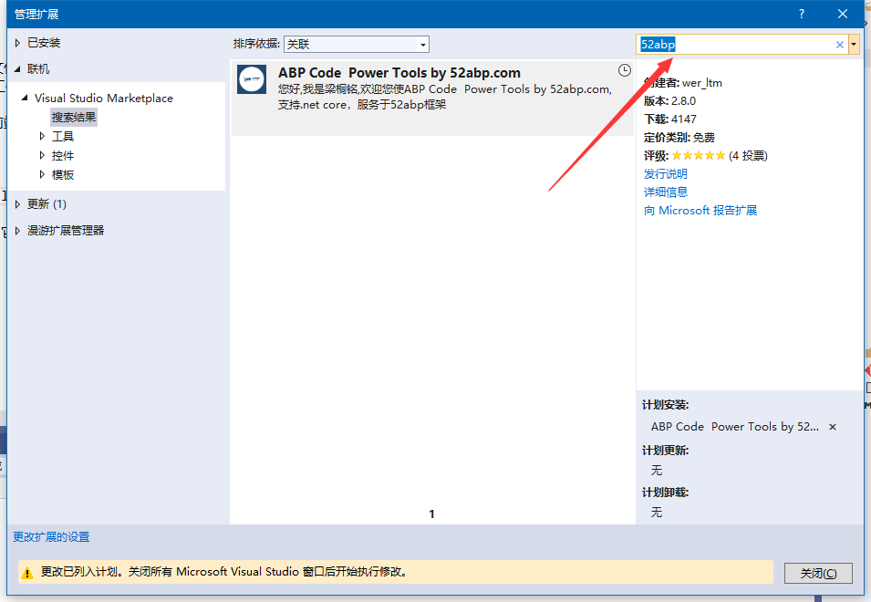
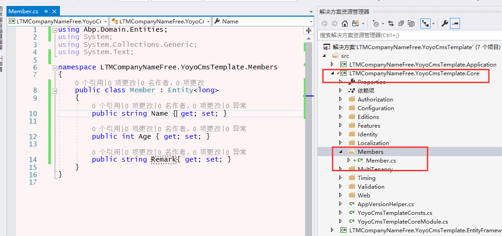
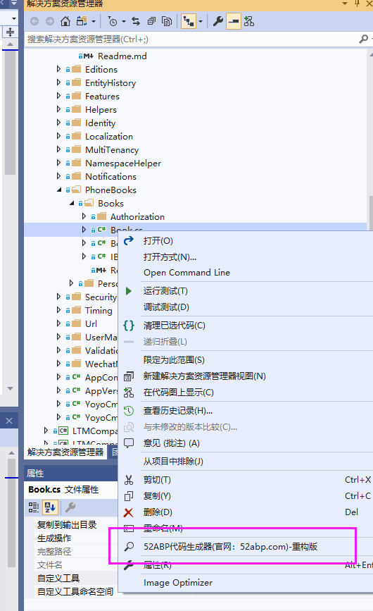
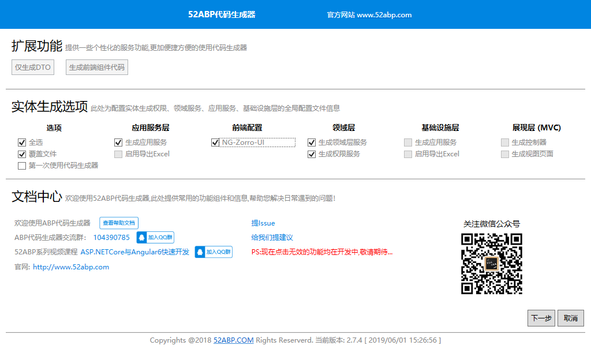
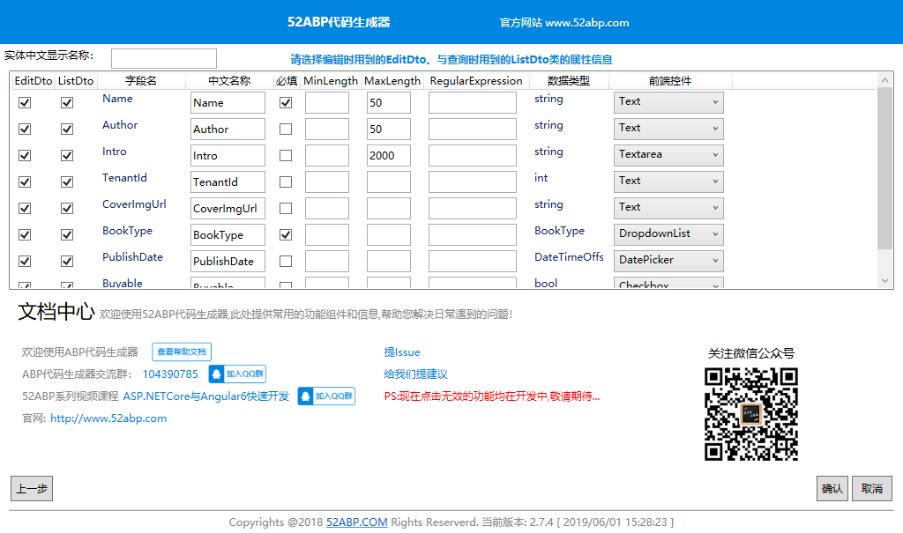
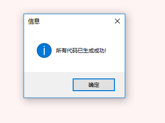
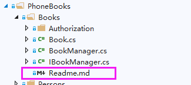
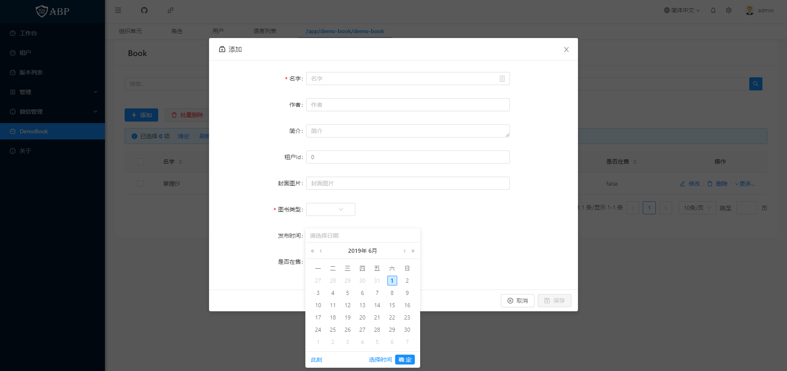

# 在Visual Studio2017/2019中使用52ABP代码生成器开发使用指南

> 本文作者：52ABP开发团队  
> 文章会随着版本进行更新，关注我们获取最新版本  
> 本文出处：[https://www.52abp.com/wiki/52abp/latest](https://www.52abp.com/wiki/52abp/latest)  
> 源代码： https://www.github.com/52abp  

 

## 介绍

在本文档中，我们会给您介绍代码生成器生成的文件并向您解释这些文件的作用。使用代码生成器是为了最大限度地减少创建新实体的工作量。帮助我们提升效率，远离996。

它通过定义实体来创建所有相关层的文件，包括前端UI界面。

## 下载并安装

如果您还没有安装代码生成器，您可以通过visual Studio市场中[下载](https://marketplace.visualstudio.com/items?itemName=werltm.52ABPCodeGenerator)，它支持VS2017和2019。或者通过在Visual Studio上的扩展更新上安装它。

打开VS,找到顶部菜单中的**工具** 选项,打开 **工具** 选项中的 **扩展和更新**, 然后选择 **联机** ,输入**52ABP** 安装最新的代码生成器。

## 如何使用呢？

在您的项目中，在项目中的Core层上，选择一个实体，进行右键。点击**52ABP代码生成器**，运行后弹出界面。

选择您所需要的对应服务

选择好了之后直接点击 确认 ,进入Dto配置界面，在这里勾选配置Dto要用到的字段、校验、字段对应的前端控件等等。 选择好了之后，直接点击确认，开始生成代码

代码生成成功后，会弹出

的提示内容。

**警告**：在运行此工具之前，请确保已保存您的工作，因为它将添加新文件并修改某些现有文件。我们强烈建议使用源代码控制系统（如Git）。否则，备份您的项目。

### 后续的步骤

生成后的代码会在Core层，创建一个Readme.md文件，您可以在这里进行后续的操作。
如果您还有其他疑问，可以参考博文：[[52ABP系列] - 002、模板项目配合代码生成器开发](https://www.52abp.com/BlogDetails/2) https://www.52abp.com/BlogDetails/2

## 生成的文件

如果我们选择一个实体，名字叫做“Book.cs”。那么我们通过代码生成器会创建或者修改的文件列表如下：。

### 服务端

#### Core层：
- DemoBookManager.cs
- IDemoBookManager.cs
- DemoBookAppPermissions.cs
- DemoBookAuthorizationProvider.cs
- Readme .md

#### Application层：

- DemoBookAppService.cs
- IDemoBookAppService.cs
- DemoBookMapper.cs
- CreateOrUpdateDemoBookInput.cs
- DemoBookListDto.cs
- DemoBookEditDto.cs
- GetDemoBookForEditOutput.cs
- GetDemoBooksInput.cs

#### EntityFrameworkCore层：

- DemoBookCfg.cs

### Angular客户端

- demo-book-routing.module.ts
- demo-book.module.ts
- demo-book.component.ts
- demo-book.component.less
- demo-book.component.html
- create-or-edit-demo-book.component.ts
- create-or-edit-demo-book.component.less
- create-or-edit-demo-book.component.html

## 最终运行效果

 

如果你在使用中代码生成器遇到了什么问题，您可以在[GitHub](https://github.com/52ABP/52ABP.CodeGenerator)上报告您的问题或提出问题。

来文档中心了解更多：https://www.52abp.com/wiki/ 

### 微信关注我们不走丢

