# GooglePlus社交登陆应用配置

> 本文作者：52ABP开发团队  
> 文章会随着版本进行更新，关注我们获取最新版本  
> 本文出处：[https://www.52abp.com/wiki/52abp/latest](https://www.52abp.com/wiki/52abp/latest)  
> 源代码： https://www.github.com/52abp  

<!-- 简单的图文介绍: 关联代码位置 -->
配置流程:
---
- 访问[console.developers.google.com](https://console.developers.google.com/projectcreate?organizationId=0), 创建一个项目(Project):
  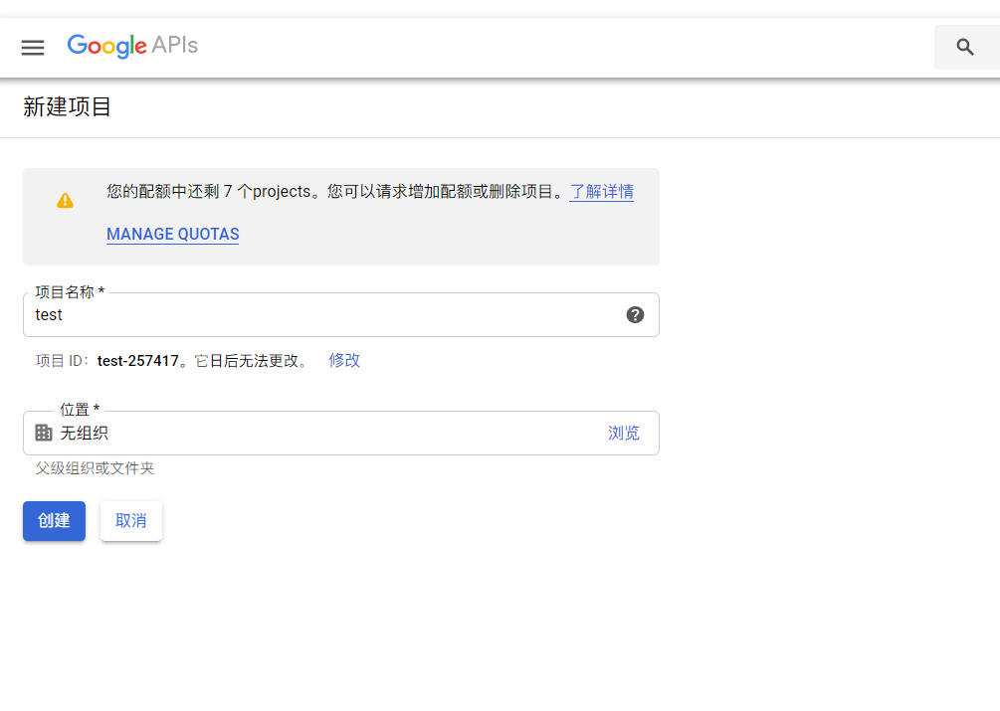
  项目创建后结果如下:
  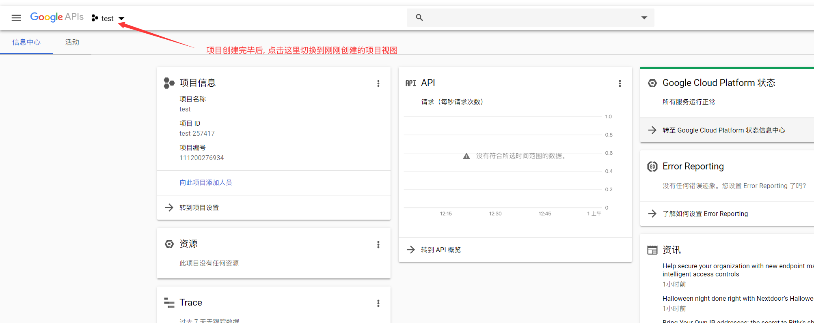
- 项目创建完成后, 向项目中接入GooglePlus服务
    - 进入信息中心
    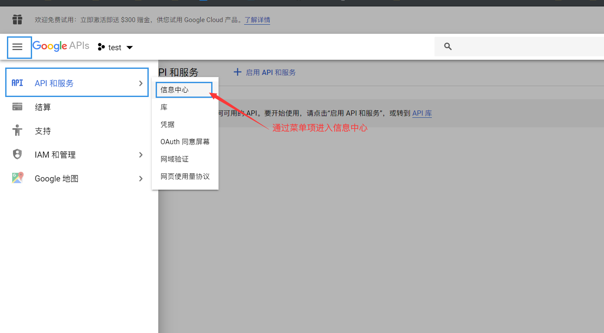
    - 创建api服务
    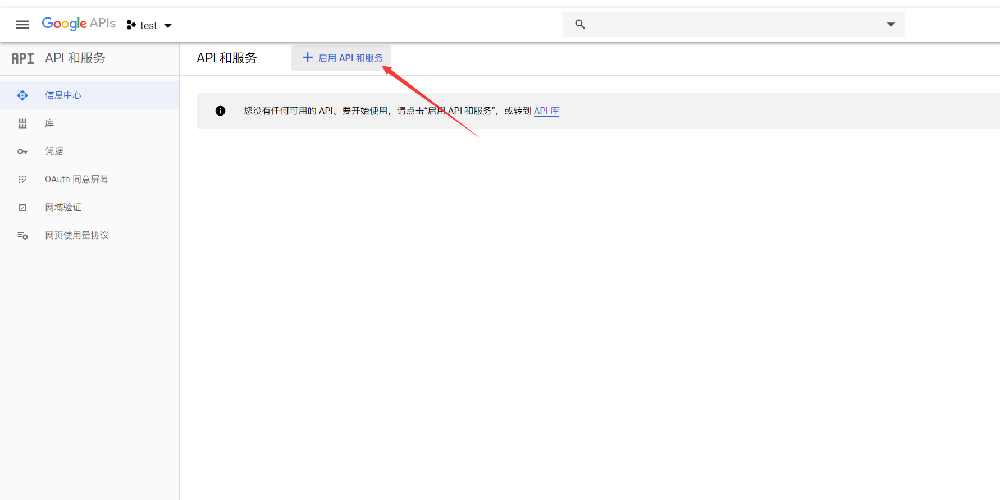
    - 在api服务中搜索`Google Plus`
    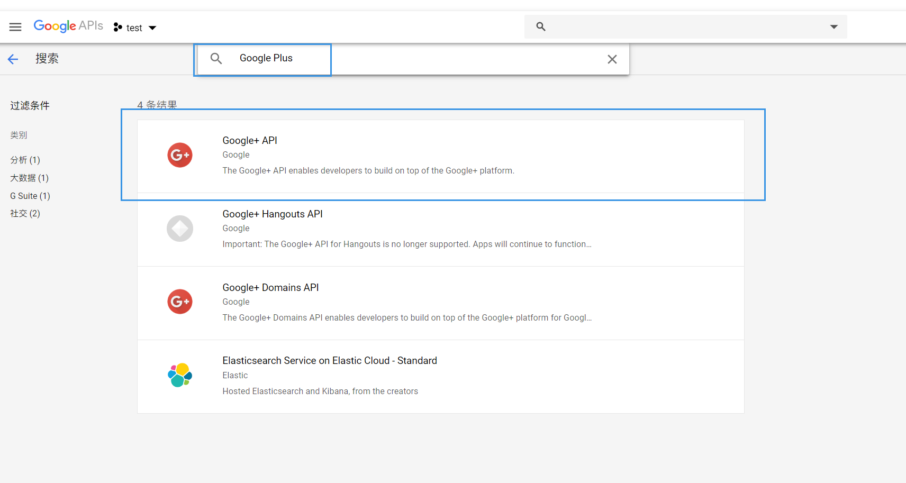
    - 启用`Google Plus`服务
    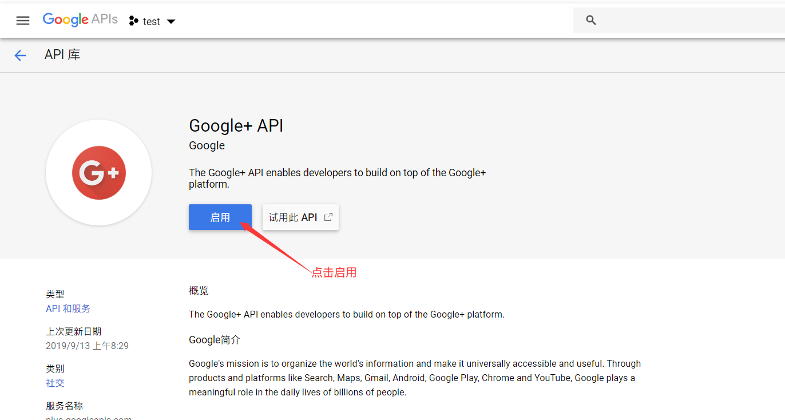
    - 启用服务后, 需要创建社交登陆所需的相关凭据
    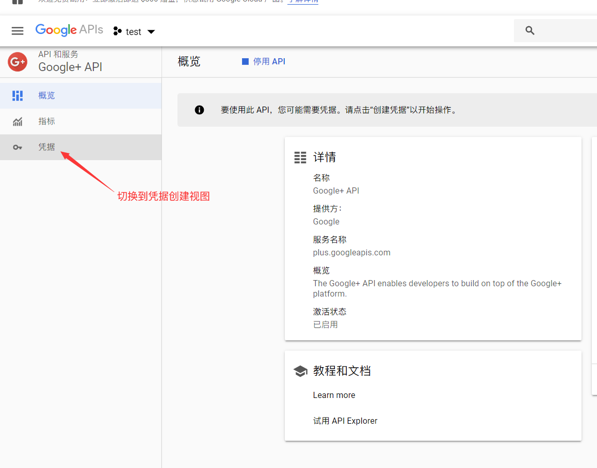
        - 在配置凭据之前, 需要先行配置授权页面信息
        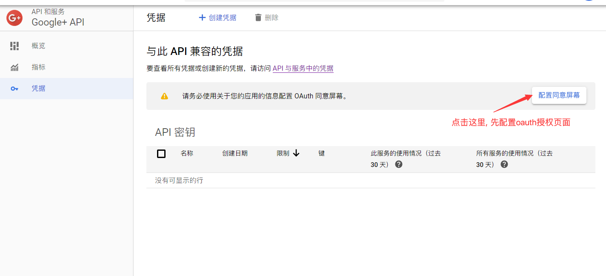
        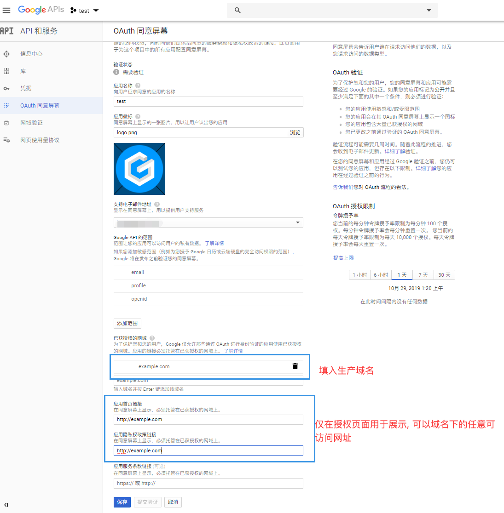
        - 再次回到凭据创建页面, 开始创建我们的OAuth凭据
        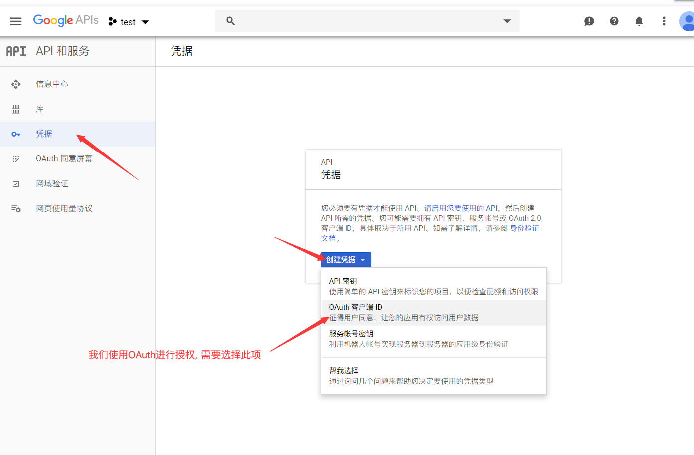
        可以参考的配置如下:
        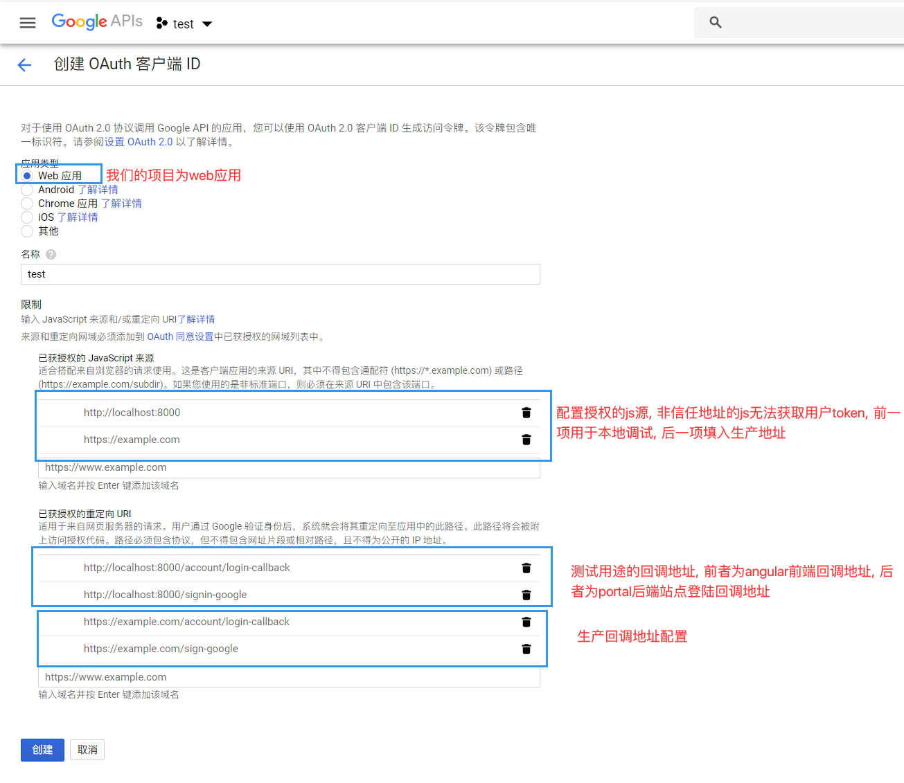
    - 创建完成后跳转, 即可获取到我们所需要的client id和client secret, 复制填入配置文件即可
    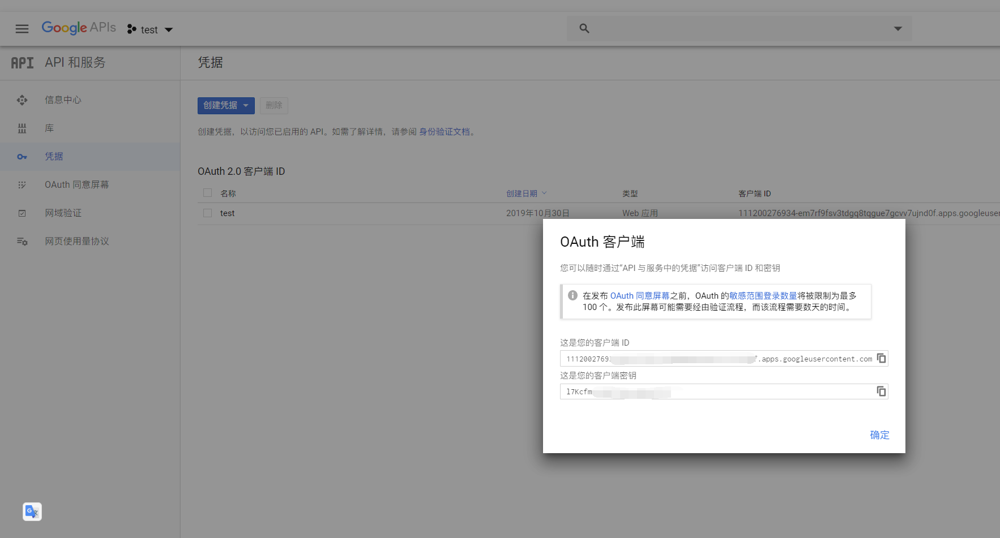
来文档中心了解更多：https://www.52abp.com/wiki/

### 微信关注我们不走丢

