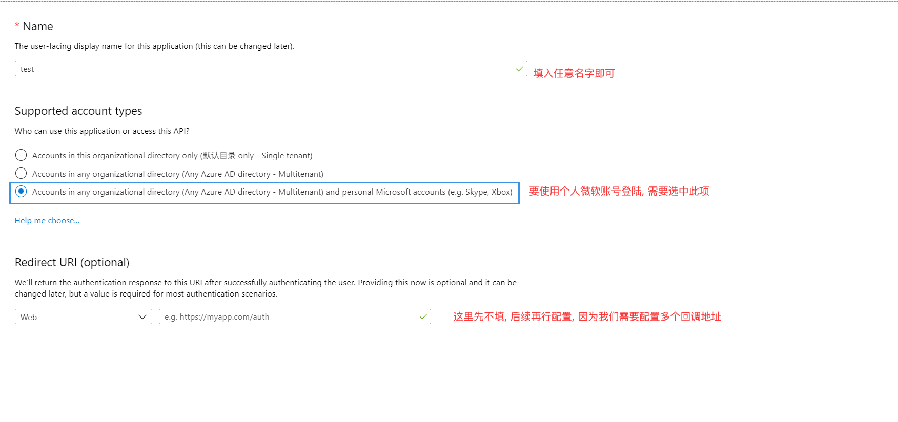

# 微软社交登陆应用配置

> 本文作者：52ABP开发团队  
> 文章会随着版本进行更新，关注我们获取最新版本  
> 本文出处：[https://www.52abp.com/wiki/52abp/latest](https://www.52abp.com/wiki/52abp/latest)  
> 源代码： https://www.github.com/52abp  

<!-- 简单的图文介绍: 关联代码位置 -->
配置流程:
---
- 访问[Azure.com](https://portal.azure.com/#blade/Microsoft_AAD_RegisteredApps/ApplicationsListBlade), 创建一个应用程序注册(App Registration):
  
- 填入相关必填项, 创建应用
  
  应用创建后结果如下, 可以在此结果页获取到我们所需要的client id
  
- 应用创建完成后, 进行应用的后续配置
    - 应用基本信息配置
    
    - 应用授权回调相关配置
    
    - 生成client secret
    
来文档中心了解更多：https://www.52abp.com/wiki/

### 微信关注我们不走丢

