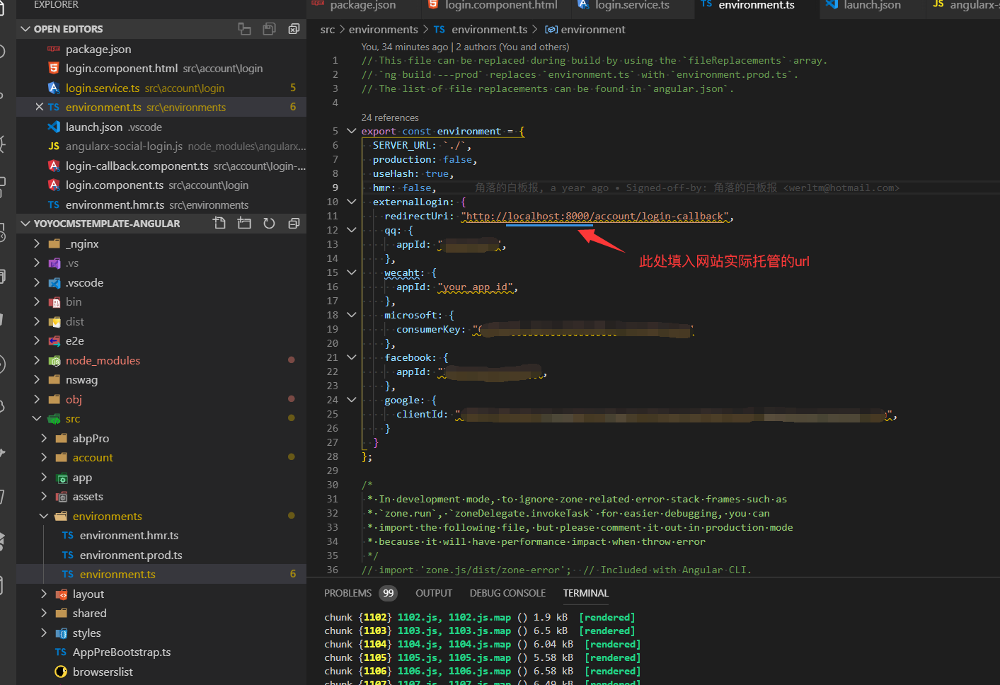

# 社交登陆

> 本文作者：52ABP开发团队  
> 文章会随着版本进行更新，关注我们获取最新版本  
> 本文出处：[https://www.52abp.com/wiki/52abp/latest](https://www.52abp.com/wiki/52abp/latest)  
> 源代码： https://www.github.com/52abp  

<!-- 简单的图文介绍: 关联代码位置 -->
功能介绍：
---

使用社交登陆, 用户可以免除繁杂的注册及账号校验流程.

配置流程:
---
1. 在社交登陆服务提供商的开发者中心注册社交登陆的应用, 具体的配置流程参考下列文章
    - QQ
    - Wechat
    - [Microsoft](Features-52ABP-External-Login-Microsoft.md)
    - [Facebook](Features-52ABP-External-Login-Facebook.md)
    - [Google+](Features-52ABP-External-Login-GooglePlus.md)
2. 配置社交登陆
    - Angular端: 
        - 在后台配置文件中启动对应的社交登陆功能并填入在上一步中获取到的appid和appsecret(不同的社交平台对于appid和appsecret可能有不同的叫法, 例如微软中appid称为consumerkey)
            
        - 在前端配置文件(environment.ts中)配置好对应的社交登陆的appid
            

来文档中心了解更多：https://www.52abp.com/wiki/

### 微信关注我们不走丢

