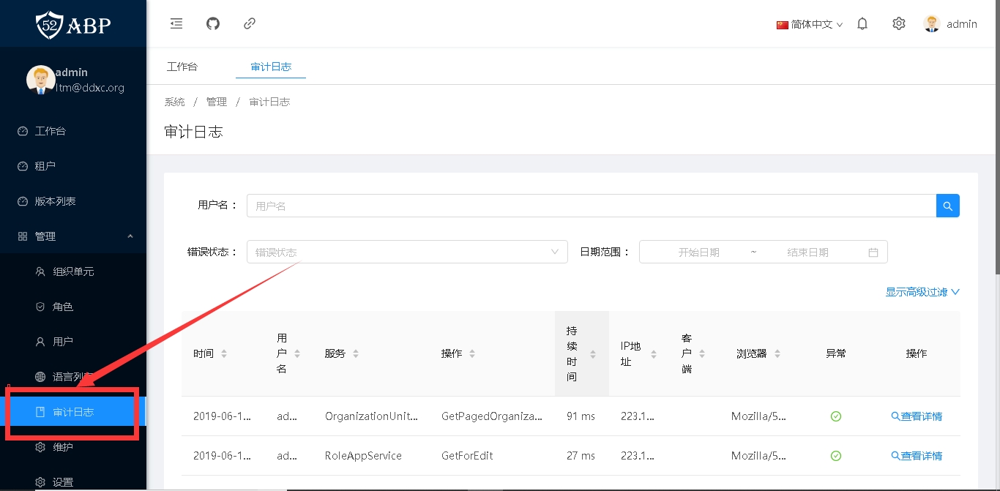

# 审计日志

> 本文作者：52ABP开发团队 </br>
> 文章会随着版本进行更新，关注我们获取最新版本 </br>
> 本文出处：[https://www.52abp.com/wiki/52abp/latest](https://www.52abp.com/wiki/52abp/latest) </br>
> 源代码： https://www.github.com/52abp </br>


<!-- 简单的图文介绍: 关联代码位置 -->
## 配置

你可以在模块初始化方法(`AbpModule.PreInitialize()`)中利用`Configuration.Auditing` 属性对审计系统进行配置。

```C#
public class MyModule : AbpModule
{
    public override void PreInitialize()
    {
    	//其他代码
        Configuration.Auditing.IsEnabled = false;
    }
}
```

以下是`Configuration.Auditing`的属性说明：

- IsEnabled: 用于设置完全启用或禁用审计系统。默认值：true。
- IsEnabledForAnonymousUsers:如果设置成ture，未登陆的用户的审计日志也会保存。默认值: false。
- Selectors:这是一个由被审计的类/接口选择器，组成的选择器列表。

默认情况下，审计日志是对所有接口都进行拦截记录的。如果某些接口你不想记录，则可以参考如下代码：

```C#
 [DisableAuditing]
 [AbpAuthorize(PermissionNames.Pages_AdminiStration_AuditLogs)]
 public class AuditLogAppService : YoyoCmsTemplateAppServiceBase, IAuditLogAppService
 {
 	//其他代码
 }
```

如果`[DisableAuditing]` 属性放在类上，则说明该类下所有接口都不做记录。如果放在某一方法上，则说明该方法不做记录。

## 使用 

在系统中，你可以在**管理** 目录下找到**审计日志** 功能，在功能页面中你可以查看所有的审计日志，如下图所示：



**审计日志** 相关后台代码在路径为`ProjectName.Application/Auditing` 的文件夹内 。


<!-- 简单的图文介绍: 效果展示 -->

<!-- 详细的图文介绍: 常见的应用场景&可能的注意事项 -->


来文档中心了解更多：https://www.52abp.com/wiki/ 

### 微信关注我们不走丢


