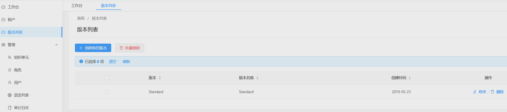
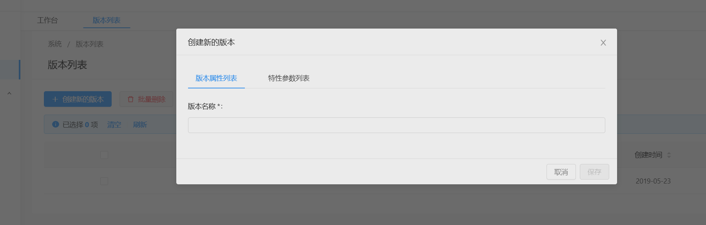
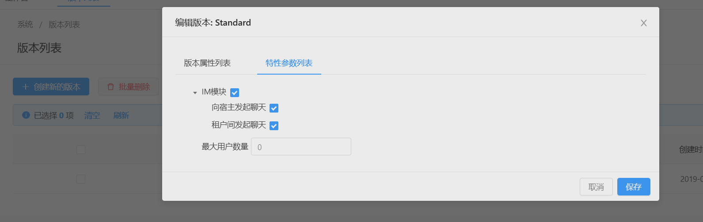

# 版本管理

> 本文作者：52ABP开发团队  
> 文章会随着版本进行更新，关注我们获取最新版本  
> 本文出处：[https://www.52abp.com/wiki/52abp/latest](https://www.52abp.com/wiki/52abp/latest)  
> 源代码： https://www.github.com/52abp  

*如果您没有开发多租户应用程序，可以跳过本节。*

大多数**SaaS**(多租户)应用程序都有**版本**的概念, 不同的**版本**具有不同的**功能**。
因此，他们可以为不同的**租户**(客户)提供不同的**价格和功能选项**。 

**版本管理**(仅在宿主登录时可用)模块用于管理应用程序的版本：

版本用于对系统的相关功能进行分组并分配给租户。我们可以点击"**创建新的版本**" 按钮创建新版本：

版本可以设定为免费或收费版本。如果是付费版，那么您需要配置月度和年度价格。
您可以允许租户在指定日期使用此版本的试用版并且通过**过期策略**来控制租户在订阅到期后使用应用程序的天数。
版本过期后，如果租户不延长订阅，您可以选择停用租户或分配给其免费版。

**编辑版本**功能选项卡用于确定版本可用的功能列表：

创建版本后，只能更改版本的名称和功能。
如果您在创建版本时出错，或者您希望用户停止订阅此版本，请删除该版本并创建另一个版本。
由于版本是[**软删除**](https://segmentfault.com/a/1190000016058823?utm_source=tag-newest)实体，因此不会从数据库中删除它，但会将其标记为已删除。

要删除版本，必须将该版本的所有租户移至另一版本。您可以参考[租户管理](Features-52ABP-NG-Tenant-Management.md)来查阅如何完成上述操作。

其他有关详细信息，请参阅[功能管理](need-help.md)和[版本管理](need-help.md)文档。

## 下一章

 -  [租户管理](Features-52ABP-NG-Tenant-Management.md)

来文档中心了解更多：https://www.52abp.com/wiki/ 

### 微信关注我们不走丢

