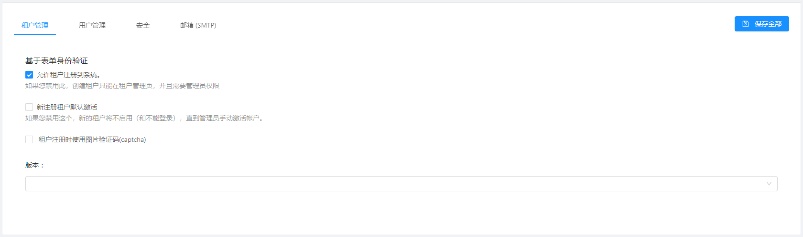
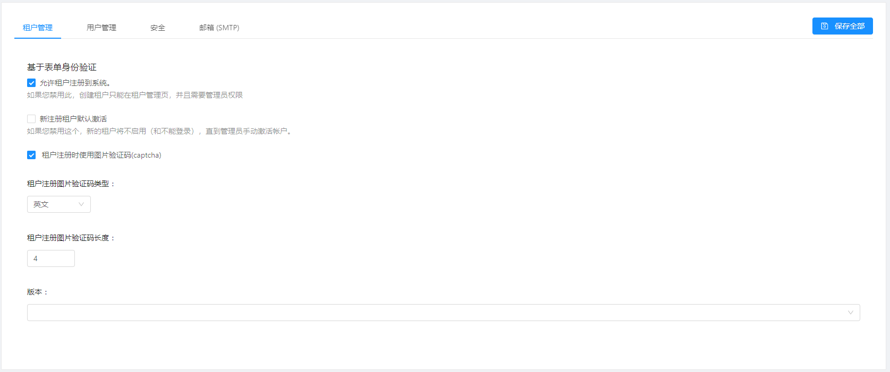
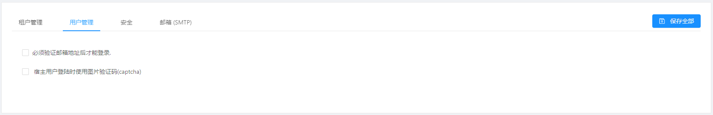
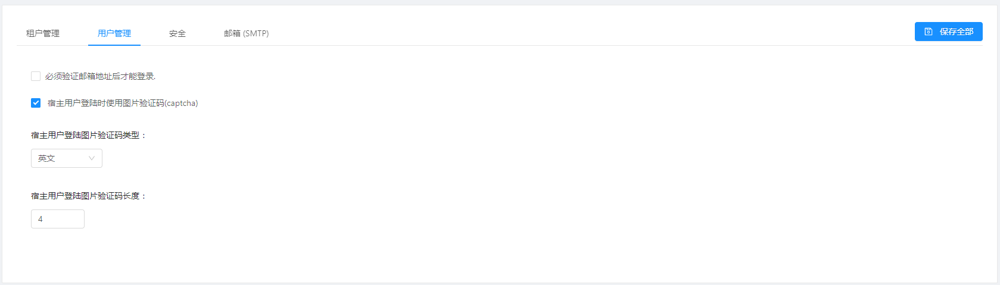
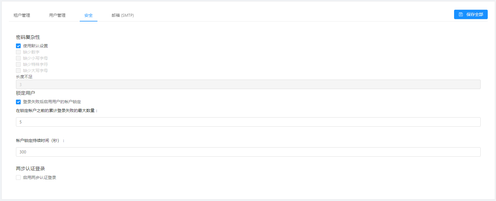
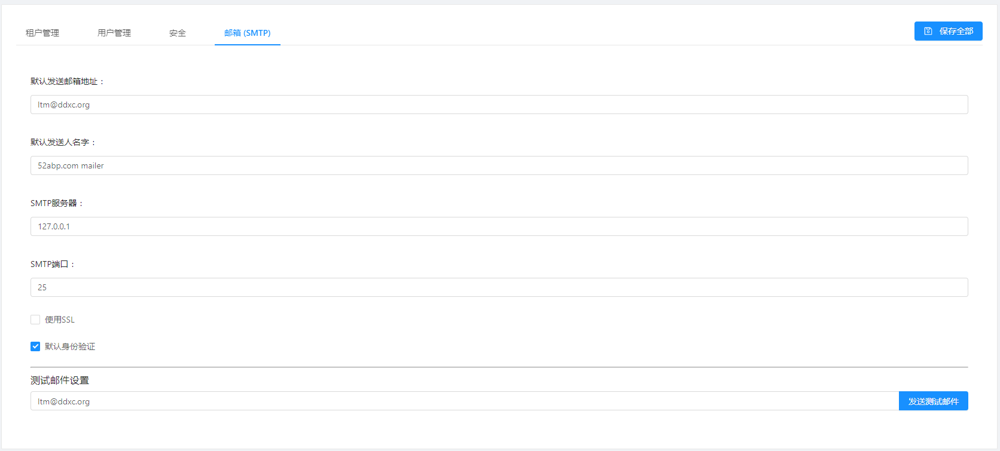

# 宿主设置

宿主设置页面用来显示和修改系统设置

## 租户管理

“租户管理”选项卡下可以启用租户管理相关的设置。

- 可以设置启用/禁用租户注册。
- 可以设置新注册的租户激活或锁定(如果你禁用这个，新的租户将不启用（和不能登录），需要管理员手动激活帐户)。
- 可以设置租户注册页面上启用/禁用验证码功能(当此项勾选时,可以设置验证码类型和验证码长度)。
  
- 可以设置租户的默认版本，因此新注册的租户将自动分配到此版本，除非租户订阅特定版本
  
## 用户管理

“用户管理”选项卡下可以启用用户相关设置。

- 可以设置必须验证邮箱地址后才能登录。
- 可以设置宿主用户登陆时是否使用图片验证码(当此项勾选时,可以设置验证码类型和验证码长度)
  

## 安全

“安全”选项卡下可以启用安全性相关设置。

- 可以设置密码复杂性(宿主可以在此选项卡中定义系统范围的密码复杂性设置但是每个租户都可以在租户设置页面中覆盖此设置)。
- 可以设置用户锁定参数(当此项勾选时,可以设置累计登录失败的最大数量和帐户锁定持续时间/秒)
- 可以设置两步认证登录(当此项勾选时,可以设置启用电子邮件验证、启用短信验证、IsGoogleAuthenticatorEnabled和允许记住浏览器)
  
## 邮箱

“电子邮件”选项卡下可以邮件相关设置。

- 可以设置默认发送邮箱地址
- 可以设置默认发送人名字
- 可以设置SMTP服务器
- 可以设置SMTP端口
- 可以设置是否启用SSL
- 可以设置是否启用默认身份验证
- 可以设置测试邮件地址(并完成邮件发送的测试)
  
## 下一章

 - 
