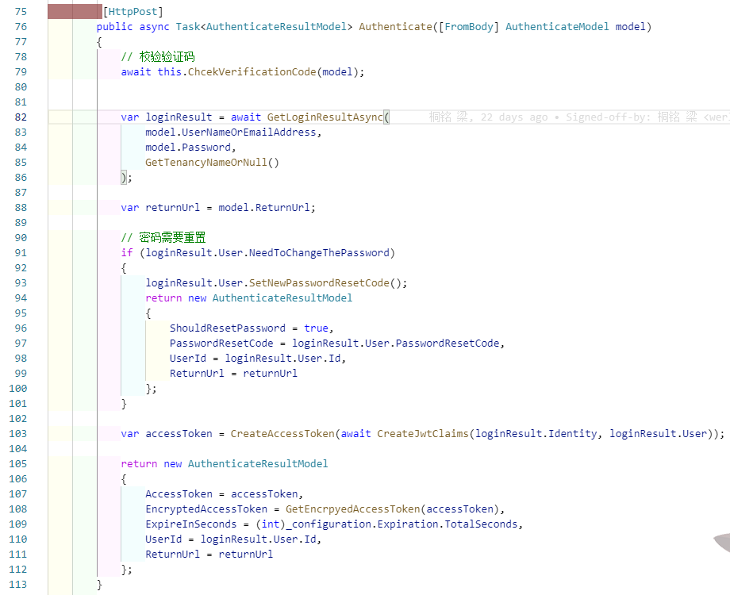
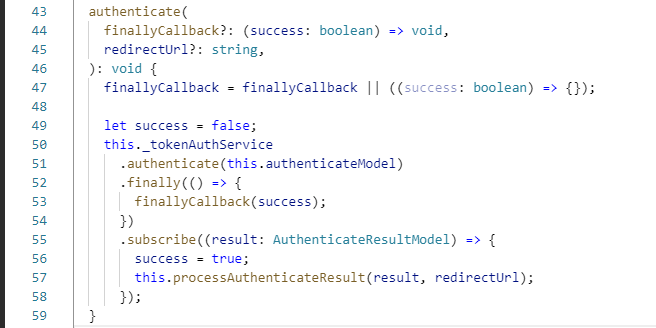
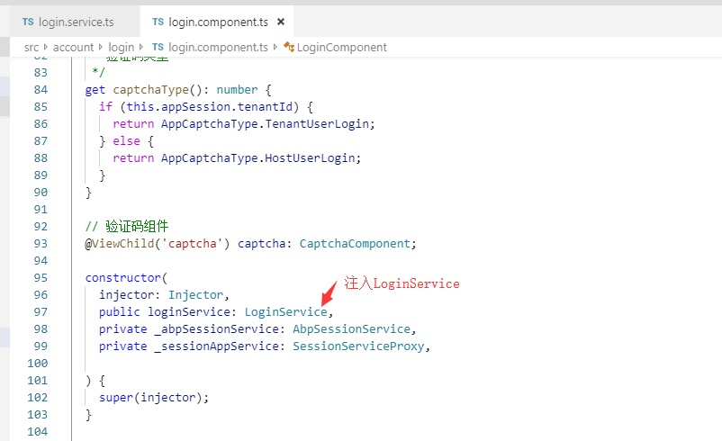
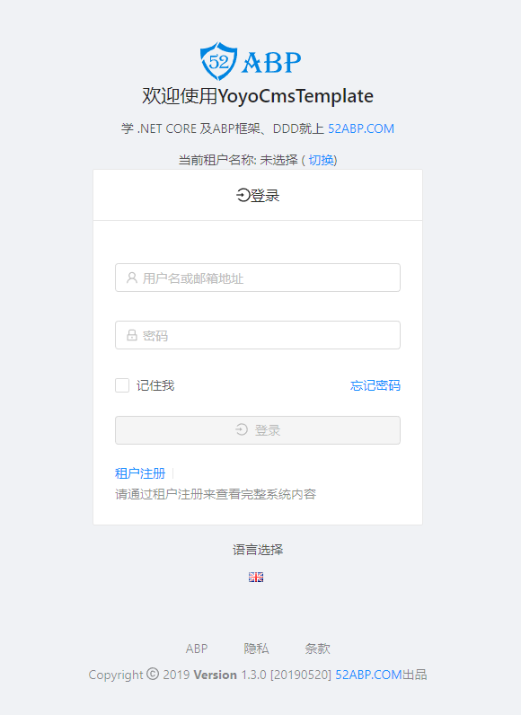
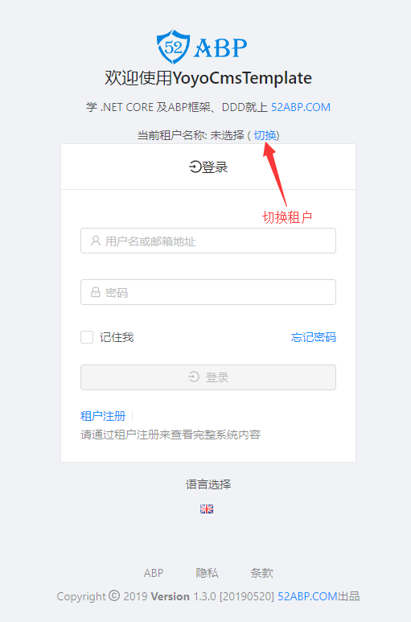
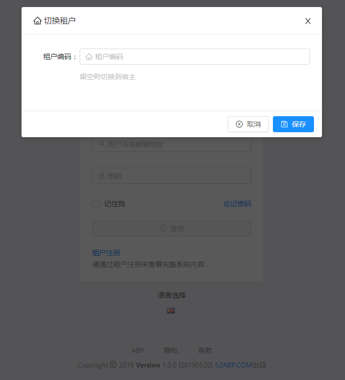

# 账号密码登录

> 本文作者：52ABP开发团队  
> 文章会随着版本进行更新，关注我们获取最新版本  
> 本文出处：[https://www.52abp.com/wiki/52abp/latest](https://www.52abp.com/wiki/52abp/latest)  
> 源代码： https://www.github.com/52abp  

<!-- 简单的图文介绍: 关联代码位置 -->
后台API：
---
所在位置：`LTMCompanyName.YoyoCmsTemplate.Controllers.TokenAuthController.Authenticate`

前端实现：
---
所在位置：`src/account/login/login.service.ts/authenticate`，使用时，需注入`LoginService`

<!-- 简单的图文介绍: 效果展示 -->
登陆页
---

登录时，可选择**租户**（**留空**则切换到**宿主**）
---

<!-- 详细的图文介绍: 常见的应用场景&可能的注意事项 -->
登录失败超过限制后，会锁定用户账户（**相关参数**可在后台设置）

来文档中心了解更多：https://www.52abp.com/wiki/

### 微信关注我们不走丢

