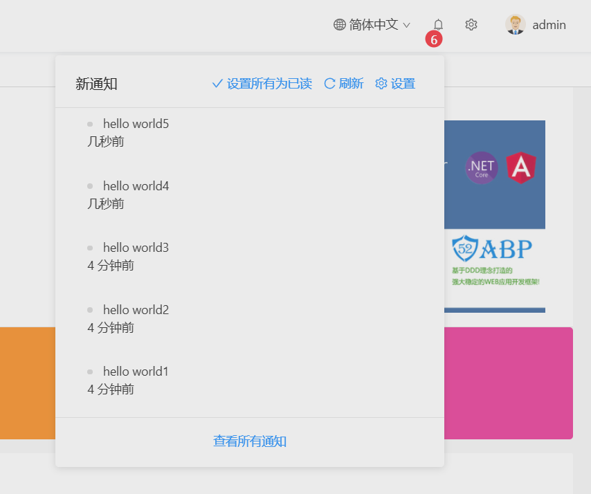
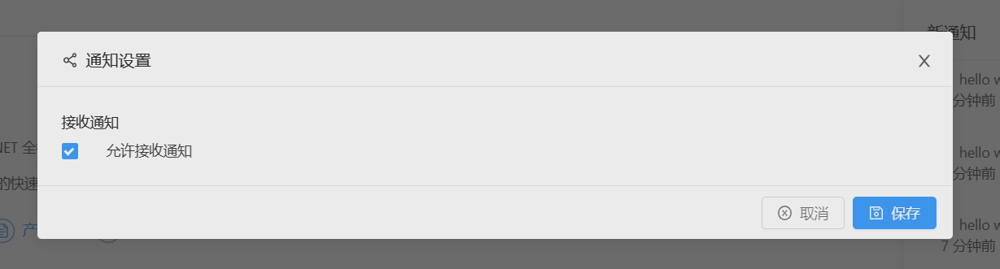

# 通知

通知图标位于语言选择按钮旁边。
用户可以通过单击此图标查看最近的未读通知。



用户可以通过单击**设置所有为已读**来将所有通知标记为已读。

## 通知设置

**设置**链接打开通知设置对话框。



在此对话框中，有一个全局设置供用户启用/禁用接收通知。

此外您还可以在**AppNotificationProvider**类中定义自定义通知。例如，新的用户注册通知在**AppNotificationProvider**中定义，如下所示。

````CSHARP
context.Manager.Add(
     new NotificationDefinition(
        AppNotificationNames.NewUserRegistered,
        displayName：L"NewUserRegisteredNotificationDefinition"),
        permissionDependency：new SimplePermissionDependency(AppPermissions.Pages_Administration_Users)
    )
);
````

有关详细信息，请参阅[通知定义](need-help.md)<!-- (https://aspnetboilerplate.com/Pages/Documents/Notification-System#notification-definitions) -->部分。

其中, **AppNotifier**类用于发布通知。 **NotificationAppService**类用于管理通知的应用程序逻辑。

发送通知时，Angular应用程序通过SignalR接收通知，**UserNotificationHelper.ts**(位于`app\shared\layout\notifications\`文件夹下")用于格式化此通知信息，然后再向用户显示。如果要将用户重定向到新页面或外部网站，可以修改其中的**getUrl**方法。

有关详细信息，请参阅[通知文档](need-help.md)<!-- (https://aspnetboilerplate.com/Pages/Documents/Notification-System) -->。

## 下一章

 -  [迁移数据库控制台](Migrator-Console-Application.md)
