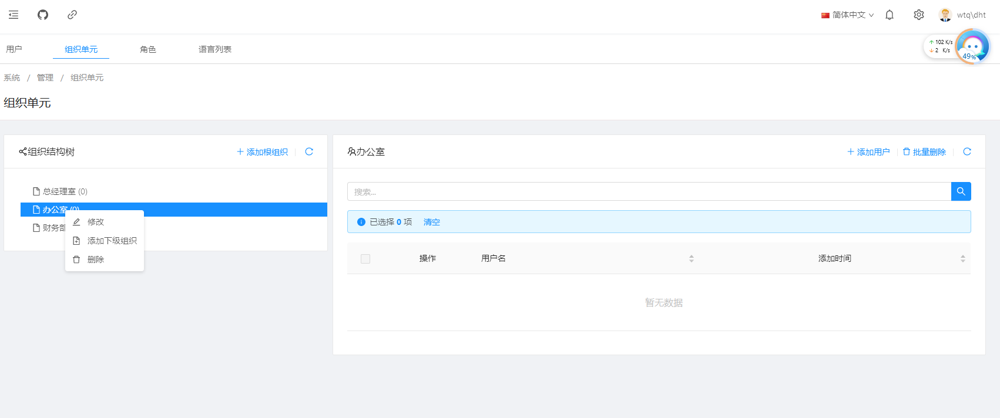

# 功能介绍：组织单元

> 本文作者：52ABP开发团队  
> 文章会随着版本进行更新，关注我们获取最新版本  
> 本文出处：[https://www.52abp.com/wiki/52abp/latest](https://www.52abp.com/wiki/52abp/latest)  
> 源代码： https://www.github.com/52abp  

<!-- 简单的图文介绍: 关联代码位置 -->
## 组织单元

52ABP的项目中组织单元。

在52ABP主菜单 选择【管理】--【组织单元】

 

 

### 组织结构树

#### 添加组织单元

 

 填写：组织单元名称（必填项）。
 

#### 组织单元维护：

 

参考上图，选择组织单元名称，按右键，出现维护菜单。

#### 修改
 

 内容同[添加组织单元](Features-52ABP-NG-Organization-Units.md#添加组织单元)。
 
#### 添加下级组织

 

 内容同[添加组织单元](Features-52ABP-NG-Organization-Units.md#添加组织单元)。

####  删除

 

  按【删除】，系统有提示框【确定要删除吗？】。

#### 添加用户
选择左边的组织结构树中的组织单元，可以对该组织单元添加用户。

 

- 可以搜索符合条件的用户。
- 勾选需要添加的用户。

####  批量删除

 

可以批量删除该组织单元的用户列表中选中的用户。

####  删除
 

 该组织单元的用户列表【操作】的【删除】功能，可以将选择的用户从该组织单元的删除。

 

 
<!-- 简单的图文介绍: 效果展示 -->

<!-- 详细的图文介绍: 常见的应用场景&可能的注意事项 -->

来文档中心了解更多：https://www.52abp.com/wiki/ 

### 微信关注我们不走丢

