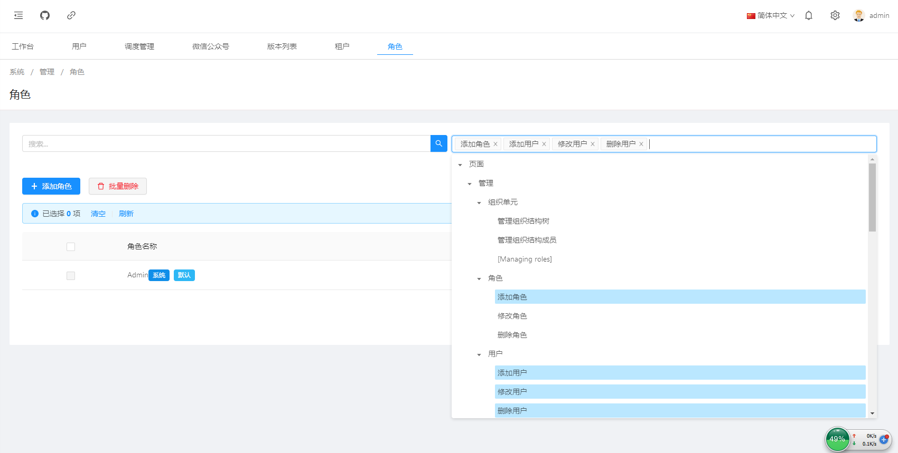

# 角色管理

> 本文作者：52ABP开发团队  
> 文章会随着版本进行更新，关注我们获取最新版本  
> 本文出处：[https://www.52abp.com/wiki/52abp/latest](https://www.52abp.com/wiki/52abp/latest)  
> 源代码： https://www.github.com/52abp  

52ABP的项目中角色管理功能。

 
## 角色管理功能介绍

在52ABP主菜单 选择**管理**--**角色**

 

#### 搜索和权限过滤
  - 搜索 
    -  在搜索框中输入要搜索的角色名称，按搜索的图标，就显示符合条件角色。
#### 权限过滤

  权限过滤是通过树形的权限列表，可以多选，见上图。
    
### 添加角色功能

#### 角色名称

 

填写：角色名称（必填项）。
选择：默认（是/否）

#### 权限树：

选择：对该角色的权限进行勾选。
 
#### 批量删除
 
对已勾选的角色批量删除。

####  修改

可以通过用户信息【操作】项，按下【修改】，对角色的信息修改，内容同【添加角色】。

#### 删除

可以通过角色信息【操作】项，按下【删除】，对角色删除。

**注意**: Admin是系统生成的角色，用户无法删除。

来文档中心了解更多：https://www.52abp.com/wiki/ 

### 微信关注我们不走丢

