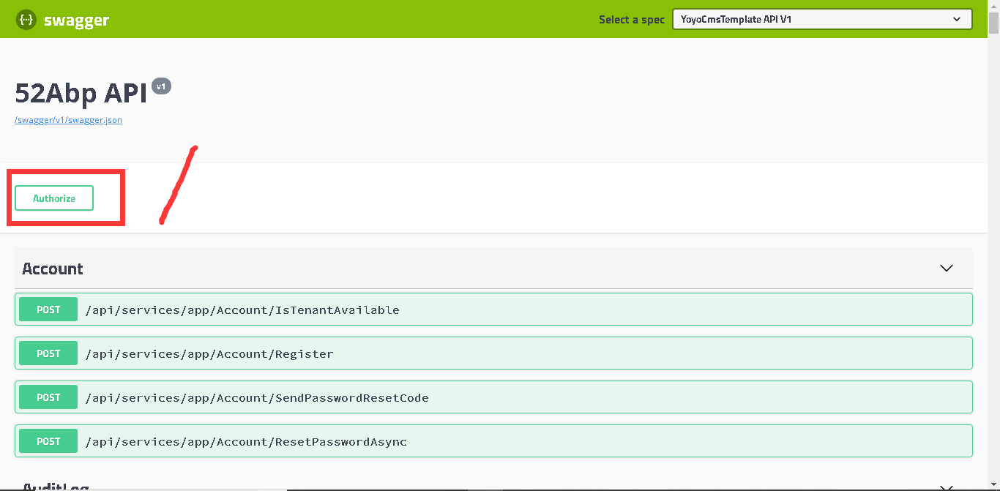

# SwaggerUI

> 本文作者：52ABP开发团队 </br>
> 文章会随着版本进行更新，关注我们获取最新版本 </br>
> 本文出处：[https://www.52abp.com/wiki/52abp/latest](https://www.52abp.com/wiki/52abp/latest) </br>
> 源代码： https://www.github.com/52abp </br>


<!-- 简单的图文介绍: 关联代码位置 -->
## 简介

52abp中集成SwaggerUI，你由此可以获得一个交互式的文档，生成和发现客户端SDK。

## 安装与升级

打开nuget包管理器，安装或升级Swashbuckle.AspNetCore 依赖。

## 配置

在 **Web.Host\Startup\Startup.cs** 文件中找到  **ConfigureServices** 方法，在其中添加Swagger的配置代码。

```C#
services.AddSwaggerGen(options =>
{
      options.SwaggerDoc("v1", new Info { Title = "52Abp API", Version = "v1" });
      options.DocInclusionPredicate((docName, description) => true);
      options.AddSecurityDefinition("bearerAuth", new ApiKeyScheme()
      {
         Description = "JWT Authorization header using the Bearer scheme. Example: \"Authorization: Bearer {token}\"",
         Name = "Authorization",
         In = "header",
         Type = "apiKey"
      });
});
```


然后在  **Configure** 方法中添加如下配置

```C#
// Enable middleware to serve generated Swagger as a JSON endpoint
app.UseSwagger();
// Enable middleware to serve swagger-ui assets (HTML, JS, CSS etc.)
app.UseSwaggerUI(); 
```

52abp中的**SwaggerUI** 的用户界面文件位于**Web.Host\wwwroot\swagger\ui\index.html**   。


## 使用

启动项目浏览地址 **website/swagger/index.html** 可以看到如下图所示 **Swagger** 界面



你可以在此页面查阅接口参数并测试相关Api。

如图所示，可以明显看到**swagger/index.html** 中排列出了当前系统中的Api接口。其中某些行尾的鎖形状标志，意味着该Api为**授权可调用** 。比如途中所示接口**/api/services/app/AuditLog/GetPagedAuditLogs** ，其接口源码摘要如下所示：

```C#
[AbpAuthorize(PermissionNames.Pages_AdminiStration_AuditLogs)]
 public class AuditLogAppService
 {
 	public async Task<PagedResultDto<AuditLogListDto>> GetPagedAuditLogs(GetAuditLogsInput input)
 	{
 		//代码实现
 	}
 }
```

如果属性`[AbpAuthorize]` 标记在类上，说明该类下所有接口，都需授权才可调用。若类上无标记，则标记了该属性的方法，为授权可调用。其余情况以此类推。

### 登录/授权

点击上图中标 **1** 所示处的**Authorize**按钮，则弹出如下图所示悬浮框 

 

依次输入 **租户名**（如果没有，则留空）、**账号**、**密码** 后点击**Login**，即可完成登录。登陆后，根据登录账号的权限，即可调用相应的Api接口。

### 测试

这里以**AuditLog** 接口的测试使用为例。

点击图示蓝色区域，即可展开接口


图中**Name** 一列为该接口的参数名，**Description** 一列为相应参数的说明。点击**Try is out**按钮，可输入相应的查询参数。


点击**Excute** 按钮，便可进行接口测试。结果如下图所示


图中**Response** 区域为接口返回结果区。如果**Code** 一列的值为**200** ，即表示接口查询成功，**Response dody** 区域中，就是返回的数据。

以上是关于52Abp所继承Swagger的简单介绍。如需更多了解，请参见[Swashbuckle官方文档](https://github.com/domaindrivendev/Swashbuckle) 。


<!-- 简单的图文介绍: 效果展示 -->

<!-- 详细的图文介绍: 常见的应用场景&可能的注意事项 -->


来文档中心了解更多：https://www.52abp.com/wiki/ 

### 微信关注我们不走丢


