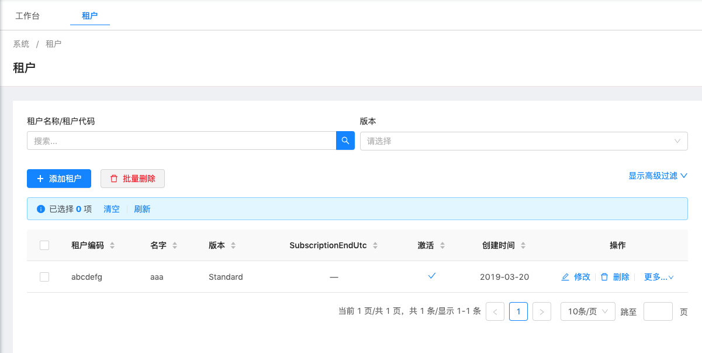
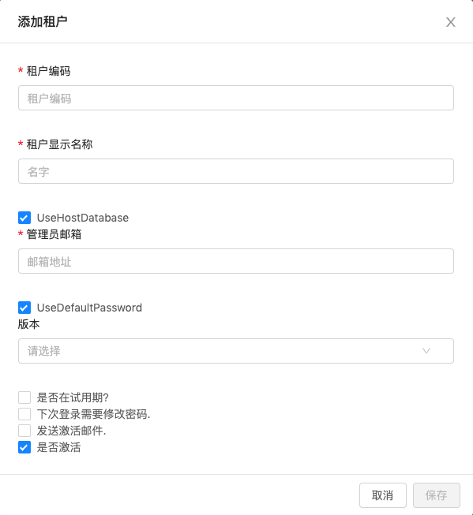
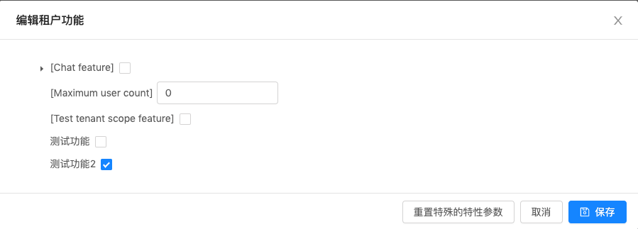
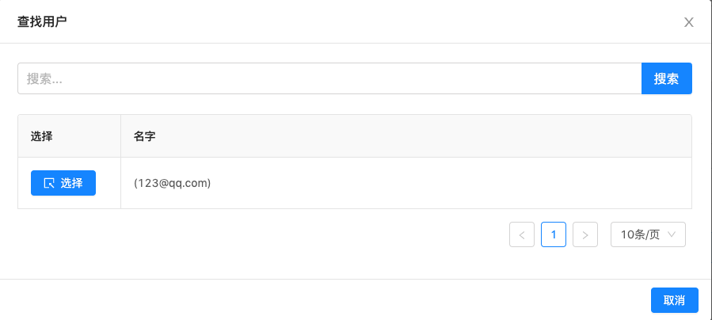

# 租户管理

> 本文作者：52ABP开发团队  
> 文章会随着版本进行更新，关注我们获取最新版本  
> 本文出处：[https://www.52abp.com/wiki/52abp/latest](https://www.52abp.com/wiki/52abp/latest)  
> 源代码： https://www.github.com/52abp  

如果您当前使用的应用并不是多租户应用，您可以跳过本节。

如果是一个多租户应用并且您以宿主用户身份登录。
在52ABP主菜单 选择【管理】-【租户管理】

您将会看到如下页面

租户管理功能是由Tenant类实现的。

开发过程中您可以通过给Tenant类添加新属性来扩展租户。

## 创建新租户

单击“创建新租户”按钮时，您将会看到如下所示的对话框：

### 租户编码
租户编码（可用作子域名的代码）是租户独一无二的属性。 
52ABP 默认的租户编码为 Default。
您可以在 EntityFrameworkCore 项目中的Seed部分修改它。
租户编码应该是唯一的，不能包含空格或者其他特殊字符。
因为它可以用作子域名（如：tenancyname.pro.52abp.com)。

### 租户显示名称
租户显示名称可以任意填写。

### UseHostDatabase
当我们创建新租户时，我们应该选择或创建一个数据库来存储新租户的数据。我们可以选择“UseHostDatabase”将租户数据存储在宿主的数据库中（可用于单一数据库方法）。
或者我们可以指定连接字符串来让新租户使用它专用的数据库。
52ABP 支持混合使用。这意味着您可以在设置某些租户使用宿主数据库的同时，使其他租户使用专用数据库。

### 管理员邮箱地址
在租户的创建过程中， 将会创建一个名为 admin 的管理员用户。
管理员邮箱地址将作为管理员用户的电子邮件地址。

### UseDefaultPassword
如果 UseDefaultPassword 被选中，admin用户的密码将会是随机的。
租户创建完成后，系统将会给租户管理员的邮箱发送一封包含激活链接的邮件。
如果您没有选中本项，页面将会要求您输入密码 以及 确认密码。

### 版本
您可以给租户分配版本。
将版本分配给租户后，您可以选择过期日期（请参阅[版本管理](Features-52ABP-NG-Edition-Management.md)部分以了解订阅到期后会发生什么）。

### 是否在试用期？
`试用期到期功能尚未完成。敬请期待。`

### 下次登陆需要修改密码
如果【下次登陆需要修改密码】被选中，那么租户的管理员用户在下次登陆时，将被要求修改密码。

### 是否激活
租户拥有激活以及未激活两种状态。 如果它是未激活的，则此租户的任何用户都无法登录。
 
## 版本以及特性参数
在租户创建或编辑的过程中，您可以为租户分配一个版本。
租户将会继承被分配版本的全部特性参数。
但是我们可以为某个租户覆写某些版本特性以及参数。
选择 【更多】-- 【特性参数列表】 以编辑租户的功能。

## 租户模拟
作为宿主用户，有时我们可能希望以租户的身份执行某些操作。
在这种情况下，我们可以点击 【更多】 -- 【使用此租户登陆】 按钮。
当我们点击它时，我们会看到一个用来选择租户中用户的对话框。
如下所示：

我们可以选择任何用户并模拟该用户对租户进行操作。

详细信息，请参阅用户管理文档的“[用户模拟](Features-52ABP-NG-User-Management.md)”部分。

## 使用 租户编码 作为子域名
多租户应用通常使用子域来标识当前租户。
如：tenant1.52abp.com，tenant2.52abp.com等。
52ABP会自动识别并从子域名获取租户名称。
请参阅概述文档的多租户和配置部分。
<!-- TODO: 完善文档，或者另外找一个地方存放此部分内容
-->

来文档中心了解更多：https://www.52abp.com/wiki/ 

### 微信关注我们不走丢

