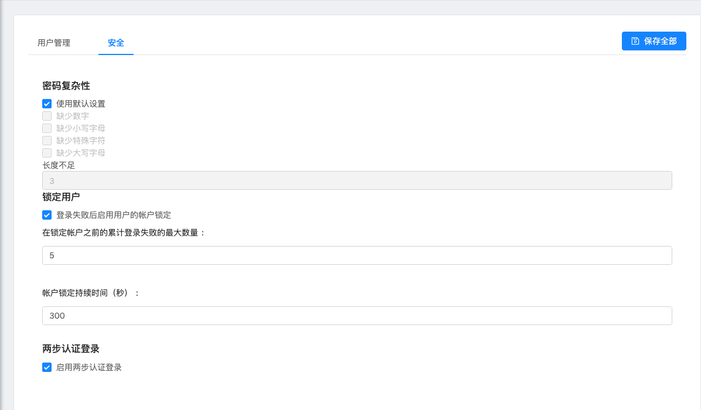

# 租户设置

> 本文作者：52ABP开发团队  
> 文章会随着版本进行更新，关注我们获取最新版本  
> 本文出处：[https://www.52abp.com/wiki/52abp/latest](https://www.52abp.com/wiki/52abp/latest)  
> 源代码： https://www.github.com/52abp  

租户设置页面用来显示和修改租户的系统设置

如果您以租户身份登陆，您可以选中 【管理】 -- 【设置】 菜单项，以浏览租户设置页面。

## 用户管理

在“用户管理”选项卡下，每个租户都可以配置与其帐户相关的一些用户管理设置。 每个租户都可以启用/禁用其帐户的用户注册功能。
每个租户也可以为新注册的用户设置默认激活与否。
每个租户还可以在其帐户的用户注册页面上启用/禁用验证码功能。
每个租户也都可以强制其用户在确认电子邮箱地址后才可以登陆。

## 安全

“安全”选项卡包含密码复杂性设置。
每个租户都可以在此选项卡中为其帐户定义密码复杂性设置。
每个租户还可以配置用户锁定以及两步认证登陆相关设置。

来文档中心了解更多：https://www.52abp.com/wiki/ 

### 微信关注我们不走丢

