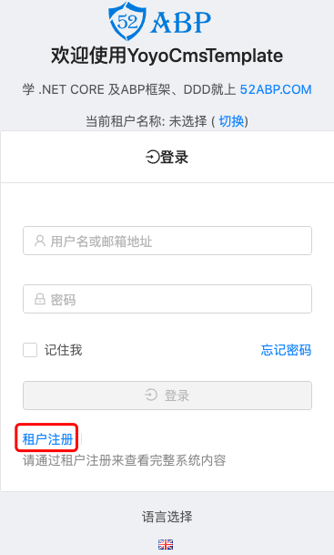

# 租户注册

> 本文作者：52ABP开发团队  
> 文章会随着版本进行更新，关注我们获取最新版本  
> 本文出处：[https://www.52abp.com/wiki/52abp/latest](https://www.52abp.com/wiki/52abp/latest)  
> 源代码： https://www.github.com/52abp  

仅当您位于宿主上下文环境中时，租户注册链接才会显示在登录表单上。
如下图所示：

当您单击租户注册链接时，将会显示如下所示的注册表单：

## `注册时版本选择暂时未完成，等待开放`

来文档中心了解更多：https://www.52abp.com/wiki/ 

### 微信关注我们不走丢

