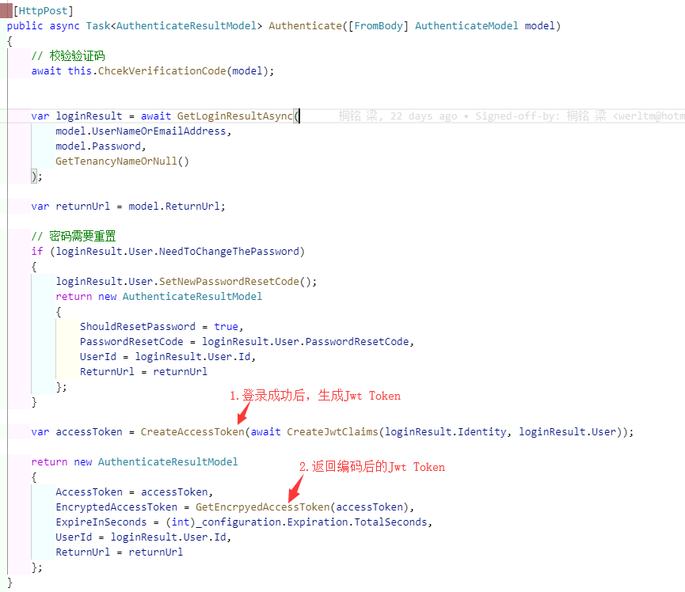

# 基于令牌的认证.

> 本文作者：52ABP开发团队  
> 文章会随着版本进行更新，关注我们获取最新版本  
> 本文出处：[https://www.52abp.com/wiki/52abp/latest](https://www.52abp.com/wiki/52abp/latest)  
> 源代码： https://www.github.com/52abp  

    使用有效登录方式登录成功后，会返回一个Token（令牌），在后面的请求中，使用该令牌访问。

<!-- 简单的图文介绍: 关联代码位置 -->
生成令牌
---

<!-- 简单的图文介绍: 效果展示 -->

获取登录成功后的令牌
---

保存令牌
---

在请求中加入令牌
---

<!-- 详细的图文介绍: 常见的应用场景&可能的注意事项 -->

来文档中心了解更多：https://www.52abp.com/wiki/ 

### 微信关注我们不走丢

