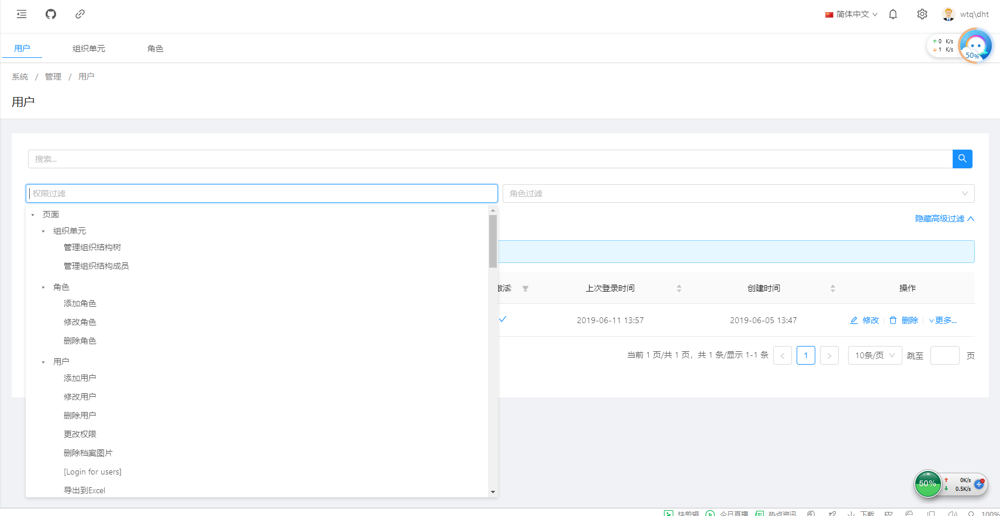
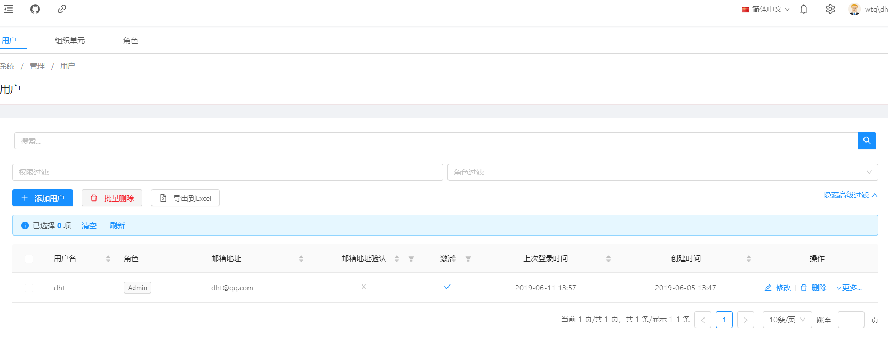

# 用户管理

> 本文作者：52ABP开发团队  
> 文章会随着版本进行更新，关注我们获取最新版本  
> 本文出处：[https://www.52abp.com/wiki/52abp/latest](https://www.52abp.com/wiki/52abp/latest)  
> 源代码： https://www.github.com/52abp  
 

52ABP的项目中用户管理。

 
在52ABP主菜单   选择【管理】--【用户】

## 功能说明：

### 搜索

   在搜索框中输入要搜索的用户名称，按搜索的图标，就显示符合条件的用户。

### 添加用户

 

#### 用户信息：

 

    填写：用户名（必填项）、邮箱地址（必填项）、电话号码 、使用随机密码、是否启用了两个因素、下次登录需要修改密码、发送激活邮件、激活、启用锁定。
   上传：头像照片。

#### 角色：

 

      选择 ：将该用户使用的角色勾选。

#### 组织单元：

 

    在搜索框中输入要搜索的组织单元，按刷新图标，就显示符合条件的组织单元。
   选择：将该用户所属的组织单元勾选。

#### 批量删除:
 

   对已勾选的用户批量删除。

####   Excel导出

   将显示的用户导出Excel表。

####  高级过滤
 

  可以通过【权限过滤】和【角色过滤】来过滤用户。

####   修改
 

  可以通过用户信息【操作】项，按下【修改】，对用户的信息修改，内容同【添加用户】。

####  删除
 

  可以通过用户信息【操作】项，按下【删除】，对用户删除。 

 

来文档中心了解更多：https://www.52abp.com/wiki/ 

### 微信关注我们不走丢

