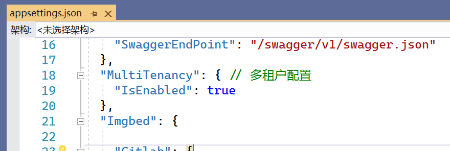
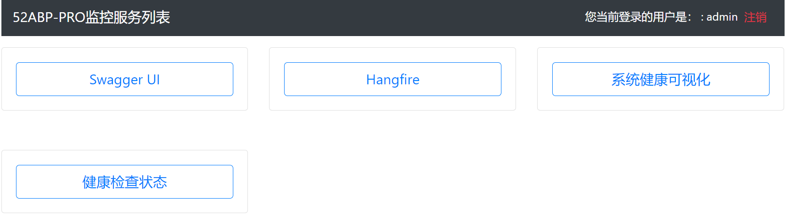
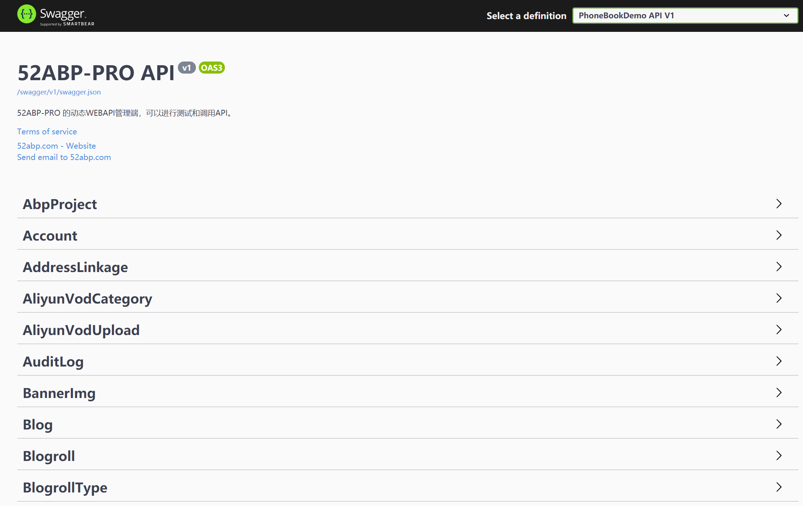

# 快速启动

> 本文作者：52ABP开发团队 </br>
> 文档会随着版本进行更新，关注[52ABP.com](https://www.52abp.com)获取最新版本 </br>
> 本文出处：[https://www.52abp.com/wiki/52abp/latest/](https://www.52abp.com/wiki/52abp/latest/) </br>
> 源码下载： [https://code.52abp.com/52abp](https://code.52abp.com/52abp) </br>


## 创建项目

如果您已经[购买](https://www.52abp.com/Purchase)了52ABP-PRO，那么它会提高您的开发体验和工作效率。

> 本文档的目标是准备在5分钟内创建和运行一个52ABP-PRO项目。

首先[登录](https://www.52abp.com/Account/Login)52ABP.COM，输入您的账号和密码。在[下载页面](https://www.52abp.com/Download/Index)上，选择**企业版**，您可以看到如下的表单内容。

 

选择项目类型为“**ASP .NET CORE&Angular**”，填写您项目名称(为了演示方便，我们使用**YoyoSoft.PhoneBookDemo**作为我们的项目名称)以及其他信息。

你的项目将会在一分钟内完成下载。
然后打开ZIP压缩包后，您可以看到以下文件夹：


phonebookdemo为您的项目名称，项目结构为前后端分离。

- **angular**文件夹包含了管理端的界面，是用于配合应用程序后端运行使用的。
- **aspnet-core**文件夹则包含了服务端的ASP.NET Core解决方案，需要使用Visual Studio启动。
- **vue**文件夹包含了管理端的界面，是用于配合应用程序后端运行使用的。


前后端的通信方式为基于WebApI的形式，详细架构可以参考[52ABP-PRO 前后端分离架构概述](Overview-Angular.md)。

## 环境配置要求

请先检查自己是否安装了以下环境配置：

- [Visual Studio 2019](https://visualstudio.microsoft.com/zh-hans/downloads/)(用于启用ASP.NET Core应用程序)
- 推荐下载[.NET Core 5.0 SDK](https://download.visualstudio.microsoft.com/download/pr/2892493e-df43-409e-af68-8b14aa75c029/53156c889fc08f01b7ed8d7135badede/dotnet-sdk-5.0.100-win-x64.exe)

### 前端开发环境配置

- [Typescript 3.0+](https://www.typescriptlang.org/#download-links)
- [Node.js 12.16.0+ with NPM 6.14+](https://nodejs.org/zh-cn/)
- [Yarn](https://yarnpkg.com/zh-Hant/)

如果你npm包本地还原速度较慢，可以查看[安装Node.js与Npm包管理器](https://www.52abp.com/yoyomooc/howto-download-install-node-and-npm)与[npm和yarn使用国内淘宝镜像源提升各依赖安装速度](https://www.52abp.com/yoyomooc/npm-yarn-registry-taobao-mirror)提升你的前端包下载和还原速度。

## ASP.NET Core 应用程序说明

使用**Visual Studio 2019**，打开项目解决方案(**YoyoSoft.PhoneBookDemo.Web.Host.sln**)，您会看到以下解决方案：


右键单击(**\*.Web.Host**)项目并选择“**设置为启动项目**“然后生成解决方案。
第一次生成解决方案，可能需要更长的时间，因为会从远程恢复Nuget包。


### 数据库

因为我们采用CodeFirst的模式开发，所以我们不需要sql文件。你如果还不会Codefirst的开发模式，可以系统性的学习一次Asp.net Core ，推荐观看我们的教程：[跨平台开发实战掌握ASP.NET Core 与EntityFramework Core](https://www.52abp.com/yoyomooc/aspnet-core-for-beginners-Index)

#### 连接字符串

在 **\*.Web.Host** 项目下，打开 **appsettings.json** 文件，您可以修改这个默认字符串内容：

```json

"Default": "Server=.; Database=PhoneBookDemo_db; Trusted_Connection=True;MultipleActiveResultSets=True"
```

或者如果你要使用Sa连接数据库参考如下：

```json
"Default": ".; Database=PhoneBookDemo_db; user id=sa;password=123;MultipleActiveResultSets=True",
```

## 初始化数据库

我们有两种方式来`初始化数据`到最新的版本。


### 使用52ABP-PRO的迁移工具

52ABP-PRO的提供了一个迁移工具，在解决方案中**tools**文件中（YoyoSoft.PhoneBookDemo.Migrator），您可以在开发和生产环境中，使用这个工具为您的数据库进行迁移。您可以查看[迁移数据库控制台文档](Migrator-Console-Application.md)来了解更多详细。


### EntityFramework Core迁移命令

您还可以使用**EntityFramework Core**内置的工具，进行数据库的迁移。打开**程序包管理控制台**。然后设置**YoyoSoft.PhoneBookDemo.EntityFramework**为默认项目。

然后输入`Update-database`命令来更新数据库。


此命令会创建数据库。数据的初始化则需要您运行 **\*.Web.Host** 项目才会执行。
您可以打开**SQL Server Management Studio** 工具来查看数据库是否创建成功。


 
我们一般会推荐您使用**EF控制台命令**进行开发，使用**Migror.exe**进行生产环境的迁移。
请注意**Migror.exe**支持同时在多个数据库中运行迁移，这在**多租户应用程序**的**开发/生产环境中**很有用。


## 配置多租户


52ABP-PRO支持多租户和单租户应用程序。多租户默认为启用状态。
如果你对多租户没有概念，那是否听过SaaS服务呢？如果都没有的话，我推荐您看看这篇文章[《有哪些通俗易懂的例子可以解释 IaaS、PaaS、SaaS 的区别》](https://www.zhihu.com/question/21641778/answer/62523535)


如果不想创建多租户应用程序，可以在项目的Core层，打开**appsettings.json**文件，将**MultiTenancy**配置下的`IsEnabled`的值设置为False。




完成以上配置后，您可以运行应用程序。服务端只包含API。当您运行项目后，即可看到系统监控页面，输入默认的账号和密码。


### 账号和密码

默认的管理员账号为：admin <br/>
默认密码为:bb123456<br/>
为了您系统的安全，请及时更改你的密码。

## 监控服务列表页面

登录成功后即可看到提供的监控服务内容。




## 可视化的SwaggerUI，动态Webapi

选择`SwaggerUI`后，会跳转到可调试的接口页面。





 
通过SwaggerUI 您可以对项目进行可视化的API接口调试。

## Angular UI应用

我们的Angular应用采用的是 [Ng Alain Pro](https://e.ng-alain.com/theme/pro) 版本，如果您已经购买了**我们的企业版**，可以放心使用，无须再次购买版权。

### 还原包

打开**angular**文件夹，然后使用**命令行工具**，运行``yarn``命令来还原包。

因为NPM还原包的速度比较慢，并且不够稳定，所以我们采用``yarn``来进行包的还原。而且yarn和NPM是兼容的。

> 如果你npm包本地还原速度较慢，可以查看[安装Node.js与Npm包管理器](https://www.52abp.com/yoyomooc/howto-download-install-node-and-npm)与[npm和yarn使用国内淘宝镜像源提升各依赖安装速度](https://www.52abp.com/yoyomooc/npm-yarn-registry-taobao-mirror)提升你的前端包下载和还原速度。


### 运行应用程序

在命令行工具中运行以下命令：

``npm start``

项目就会进行编译，一旦编译成功后。您可以通过浏览器访问 [localhost:8000](http://localhost:8000/) 来查看项目。

当然我们也配套了（HMR）热模块替换的启用。

您可以使用：
``npm run hmr``
来运行。

## 管理系统登录

当运行成功后！您可以登录程序了。


如果您启用了多租户，在这里能够看到有一个**租户注册**。以及切换租户的功能。我们默认创建了一个default的租户信息。如果您保留为空，则会进入**宿主管理员**的身份登录。

### 账号和密码

默认的管理员账号为：admin <br/>
默认密码为:bb123456<br/>
为了您系统的安全，请及时更改你的密码。


## 系统UI

当您登录系统后，可以看到系统完整的功能。


## 52ABP配套代码生成器

52ABP PowerTools 是一个基于实体，就可以从数据库创建一个新页面到UI层。它创建实体、相关权限、应用程序服务、DTO、客户端代码、菜单元素等。
最后，您将有一个具有插入、更新、删除、列表和EXCEL导出功能的CRUD页面。要尽量减少创建新页面的工作量，有关代码生成器的更多信息[52ABP-PRO代码生成器介绍](52ABP-Power-Tools-Intro.md)


## 下一篇文档

可以阅读[52ABP-PRO解决方案设计概述](Overview-Angular.md)，对每个类库有更加清晰的了解。

来文档中心了解更多：https://www.52abp.com/wiki/ 

## 微信扫码关注我们

<div class="text-center ">
 
</div>
