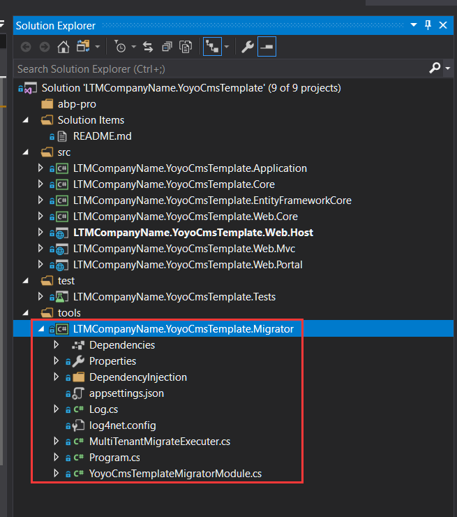
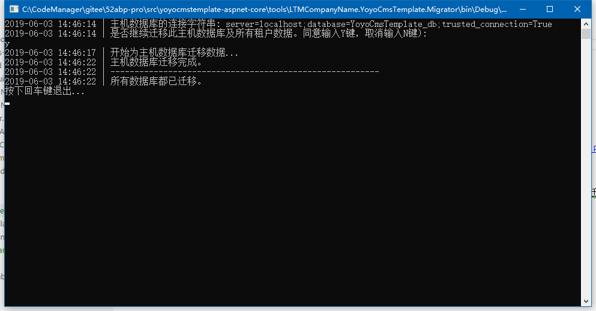

# 迁移数据库控制台.

> 本文作者：52ABP开发团队  
> 文章会随着版本进行更新，关注我们获取最新版本  
> 本文出处：[https://www.52abp.com/wiki/52abp/latest](https://www.52abp.com/wiki/52abp/latest)  
> 源代码： https://www.github.com/52abp  

<!-- 简单的图文介绍: 关联代码位置 -->
52ABP的项目中都包含了一个迁移数据库的工具，**Migrator**。

<!-- 简单的图文介绍: 效果展示 -->
您可以使用它轻松的创建或者更新您的数据库。

 

<!-- 详细的图文介绍: 常见的应用场景&可能的注意事项 -->
迁移工具读取的当前项目(**非Web.Host项目**)中的**appsettings.json**文件中的连接字符串。所以请确保你的配置中的连接字符串是所需的数据库。

在运行后，它会检查数据库是否存在，如果不存在则会创建数据库，如果存在则会进行应用程序数据的迁移。

如果启动了多租户的隔离连接字符串，它会获取租户数据库的连接字符串，并为这些数据库运行迁移。

如果没有专用数据库，或者已经为另一个租户迁移了它的数据库(用于多个租户之间的共享数据库)，它将跳过租户。

您可以在开发或者生产环境中使用此工具在部署时迁移数据库，而非通过EntityFramework自己的Migrate命令
(Migrate命令需要一些额外的配置，并且只能单次运行只能更新单个数据库)。

<!-- 如果有子级的功能

## 子功能1

简单的图文介绍: 关联代码位置

简单的图文介绍: 效果展示

详细的图文介绍: 常见的应用场景&可能的注意事项

 -->

来文档中心了解更多：https://www.52abp.com/wiki/ 

### 微信关注我们不走丢

