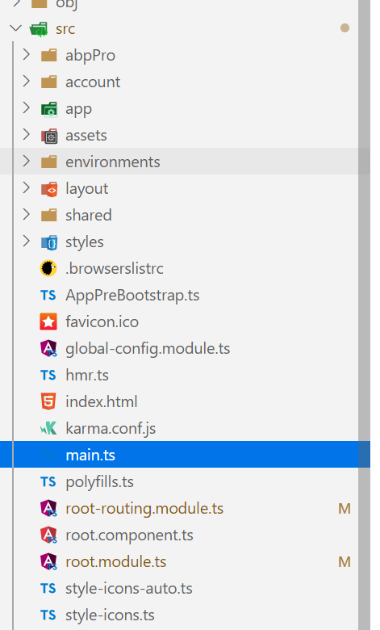

# [52ABP-PRO 前后端分离架构概述](Overview-Angular.md)

> 本文作者：52ABP 开发团队 </br>
> 文章会随着版本进行更新，关注我们获取最新版本 </br>
> 本文出处：[https://www.52abp.com/wiki/52abp/latest](https://www.52abp.com/wiki/52abp/latest) </br>
> 源代码： https://www.github.com/52abp </br>

## 介绍

在阅读本文档之前，建议您先运行一次 52ABP 项目程序，打开过 Angular 版本的界面,如果你还没有运行过项目可以参考[快速入门文档](Getting-Started-Angular.md)。 或者你已经对 ABP 有过一些了解。
那么您阅读本篇文档的时候将会更加容易理解这些概念。

## IDE 工具和操作系统

我们推荐您使用 [Visual Studio 2017(v15.9.0+)](https://visualstudio.microsoft.com/zh-hans/vs/older-downloads/)以上版本的工具来进行开发。
当然您也可以选择您喜欢的其他工具如：VsCode 或者 Rider。
因为 .NET Core 是跨平台的，所以您可以在任何操作系统中运行（MacOS/Linux/Windows)。

## 总体设计架构

我们先来看下总体设计架构。


Angular UI 项目一个可单独部署的项目，它不依赖于后端 ASP .NET Core，不用强制部署在一起。
在部署服务的时候，不用考虑他们必须在一台服务器上，只需要在部署的时候，指定好对应的 IP 或者域名以及端口号。就可以部署成功。

因为当 Angular 项目被部署出来的时候，它实际上是一个 HTML+JS 和 CSS 的网站，它可以在任何的操作系统和 Web 服务器上提供服务。

需要注意的是，我们的 ASP.NET Core 解决方案中没有任何 HTML、JS 和 css 代码，因为它是基于 token 的身份验证，而服务之间的通讯都是通过（RESE）风格的 API。

## 服务器端多层架构解决方案说明

当您创建一个项目后，打开项目解决方案方案后，可以看到下图所示：


解决方案中有 7 个项目：

- **Application**类库为应用层，主要包含 Dto 和动态 webapi 以及应用服务，我们的业务逻辑基本都在这里。
- **Core**层为领域层，包含**实体**和**领域服务**以及枚举（enums）常量等帮助类文件。
- **EntityFrameworkCore**层为基础设施层，包含了项目的 DbContext，仓储扩展和实现、数据库的迁移和 EF Core 中的基本配置信息。
- **Web.Core** 项目主要是服务于 MVC 和 Host 项目的公共类文件。
- **Web.Host** 项目不包含任何与 Web 相关的文件，如 Html、Css 或 Js。它是作为提供远程 Webapi 的应用程序。因此，您的任何设备都可以来访问您的 API 应用程序。要了解更多的信息，请参考[Web.Host 项目介绍](Features-Mvc-Core-Web-Host-Project.md)
- **Web.Portal**是一个独立的 web 应用程序，可用于为您的应用程序创建公共页面或登录页面，如 52ABP.Com 的门户。有关更多信息，请参见[门户项目介绍](Features-Mvc-Core-Web-Portal-Project.md).
- **Tests** 项目包含单元测试和集成测试。
- **Migrator** 项目是一个运行数据库迁移的控制台应用程序。有关更多信息，请移步[迁移数据库控制台](Migrator-Console-Application.md)

## 应用程序

52ABP-PRO 解决方案中包含了三个应用程序：

- 后端 API(**Web.Host**):提供 RESTAPI 的应用程序，不包含任何 UI 的应用程序。
- 门户网站(**Web.Portal**):这可以用于为您的应用程序创建一个公共网站或登陆页面。
- 迁移工具(**Migrator**):运行数据库迁移的控制台应用程序。

## 基本配置

**appsettings.json** 是.Net Core 中的系统配置文件，它在 Web.host 项目中包含许多设置，其中**ServerRootAddress**, **ClientRootAddress**和**CorsOrigins**三个配置是运行应用程序所必须的：

```json

"AdminServerRootAddress": "http://localhost:6298/",
"WebSiteClientRootAddress": "http://localhost:11805/",
"CorsOrigins": "http://localhost:8080,https://pro.52abp.com/"
```

- AdminServerRootAddress 是服务端运行的 Web.Host 应用程序的地址。
- WebSiteClientRootAddress 客户端 Angular 应用程序的 URL 地址。
- CorsOrigins 则是管理允许哪些 Url 地址向 Web.Host 应用程序提出跨源请求的 URL。

有关配置 Web.host 应用程序的详细信息，请查看[Web.Host 项目介绍](Features-Mvc-Core-Web-Host-Project.md).

## 多租户

多租户的设计是为了让我们在开发 SaaS（软件即服务）应用的时候更加容易。使用这种技术，我们可以部署一套应用而服务于多个客户。
每个租户都有属于自己的角色、用户、设置和其他数据。租户和租户直接的数据是隔离的。

52ABP-PRO 的代码支持多租户的开发。默认为开启状态。当然也可以通过[配置来关闭它](Getting-Started-Angular.md#配置多租户)。当您禁用它的时候，所有的多租户的功能都会被关闭。我们会默认开启一个名为“default”的租户。

在多租户的应用中，我们有两种不同类型的透视图：

- 宿主（主机）：管理租户和系统。
- 租户：实际使用这些应用系统功能为此付费的用户。

多余多租户应用程序，URL 可以包含动态的租户名称（Tenancy_Name）。这种情况下，我们可以将租户名称通过占位符的形式来进行表现，如下所示：

```json

"AdminServerRootAddress": "http://{TENANCY_NAME}.52abp.com/",
"WebSiteClientRootAddress": "http://{TENANCY_NAME}.app.52abp.com/"

```

而在设置 CorsOrigins 值的时候，可以使用\*来代表允许所有子域进行访问。例如：

```json
"CorsOrigins": "http://*.app.52abp.com/"

```

在启用了以上之后，我们还推荐您继续使用`{TENANCY_NAME}`作为 URL 地址作为租户的占位符，那么就需要您在 AngularUI 项目中配置 URL。配置好以上后，52ABP-PRO 就可以从 URL 自动检测当前租户信息。

如果您按照上面的方式配置好了，您还应该将所有子域重定向到您的应用程序。需要进行以下配置：

1. 应该配置 DNS 将所有子域重定向到静态 IP 地址。要声明“所有子域”，可以使用通配符如`*.52abp.com`
2. 还需要在 IIS 中配置静态 IP 绑定到应用程序。

或许还有其他的办法，但是这个应该是最简单了。欢迎沟通交流。

> 而我们在开发的时候不需要为租户配置子域名，我们可以采用更加简单的方法。我们开启多租户的时候提供了**切换租户**的功能来手动让我们在租户和宿主之间进行相互切换。

## Angular 解决方案

52ABP-PRO 采用的是[NG-Alian-Pro](https://e.ng-alain.com/theme/pro)作为 Angular 的前端模板，[购买 52ABP-PRO](https://www.52abp.com/Purchase)会自动获得此授权无须再单独购买[NG-Alian-Pro](https://e.ng-alain.com/theme/pro)。

Angular 解决方案的入口是`src\main.ts` 。它的作用是用于引导 Angular 的根模块（RootModule）。解决方案的基本模板如下图所示：



- RootModule 负责引导应用程序的加载。
- AccountModule 提供登录，注册,第三方登录，密码忘记/重置，电子邮件激活等...它是懒加载。
- AppModule 仅用于对应用程序模块进行分组并提供基本布局。它包含几个个子模块：

  - AdminModule 包含用户管理，角色管理，租户管理，语言管理，设置等页面。它也是懒加载。
  - MainModule 是开发自己的应用程序的主要模块。它只包含一个可以修改或删除的演示仪表板页面。
  - WeChatModul 是我们自己开发的用于管理微信公众号授权的模块。它也是懒加载。

我们建议将模块化思想贯彻到底，应用程序划分为更小的模块，就像我们在启动项目中所做的那样，而不是将所有功能添加到主模块中。尽量使用懒加载的形式。

作为基础设施的模块，都应该有自己的路由。例如： AccountModule 的路由规则`/account`开头（如"**/account/login**"），AdminModule 的路由规则`/app/admin`(如"**app/admin/users**")

Angular 的模块都是基于其 url 加载模块，我们建议启用路由器延迟加载。例如，当您请求以"app/admin"开头的 URL 时，会加载 AdminModule 及其所有组件。如果您不请求这些页面，则不会加载它们。这加快了项目的启动时间（以及让开发调试也更快了，同时他们被独立分割成独立的模块）

除了那些基本模块，还有一些共享模块：

- app/app-shared/common/**app-shared.module**：它作为共享功能的通用模块服务于 main 和 admin 以及 wehcat 模块。
- shared/auth/common.module：用于帐户和应用程序模块（及其子模块）使用的通用模块。
- shared/utils/utils.module：所有模块（及其子模块）使用的另一个常用模块。我们尝试在这里收集通用代码，即使在不同的应用程序中也可以使用。
- shared/service-proxies/service-proxy.module：自动生成的 nswag 代码。它用于与后端 ASP.NET Core API 进行通信。稍后我们将看到“如何生成自动代理”。

## 构建和配置

Angular 解决方案包含 `src/assets/appconfig.dev.json`以及`src/assets/appconfig.prod.json` 文件,它们分为开发环境和生产环境，其中都包含客户端的一些基本设置：

- remoteServiceBaseUrl：用于配置服务器端 API 的根地址。默认值：http://localhost:6298
- portalBaseUrl：用于配置门户应用程序的根地址。默认值：http://localhost:38772
- localeMappings：用于配置与现有本地化不兼容的第三方库的本地化。
- uploadApiUrl:用于处理像后端统一上传的路径。默认值："/api/File/Upload"
- ngZorroLocaleMappings：用于映射 ngZorro 的本地化配置信息

`portalBaseUrl`已配置，因为我们使用它来定义 URL 的格式。如果我们想将租户名称用作多租户应用程序的子域名，那么我们可以将`appBaseUrl`定义为

```
http://{TENANCY_NAME}.mydomain.com
```

`{TENANCY_NAME}`是租户名称的占位符。也可以为 `remoteServiceBaseUrl` 配置租用名称。要使租赁名称子域正常工作，我们还应在 IIS 的应用程序旁边进行两种配置：

- 我们应该配置 DNS 以将所有子域名重定向到静态公网 IP 地址。要声明“所有子域名”，我们可以使用`\* .mydomain.com` 之类的通配符。
- 我们应该配置 IIS 以将此静态 IP 绑定到我们的应用程序。
- 至于 LINUX 的玩法，需要配合 Nginx 使用。

### 在进行多租户开发时，您不需要为租户配置子域名来进行开发， 你可以使用**切换租户**的功能来进行开发，使用“租户开关”对话框用于在租户之间手动切换。

## AppComponentBase

如果从 **AppComponentBase** 类继承组件，则可以预先注入许多常用服务（如本地化，权限检查器，功能检查器，UI 通知/消息，设置等等）。例如; 你可以在组件类中使用 this.l（...）函数进行本地化。在视图中，您可以使用 localize pipe。请参阅预构建的组件，例如用法。

更多的文档可以参阅`https://www.52abp.com/Wiki/52abp/latest`，我们正在加紧更新中。

来文档中心了解更多：https://www.52abp.com/wiki/

### 微信关注我们不走丢


