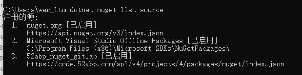

# 52ABP V5 升级指南

> 本指南适用于当前版本 52Abp <=4.0的版本；如果在升级过程中遇到问题，欢迎提出。 如果发现本指南存在遗漏/错误，请指出! 或者你遇到了新的问题并解决了，欢迎补充! 如果升级中遇到问题请前往 [52ABP V5 升级指南 Upgrade Guide](https://github.com/52ABP/52ABP.Template/discussions/57) 反馈


## 开始之前

1. 首先确保您`Node.js` >= 10.13。
2. 已经安装.NET 5 版本。
3. 创建新的分支，或者使用其他方式备份当前项目。

> 52ABP框架不仅仅是一个后端框架，它还包含了前端框架如Angular和Vue。本次的升级包含了52ABP的大量模块变化，本次的升级与以往的升级不同，带有较大的破坏式升级。如果您在升级过程中遇到了问题，请前往 [52ABP V5 升级指南 Upgrade Guide](https://github.com/52ABP/52ABP.Template/discussions/57) 反馈。


## 升级步骤

### 1.配置私有Nuget源

打开cmd或者pwsh后，在控制台中输入以下命令：

```bash
dotnet nuget   Add source "https://code.52abp.com/api/v4/projects/4/packages/nuget/index.json"  --name "52abp_nuget_gitlab"  --username gitlab-ci-token  --password FReV-29xFzz2TsoEd4Wg

```

即可配置，配置完成后
可以通过`dotnet nuget list source`命令进行检查如下图：




### 2.统一Nuget包的版本（升级ABP包）

打开项目解决方案后，访问`abpversion.props`文件，统一配置ABP与L52ABP的nuget包版本。

```xml
<Project>
  <PropertyGroup>
    <AbpVersion>6.4.0</AbpVersion>
    <L52abpVersion>4.7.2144</L52abpVersion>
  </PropertyGroup>
</Project>
```

现在你可以有针对性的调整各个nuget包的版本内容。我们按照领域驱动设计的思路从领域层逐步到最后的展现层来做升级。

### 3.领域Core层类库升级


### 4.应用层Application层类库升级

### 5.展现层Web层类库升级

### 6.基础设施层Entityframework层类库升级