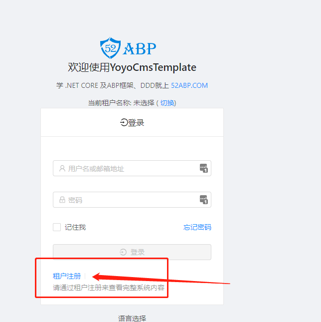
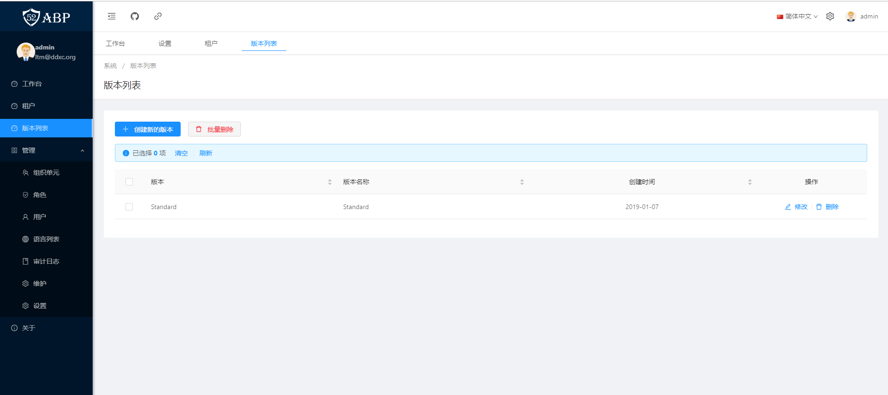
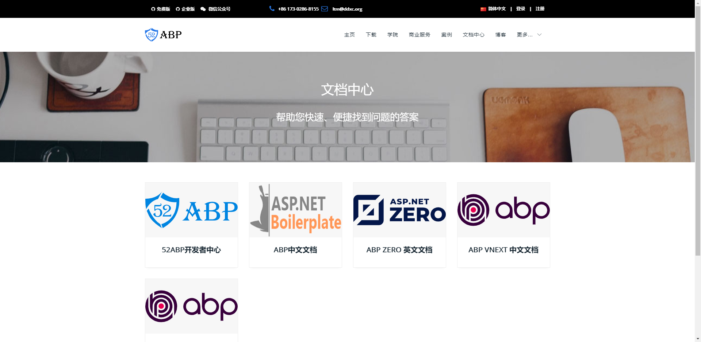

# 上线了

官宣！官宣！官宣！
重要的事情说三次。

是的，你没有看错 https://www.52abp.com/ 的官方企业模板：52abp-pro 已经正式上线。
至此 52abp.com 的官方网站就算告一段落，后续会补充的功能，应该是活动有关的内容了。
距离 52abp 社区的完善又近了一步。

目前 52abp-pro 的功能范围依然以后端功能为主，当然目前我们正在集成微信开发模块，已经进入测试阶段了。不久就会和大家相见。从 19 年 1 月 52abp-pro 发布第一个版本到目前为止，更新的内容更多是为了完善内容，以及稳定模块，并没发生太大的改动。另外和几个小伙伴在运营上不太擅长，精力也有限的很，所以我们把更多的时间和精力用来开发更加完善的用户体验功能了。

目前你只需要到 https://www.52abp.com/Purchase 进行购买下载即可。
52abp.com 整个网站都是采用的 52abp-pro 进行开发的，目前已经打通了支付宝支付，功能稳定。
所以无须担心是否放心用于生产环境的问题。

# 功能范围

52abp-pro 当前功能有 登录注册 多语言切换* 消息管理* 租户管理（多租户）_ 角色管理_ Session* 授权（权限管理）* 设置管理* 多语言管理* 邮件通知* 审计日志* 动态 WebApi\* Feature 处理等功能，欢迎注册使用

> 预览地址：[https://pro.52abp.com/account/login)
> 请通过租户注册来查看完整系统内容

 

**目前我们采用的是收费授权，金额较为低廉 欢迎咨询,qq:623037939 微信:wer_ltm**

## 后续

我们会继续完善 https://www.52abp.com/Wiki 的文档中心内容，无论是 ABP、52ABP 还是 ABPVnext 我们都会持续更新，当然由于人力资源和精力的原因，速度会比较慢。

 
## 感谢

一路走来，听过不少诋毁和吐槽，也收到不少鼓励和赞赏，有太多想要感谢的人：
感谢我们的用户，感谢每一个提 issue 和 pr 的人；
感谢码云 CEO 红薯大力的支持。**PS：即将和他们录制公开课视频哦~到时候大家来一起看哦。**
感谢购买《[ASP.NET Core 与 Angular6 快速开发](https://dwz.cn/kQydQrTe)》的学员们，让 52abp 得以有资金进行发展。
感谢 @熊猫 的信任和支持，感谢@兔子为我们设计的 Logo。
感谢某人的及时出现，稳定了我的信心；
感谢每一个帮助过我们的人；

## 最后

本着对用户、对团队乃至对自己负责的态度，借此机会尝试着寻求一些赞助，当然赞助商能够得到充分的广告展示在 52abp.com 以及相关框架中，**黄金位置、先到先得**。。当然目前我们网站流量并不大。
我们也在寻求一些更多的合作机会，如有兴趣，可以通过微信(wer_ltm)联系我

> 如果到现在为止你都不了解 ABP 框架可以看看这篇文章：[2019 年起如何开始学习 ABP 框架系列文章-开篇有益](https://www.52abp.com/Wiki/52abp/latest/docs/Introduction)
> 在 2019 年如果你不了解.NET 方面的趋势与前景，可以推荐你看看[.NET 持续进化的统一开发平台
> ](https://www.52abp.com/BlogDetails/10009)

欢迎关注微信公众号 角落的白板报，及时掌握更新动态！！！

