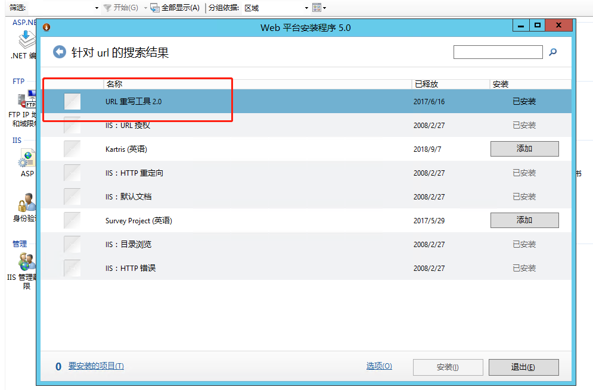
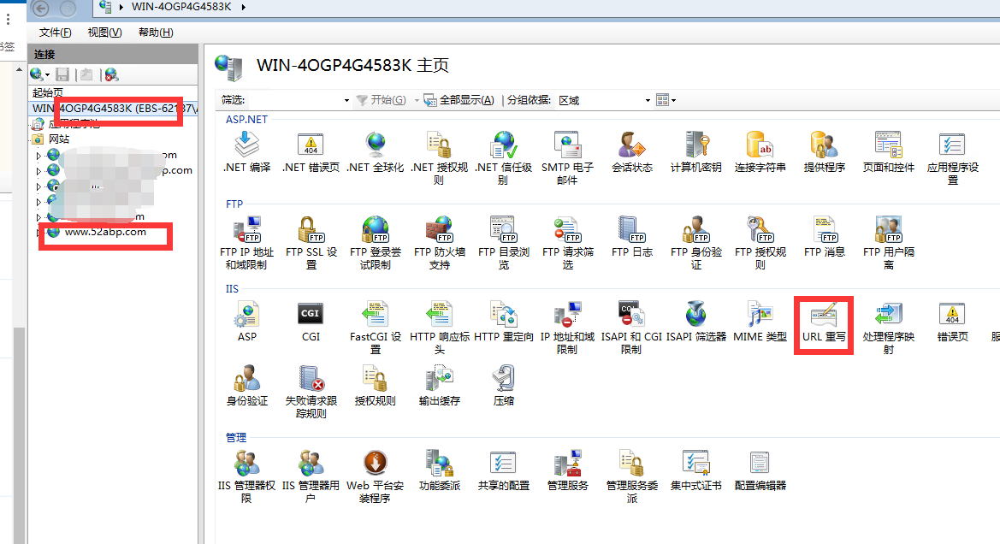
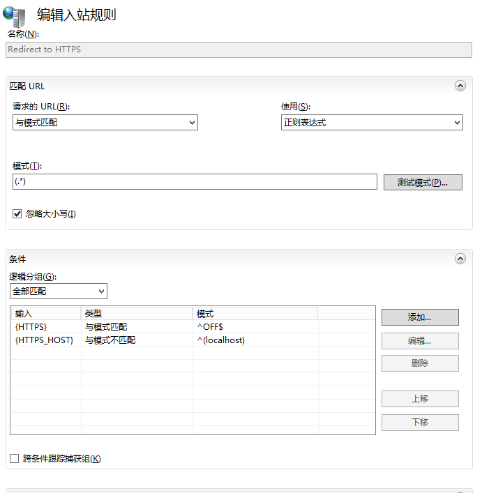
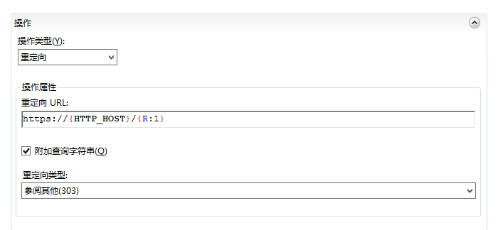
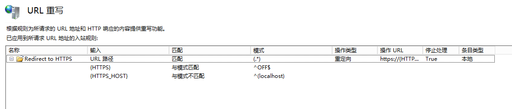

# 引言

> 本文推荐阅读地址：[https://www.52abp.com/BlogDetails/10008](https://www.52abp.com/BlogDetails/10008)

这种文章网上可以说一搜一大把，但是我为什么还要写呢，因为一搜一把没把我气死，都是东抄西挪的东西，搞得整个文档质量太差。基本上看了几篇，连蒙带猜才配置好。
当然我在 2019 都要来了的时间写这个文章，有点像 49 年入国军的感觉。但是改写的内容还是得写，谁叫 IIS 还是很好用的。

# 我们先说需求场景

使用场景：首先你的有需求，比如我们的 52ABP 启用了 SSL 全站加密，那么默认浏览器进入的地址是：http://www.52abp.com ，我需要将http://www.52abp.com 自动跳转到 https://www.52abp.com 的入口中去，不然还是会有没加密的路径可以进行访问。

有了需求我们再来说下需要准备的工具和环境：

- URL ReWrite 工具，下载地址：https://www.iis.net/downloads/microsoft/url-rewrite
  but，2.1 的版本是有 bug，我之前被他们坑出翔了。所以有些时候你可能需要 2.0 的版本。
  2.0 从哪里可以下载呢。从[Web Platform Installer](https://go.microsoft.com/fwlink/?LinkID=145510)里面进行安装吧。

 

# 操作流程

配置 URL 分为全局和非全局，下图，可以看到 URL 重写组件内容。

 
选择某一个站点中的 URL 重写，我们称之为单独的非全局。
直接选择 IIS 的可以配置全局，所以这里要依靠你自己的判断和选择。

## 打开 Url 重写工具

在右侧点击`添加`，然后选择`空白规则`，然后进行规则的配置。

## 规则命令如下

这个也是网上一大堆教程最神的地方，很多东西都是缺失的，后者不把代码帖出来的。。

名称：`Redirect To HTTPS`（这个名字你可以自己改）
模式: `(.*)` 然后点击忽略大小写

 

### 条件中的逻辑分组处理

首先参考上图中的逻辑分组信息。

|     输入     |     类型     |     模式     | 是否忽略大小写 |                   备注                    |
| :----------: | :----------: | :----------: | :------------: | :---------------------------------------: |
|   {HTTPS}    |  与模式匹配  |    ^OFF\$    |      YES       |  此项用来匹配你的请求是 HTTPS 还是 HTTP   |
| {HTTPS_HOST} | 与模式不匹配 | ^(localhost) |      YES       | 如果你是本地的`localhost`不会重定向到 SSL |

> 这个也是网上一堆复制粘贴不写清楚的地方。

## 操作重定向
 

在操作属性中，重定向的 URL：`https://{HTTP_HOST}/{R:1}` ，然后选中 `附加查询字符串`以及重定向类型为 303 即可。

## 总结

其实这些都不难，但是网上很多人写资料，写的不清晰也不检查，导致问了不少问题。

最终效果

## 额外的内容

本文的原文在 github，如果您发现了错漏，欢迎参与协同哦~】

协同地址：[https://github.com/52ABP/Documents/blob/master/src/articles/IISConfigUrlRewrite.md](https://github.com/52ABP/Documents/blob/master/src/articles/IISConfigUrlRewrite.md)

我们创建的 52ABP 框架，已经开始有很多小伙伴开始使用了。如果您对这套基于.net core +angular 的前后端分离的框架感兴趣的话，欢迎来找我们哦~

传送门： [2019 年起如何开始学习 ABP 框架系列文章-开篇有益](https://www.52abp.com/Wiki/52abp/latest/docs/Introduction)
