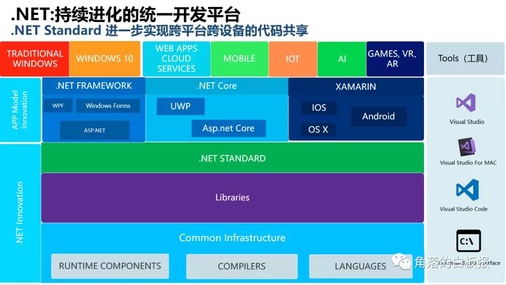
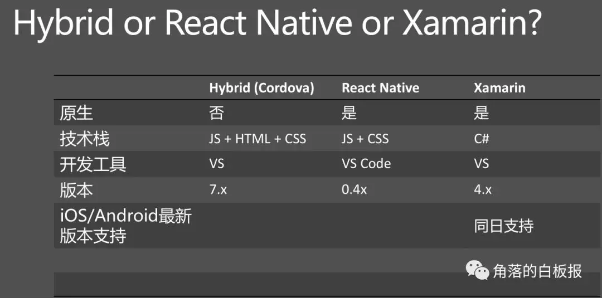
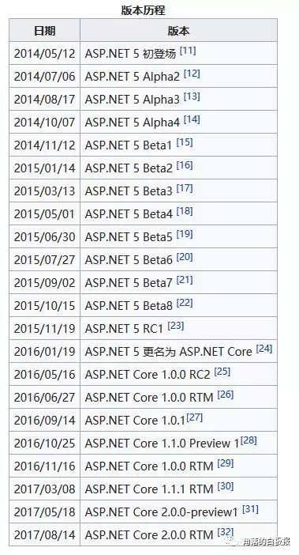

> 阅读文本大概需要 8 分钟。

标题使用的是**进化**这个词语，是因为 .NET 在不断的努力，也在不断的重构。
这篇文章的更多目的和意义在于科普，俗称“传教”。

# 持续进化的 .NET

这张图即是一个学习的路线图同样他也是 .NET 平台的进化图。也是代表着 未来.NET 的发展方向。
今天的故事呢，就会根据上图中的名词一个个的解释下来。让各位更好的了解.NET 。

# .NET 到底是什么？

在过去的日子中大家提到 .NET 通常是指 .NET Framework 这么一个框架。但是随着.NET 技术的发展，时至今日，广义的 .NET 指包含 **.NET Framework**，**.NET Core**，**Mono**在内，是基于.NET 技术的整个产品系列。

> .NET 是一个通用开发平台。 它具有几项关键功能，例如支持多种编程语言、异步和并发编程模型以及本机互操作性，可以支持跨多个平台的各种方案。
> .NET 开发可以实现包括 .NET Framework、.NET Core 和 Mono。 .NET 的所有实现都有一个名为 .NET Standard 的通用 API 规范。
> .NET 拥有惊人的性能和开发效率，并且拥有数百万的开发者。

以上就是最新的.NET 的介绍。以后提到.NET 不再仅仅是.NET Framework 了。

我也就微软着新生的 .NET 或者说进化后的.NET 来说说过往吧。

# .NET Framework

> 传统的 .NET Framework 是以一种采用系统虚拟机运行的编程平台，以(通用语言运行库)CLR（Common Language Runtime）为基础，支持多种语言（C#、F#、VB .NET、C++、Python 等）的开发。

这也是我们目前市面上用到最多也是大家最熟悉的.NET，它是目前在市场中的占比是最大的，他很成熟也很稳定，但是他的弱点是在于他天生不具备跨平台，这也是被广大程序员所诟病的，他需要跨平台，是需要通过配合 Mono 来使用，它更多的运行在 Windows 服务器上，需要 IIS 作为宿主。

而提到.NET Framework 就不得不提到 Java 了。

# .NET Framework VS Java

甲骨文(Oracle)公司的 Java 语言和 J2ee 技术是.NET 平台的竞争对手之一。

说起.NET 的起源，还得先说到 Java。众所周知，Java 是一个主打敏捷开发，跨平台的编程语言。而.NET 的诞生，与 Java 有着千丝万缕的联系。

> Java 的历史可以追溯到 20 世纪 90 年代，最初是由 Sun 公司为了实现电子产品智能化而开发的程序语言，主打的设计思想是敏捷开发和跨平台。1995 年 Java 正式推出之后，立刻受到了包括 IBM、Apple、Adobe、HP 和微软在内的各大公司的追捧。随后几年 Java 的发展势如破竹，作为一款收费产品，Java 给 Sun 公司带来了非常可观的盈利（Java 已于 2006 年底宣布免费开源）。而微软作为软件大厂，当然不愿看着 Java 一家独大，同时也意识到了敏捷开发的巨大前景，由此诞生了 Microsoft .NET。

> .NET 框架作为 Visual Studio 的组件之一发放，自 2002 年全新 VS .NET 搭载.NET 1.0 起，.NET 至今已更新四个主版本，.NET 4.0 于 2010 年随 VS2010 发布， 目前最新的 .NET Framework 版本为 4.7.1。来源

> .NET 与 Java 有非常多的相似之处，二者都是即时编译（JIT）的动态语言。这类语言中，项目编译生成的目标文件并不是机器码，而是需要由运行时环境进行即时编译的特殊代码。在 Java 中这种特殊代码叫做字节码（bytecode），而.NET 中则叫做中间语言（Common Intermediate Language，简称 IL）。Java 官方的运行时环境叫做 JRE（Java Runtime Environment），而.NET 官方的运行时环境叫做 CLR（Common Language Runtime）。

**而我要吐槽的地方就在这里 ** 经常有很多人唱衰.NET 说 BAT 都不用 .NET 都是用 java 的。

# 为什么国内的互联网公司都使用的是 JAVA 呢？

拨开迷雾看本质。

- 阿里巴巴 1999 年成立
- 百度 2000 年成立
- 腾讯 1998 年成立 。
  > .NET 2002 年才发布 1.0 版本。。你告诉我 他们有的选吗？

### 有人要提出京东 是从.NET 转的 java ?

为什么，因为那个时候 .NET 不开源没有现成的大型电商、分布式、集群的解决方案，而 java 有大把的电商和互联网人才，注定了会选择 JAVA 而不是 .NET 。
**或许还有就是舍不得钱啊，毕竟 windows 服务器的授权费贵。** ~皮一下很开心。
所以 .NET 错在于它出生的晚了，不支持跨平台。 中国的互联网公司一开始就没有什么选择。

# .NET 的跨平台之路

在和 Java 的博弈和对战中，我们都知道 .NET Framework 一直被吊打，尤其在国内。好在 2014 年 11 月 12 日，微软宣布将完全开放.NET 框架的源代码，并提供给 Linux 和 OS X 使用。[[来源]](https://weblogs.asp.net/scottgu/announcing-open-source-of-net-core-framework-net-core-distribution-for-linux-osx-and-free-visual-studio-community-edition)

听了这么一则新闻之后大家知道 .NET 或许还有机会打一波翻身仗。但是早在这个新闻之前其实就有 Mono 这么一个 .NET 跨平台解决方案。

# Mono 神奇的跨平台解决方案

所以如果有人问你，.NET Framework 怎么跨平台，告诉他，可以使用 Mono。
那 Mono 到底是什么？
它为什么可以跨平台？

在 .NET 开源之前，需要首先了解 Mono，了解 Mono [[维基 Mono]](http://www.wikipedia.org/wiki/Mono)

考虑到大多人咳咳不方便搭梯子以及英文不是很好,我摘录和转载了几个博主的文章。

> .NET Framework 是由微软独立开发，闭源且具有专利性质的独家技术，并且微软只提供了针对 Windows 系统的支持。而作为同类竞争对手的 Java，却能通杀包括 x86、ARM 在内的主流硬件平台，软件方面也支持包括 Windows、Linux、Android 在内的各种桌面、移动、嵌入式系统。

> Mono 是一个由 Xamarin 公司（先前是 Novell，最早为 Ximian）所主持的自由开放源代码项目。该项目的目标是创建一系列符合 ECMA 标准（Ecma-334 和 Ecma-335）的 .NET 工具，包括 **C# 编译器**和**通用语言架构**。与微软的 .NET Framework（共通语言运行平台）不同，Mono 项目不仅可以运行于 Windows 系统上，还可以运行于 Linux，FreeBSD，Unix，OS X 和 Solaris，甚至一些游戏平台，例如：Playstation 3，Wii 或 XBox 360

因此，为了提升.NET 的平台适应性，微软在.NET 发展之初就建立了一套对于.NET 中间语言的实现规范——**.NET Common Language Infrastructure**，这相当于一套关于.NET 中间语言（IL）的语法手册，微软希望通过这种方式让第三方和开源社区来参与.NET 的平台移植。

**Ximian 公司是最早参与这项工作的成员之一，并于 2004 年 6 月发布了第一代.NET 跨平台产品——Mono 1.0。**

Mono 与微软官方的 CLR 一样，都是对 .NET CLI（Common Language Infrastructure）的实现，他们都能对.NET 的中间代码（IL）提供实时编译。不同的是，CLR 只支持 Windows 系统，而 Mono 如今已支持包括 Windows、Linux、macOS、iOS、Android 在内的各种主流平台和操作系统。

著名的游戏引擎 Unity3D 就包含了 Mono，我们所熟知的《Tample Run 神庙逃亡》、《炉石传说》、《Deemo》等游戏都是基于 Unity3D 开发的（包含.NET 和 Mono 的技术）。

> 值得一提的是，Mono 是一个有故事的项目，十几年来历经波折，几经转手，于 2011 年落入 Xamarin 公司手中，其间 Mono 还与微软发生过专利纠纷。

> 终于在 2016 年 2 月，微软正式收购 Xamarin，从此 Mono 回到了微软霸霸的怀抱，成了亲生儿子，同时微软宣布 Mono 面向社区免费。在 2016 年 11 月的 Connect(); //2016 开发者大会中，微软还发布了基于 Xamarin Studio 改造的 Visual Studio for mac。

> 看看 Mono 这么牛逼 可以在微软闭源的情况下，还让.NET 跨平台的 他到底是怎么个牛逼法呢。
> 这就牵扯到了一个问题“.NET 应用程序是怎么运行的？” 想知道答案的朋友们可以去好好看 ** [魅力 .NET：从 Mono、.NET Core 说起](http://www.cnblogs.com/xishuai/p/mono-dotnetcore.html)**

# Xamarin

考虑如何生成 iOS 和 Android 应用程序时，许多用户都认为本机语言、Objective-C、Swift 和 Java 是唯一的选择。 但是，在过去几年中，一个全新的生成移动应用程序平台的生态系统已经出现了。
Xamarin 将.NET 的强大功能和生产力带入 iOS 和 Android，重用技巧和代码，同时获得本地 API 和性能。
Xamarin 是唯一能通过提供跨 iOS、Android 和 Windows Phone（Windows Phone 的本机语言已经是 C#）这三种平台可正常工作的单一语言 - C#、类库和运行时，却仍能编译性能甚至足以满足高要求游戏的本机（非解释型）应用程序的平台。
**来一张对比图**

 

Hybrid 是指混合开发，目前的 ionic 、weex、MUI 均在此列表中。

React Native 是 Facebook 推出的基于 React 的做的框架，也很生猛目前在社区的生命力很旺盛。

#.NET Standard
某明奇妙提到的这个 .NET Standard 其实是未来的.NET 核心，一切基于它来实现代码的共享。

> .NET Standard 进一步实现跨平台跨设备的代码共享

.NET Standard 是一组由 .NET 实现的基类库实现的 API。 更正式地说，它是构成协定统一集（这些协定是编写代码的依据）的特定 .NET API 组。 这些协定在每个 .NET 实现中实现。 这可实现不同 .NET 实现间的可移植性，有效地使代码可在任何位置运行。

.NET Standard 也是一个目标框架。 如果代码面向 .NET Standard 版本，则它可在支持该 .NET Standard 版本的任何 .NET 实现上运行。

# .NET Core

> 最后，终于来到了现在火热的.NET Core 。

自 .NET Framework 发布至今已有十余年，由于微软过于保守的版权策略，.NET 一直作为 Windows 平台的封闭产品。尽管有 Mono 项目对.NET 实现了平台移植，但毕竟不是微软“亲生”，Mono 在一些实现上仍然不够完美。

随着 2014 年 Xamarin 和微软发起.NET 基金会，微软在 2014 年 11 月份开放.NET 框架源代码。随后在.NET 开源基金会的统一规划下诞生了 .NET Core。

（注：.NET Core 早期被称为 .NET vNext 或 .NET 5，直到 2016 年 1 月才正式命名为 .NET Core 1.0）

需要注意的是，尽管微软把 .NET Core 作为.NET 未来的发展方向，但 .NET Core 和 .NET Framework 仍然是两个独立的产品。.NET Framework 也会继续更新和维护。

.NET Core 与 .NET Framework 最大的区别在于 .NET Core 是完全开源的，托管在 github 上，支持任何人向项目贡献代码。并且，.NET Core 不再是 Windows 独占，还支持 Linux、macOS 等多种平台。

而 .NET Core 是.NET Framework 的新一代版本，或者说是其进化版本，是微软开发的第一个跨平台 (Windows、Mac OSX、Linux) 的应用程序开发框架（Application Framework），未来也将会支持 FreeBSD 与 Alpine 平台。.Net Core 也是微软在一开始发展时就开源的软件平台，它经常也会拿来和现有的开源 .NET 平台 Mono 比较。

由于 .NET Core 的开发目标是跨平台的 .NET 平台，因此 .NET Core 会包含 .NET Framework 的类库，但与 .NET Framework 不同的是 .NET Core 采用包化 (Packages) 的管理方式，应用程序只需要获取需要的组件即可，与 .NET Framework 大包式安装的作法截然不同，同时各包亦有独立的版本线 (Version line)，不再硬性要求应用程序跟随主线版本。

> **2016 年 6 月 27 日 在 RedHat DevNation 峰会上宣布了 .NET Core & ASP .NET Core 1.0 RTM 的发行。**
> 而目前最新的 .NET Core 版本为 2.1.4。

> .NET Core 的核心点： 创新、开源、跨平台

## 用更少的时间做更多有趣的事情

**Develop high performance applications in less time, on any platform.**
翻译后：用更少的时间，在任何（全）平台上开发高性能应用程序。
以上描述说的就是 .NET Core。

参考链接：[Develop high performance applications in less time, on any platform](https://www.svmsystems.com/single-post/2017/07/11/Develop-high-performance-applications-in-less-time-on-any-platform)

### 特点如下：

- #### 跨平台
  您可以创建在 Windows，Linux 和 MacOS 上运行的.NET Core 应用程序。
- #### 统一
  利用统一的.NET 标准库(.NET Standard)，使用相同的代码定位所有平台，并使用相同的语言和工具重用您的技能。
- #### 轻量级
  没有影响部署和模块化开发模型，您只需要依赖于您所需的最少组件包。
- #### 现代

  多语言支持 C＃，VB，F＃和现代结构，如泛型，语言集成查询（LINQ），异步支持等等。

- #### 开源
  运行库，库，编译器，语言和工具都是 GitHub 上的开源代码，接受代码贡献，测试和完全支持。

# .NET Core 与其他平台的关系

.NET Core 经常会拿来与其他平台做类比，尤其是它的源头 .NET Framework 以及另一个相似性质的开源平台 Mono。
为了让大家，更好的理解下，我阐述下吧。

#### .NET Framework

据微软的帮助，.NET Core 和 .NET Framework 是子集 (Subset) 与超集 (Superset) 的关系，.NET Core 将会实现出部分的 .NET Framework 功能 (基本上是不含用户界面的部分)，例如 JIT (.NET Core 采用 RyuJIT)、垃圾收集器 (GC) 以及类型 (包含基本类型以及泛型类型等)[10]。未来 .NET Framework 和 .NET Core 也将会是各自发展，但它们也会同时使用彼此的功能，例如 .NET Compiler Platform 与 RyuJIT 等技术。

#### Mono

Mono 是另一个已发展许久的 .NET Framework 跨平台开源版本，基本上并不隶属微软官方，而是由社区的力量所主导，自成一个生态系统，也开发出了像 Xamarin 这样的跨平台.NET 移动应用，.NET Core 与 Mono 未来会是合作的关系，Mono 仍会维持社区力量的维护与发展，而 .NET Core 则会以官方角度来进行发展，两边也会一起进行彼此功能上的增进。

#### .NET Core 与 ASP .NET Core 的关系

其实一开始并不是主从关系 [11]，ASP.NET Core 的开发初期 (ASP.NET 5) .NET Core 还没有开始起跑，因此 ASP.NET Core 当时有自己的运行期与工具，一开始称为 Project K，后来改为 DNX (.NET Execution Environment)，DNX 本身就具有可独立运作的运行能力，不需要依赖 .NET Core 运行，但是这样会变成 .NET Core 和 ASP.NET Core 双头马车的现象，在 .NET Core 逐渐成熟之后，微软也决定要将这两个各自独立发展的产品线集成在一起，DNX 也将因改用 .NET Core 运行期而终止开发，DNX 的功能将由 .NET Core 以及旗下的 .NET CLI 接替提供，集成后的版本将在 1.0 RC2 时发布。

# ASP .NET

严谨来说，ASP.NET 本不应该放在此处与以上三个框架平行，但是因为 ASP .NET 太出名了，因此我不得不在这说清关系。

ASP.NET 最初是.NET Framework 框架中的一个组件，用于开发 Web 应用程序。它是 ASP 技术的改进版本，需要注意的是，ASP 与 ASP.NET 是完全不同的两个产品。同理，VB 和 VB.NET 也是完全不同的两个产品。ASP 和 VB 都是上个世纪的技术，过于古老在此不再赘述，但请务必注意区分它们。

早期的 ASP.NET 提供一种叫做 WebForm 的方式用于呈现网页，它可以让网页开发变得像 WinForm 开发一样简单且可视化。但由于 WEB 技术的飞速发展，WebForm 由于其低效、封闭和难以定制的缺陷已经逐渐淡出历史舞台。

随着.NET 3.5 的发布，微软提供了全新的 ASP.NET 网页呈现方式，称为 ASP.NET MVC Framework。这套框架遵循 MVC 设计模式思想，将视图和逻辑进行了很好的分离，并且大幅提升了性能和可定制性。

经过多年发展，目前已经更新到了 ASP.NET MVC6，MVC6 完全采用.NET Core 的项目结构，支持 Framework、Core、Mono 多种运行时。因此，ASP.NET MVC6 也被称为 ASP.NET Core。

# ASP.NET Core

#### 历史的进程

ASP.NET Core 是新一代的 ASP.NET，早期称为 ASP.NET vNext，并且在推出初期命名为 ASP.NET 5，但随着 .NET Core 的成熟，以及 ASP.NET 5 的命名会使得外界将它视为 ASP.NET 的升级版，但它其实是新一代从头开始打造的 ASP.NET 核心功能，因此微软宣布将它改为与 .NET Core 同步的名称[1]，即 ASP.NET Core。

ASP.NET Core 可运行于 Windows 平台以及非 Windows 平台，如 Mac OSX 以及 Ubuntu Linux 操作系统，是 Microsoft 第一个具有跨平台能力的 Web 开发框架。

微软在一开始开发时就将 ASP.NET Core 开源，因此它也是开源项目的一员，由 .NET 基金会 (.NET Foundation) 所管理。

### 现在的责任

ASP .NET Core 是一个跨平台的高性能开源框架，用于生成基于云且连接 Internet 的新式应用程序。
使用 ASP.NET Core，可以：

- 生成 Web 应用和服务、IoT 应用和移动后端。
- 在 Windows、macOS 和 Linux 上使用喜爱的开发工具。
- 部署到云或本地。
- 在 .NET Core 或 .NET Framework 上运行。

> 注 1：随着.NET 技术的发展，时至今日，广义的 .NET 指包含.NET Framework，.NET Core，Mono 在内，是基于.NET 技术的整个产品系列。而在过去的习惯中，.NET 通常特指.NET Framework 这一个最正统的框架。

> 注 2：.Net Core 也有两重概念，广义来说，Core 指全新的一整套框架，包括运行时，命令行工具，项目结构定义等等。Core 结构的项目，支持指定 Framework、Mono 或者 Core 中的一者或多者作为运行时环境。而狭义上的 Core，仅特指 .NET Core CLR（运行时）。请根据上下文和语境区分其定义。

# 如何在 Windows，Linux 和 macOS 上选择顺手的.NET 开发工具.

如果您不确定从哪里开始？我们建议尝试[Visual Studio](https://www.visualstudio.com/)。

### Visual Studio

Windows 上的全功能集成开发环境（IDE），用于构建各种类型的.NET 应用程序。宇宙最强大的编译器。

### Visual Studio Code

在 Linux，macOS 或 Windows 上开发以构建跨平台网站和服务。安装 C＃扩展以获得最佳体验。

### 适用于 Mac 的 Visual Studio

使用 Xamarin 构建原生 Android，iOS，macOS 和 Windows 应用程序，以及使用 ASP.NET Core 创建网站和服务。

### OmniSharp

编辑器中的跨平台.NET 开发，如 Atom，Brackets，Sublime Text，Emacs 和 Vim。

### JetBrains Rider

使用 IntelliJ 和 ReSharper 技术构建的跨平台.NET IDE。它为所有平台上的.NET 和.NET 核心应用程序提供支持。

### .NET Core CLI

用于在 Linux，macOS 和 Windows 上开发跨平台网站和服务的命令行界面（CLI）。

### 尾声

最后推荐一本小书：《.NET 传奇：封闭到开放的历程》
所以 2018 全面扑腾到 .NET CORE 吧 !

顺带一提，您如果在文章中看到一些错误和疏漏，还请指出，或者到 github 上进行修改提交 PR。非常感谢。

我们再回过头来看这张图是不是清晰了很多呢。

#### 参考文献：

https://en.wikipedia.org/wiki/Mono_(software)
https://wc.yooooo.us/wiki/.NET_Core
http://www.cnblogs.com/xishuai/p/mono-dotnetcore.html
http://www.jubeat.net/2016/09/25/dotnet-core-prologue/
https://wc.yooooo.us/wiki/.NET%E6%A1%86%E6%9E%B6
https://wc.yooooo.us/wiki/ASP.NET
https://wc.yooooo.us/wiki/ASP.NET_Core
