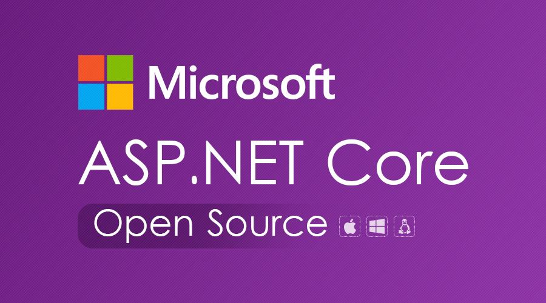
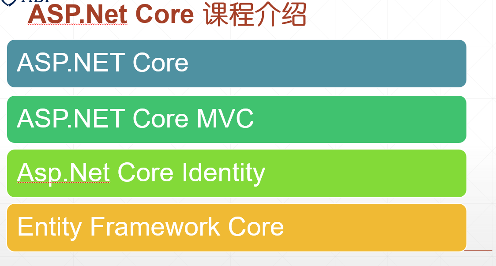
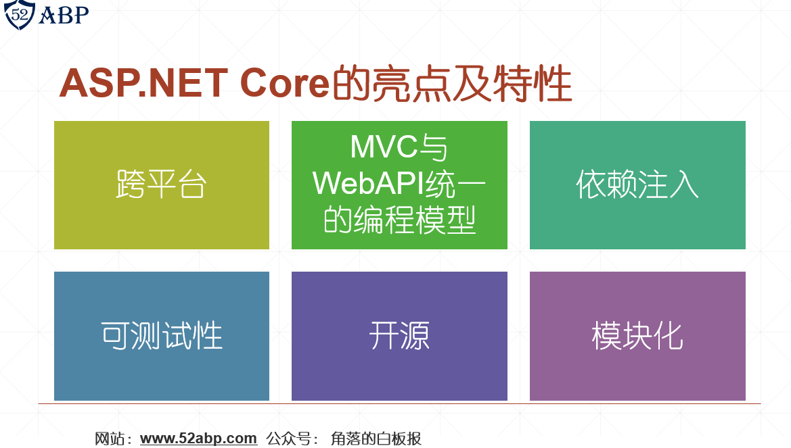
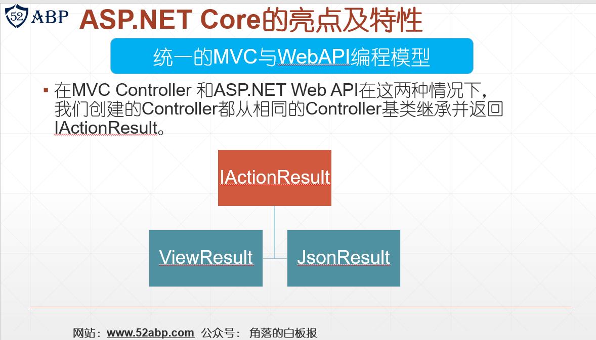

# 目录

> 本文出自[《从零开始学 ASP.NET CORE MVC》目录](https://www.52abp.com/wiki/mvc/0.1.4/1.Intro)  
> 视频课程效果更佳：[从零开始学 Asp.Net Core MVC](https://study.163.com/course/courseMain.htm?courseId=1209215803&share=2&shareId=400000000309007)  

# ASP.NET Core 简介--master

大家好，欢迎来到 52ABP 学院，收看我们的 《从零开始学 ASP.NET CORE 》。

从 2015 年开始随时互联网成长，云计算和 AI、大数据的爆发，大家从谈论项目信息化到数字化的转型，从 ToC
产业到 ToB 产业的转型，Web 的项目开发模式也开始不断的在变化，出现了众多的新技术，新标准。
微软也适时的推出了 ASP.NET Core，这是.NET 开发的一次重大革命，它将使数百万开发人员进入一个全新领域
的机会。

作者有幸看了不少.Net 有关的书籍，都发现一个特点，都是一开始都是很多散乱的知识点一次性讲解，比如讲解布局有关的知识点，恨不得把所有的知识点都写出来。这样固然是好，但是这样不利于初级开发人员，因为初级开发人员不知道这样的功能或者知识点能够解决什么业务问题。

而本书，暂定名字《从零开始学 ASP.NET CORE 》。则带着大家从零开始搭建一个项目，从最基本的控制台开始，然后涉及到基本的启动流程到中级到最后的高级ASP.NET Core 概念。
 

在我们搭建这个项目并完成整个课程的过程中，我们将学习如何使用 ASP.NET Core Web 框架,并且能够掌握如何搭建以数据驱动的 Web 程序的一切知识。

通过完成本课程，您将能够使用 ASP.NET Core 开发新的 Web 应用程序，并在为新项目选择技术时做出战略决策。

我们将详细讨论和学习

- ASP.NET Core
- ASP.NET Core MVC
- ASP.NET Identity Core
- Entity Framework Core

# 什么是 ASP .NET Core

ASP.NET Core 是一个跨平台，高性能的开源框架，用于开发更加符合现代现代思想的 Web 应用程序,更符合互联网平台，而且它让基于“云”的开发方式更加简单。

ASP.NET Core 是基于 ASP.NET 4.x 系列的重新设计的。出于这个原因，它最初称为 ASP.NET 5，但后来重命名为 ASP.NET Core 1.0。

ASP.NET Core 完全由现有的 ASP.NET 4.x 重写，其架构更改使其更具模块化，可扩展，开源，轻量级，高性能和跨平台的 Web 框架。

> 如果你想知道更多.NET 的发展趋势，可以参考这篇文章：https://www.52abp.com/BlogDetails/10009

# ASP .NET Core 的优点和特性：

ASP.NET Core 框架在开发人员中变得越来越流行，是因为基于以下几个优点和特性：

## 跨平台：

ASP.NET Core 框架从底层设计就是为了跨平台。
ASP.NET 4.x 应用程序只能在 IIS 上托管，而 ASP.NET Core 应用程序可以托管在 IIS，Apache，Docker 甚至自己把自己托管在进程中（俗称：自托管）。
从开发方式上来看，您可以使用 Visual Studio 或 Visual Studio Code 来构建.NET Core 应用程序。您也可以使用 Sublime 等第三方编辑器。

## 统一的MVC和WebAPI的技术栈:

使用 ASP.NET Core ，我们使用相同的编程模型来创建 MVC 风格的 Web 程序和 ASP.NET Web API。
在这两种情况下，我们创建的 Controller 都从相同的 Controller 基类继承并返回 IActionResult。
顾名思义 IActionResult 是一个接口，它有几个实现。ViewResult 和 JsonResult 只是 IActionResult 接口的内置的返回结果类型中的两个而已。
因此，对于 Web API，控制器返回 JsonResult，对于 MVC 风格的 Web 程序，它返回 ViewResult。如果当前您听的不是很明白，不知道其中的意思，请不要担心，随着课程的进行，我们会在后面的内容中说的很清晰。

## 依赖注入

开箱即用，ASP.NET Core 内置支持依赖注入。如果您对这个强大的概念不熟悉，请不要担心，我们会在后面使用的过程中详细讨论它，目前你只需要理解它是一种设计模式即可。

## 可测试性

通过内置的依赖注入和用于创建 Web 应用程序和 Web API 的统一编程模型，可以轻松地对 ASP.NET Core 应用程序进行单元测试和集成测试，如果你不理解不要紧，后面都会讲的。

## 开源和以社区为中心

ASP.NET Core 是完全开源的，由.NET 团队与众多开源开发人员社区合作开发。因此，ASP.NET Core 会不断的发展，因为它背后的庞大社区正在建议改进它并帮助修复错误和有问题的方法。这意味着我们会拥有更安全，质量更好的软件。

## 模块化 HTTP 请求管道

ASP.NET Core 提供了模块化的中间件组件。
在 ASP.NET Core 中，请求(Request)和响应(Response)的管道都使用了中间件组件。它包含一组丰富的内置中间件组件。我们还可以编写自己的自定义中间件组件。随着课程的进行，我们将讨论中间件组件是什么，并使用它们来组成请求和响应管道。

# 课程的源代码哪里获取

免费提供源代码下载，您可以从 https://gitee.com/aiabpedu/asp.net-core-mvc-2019 下载本视频中的所有示例项目。

# 开始课程前得会点啥：

- 会一些基本的 HTML，CSS 和 C＃，无须是这方面的熟练者。您只需要掌握他们的基础知识就可以了。
- 之前的 MVC 知识很有帮助但不是必需的。即使你没有任何 MVC 经验，没关系。我们将在本课程中学习所有必需的 MVC 基础知识。

> 下节课： 为您的机器配置开发环境

## 延伸点：ASP.NET Core 没有了什么呢？

与传统的 ASP.NET 4.x Framework 相比，你在 ASP.NET Core 中找不到以下内容 ：

- Global.asax 文件
- Web.Config 文件
- HTTP 处理程序和 HTTP 模块
- ASP.NET 页面生命周期模型

# 文章说明

> 如果您觉得我的文章质量还不错，欢迎打赏，也可以订阅我的视频哦  
> 未得到授权不得擅自转载本文内容,52abp.com 保留版权  
> 【收费】腾讯课堂:[https://ke.qq.com/course/392589?tuin=2522cdf3](https://ke.qq.com/course/392589?tuin=2522cdf3)  
> 【免费】youtube 视频专区：[http://t.cn/Ei0F2EB](http://t.cn/Ei0F2EB)  
> 感谢您对我的支持

## 关注微信公众号：角落的白板报

