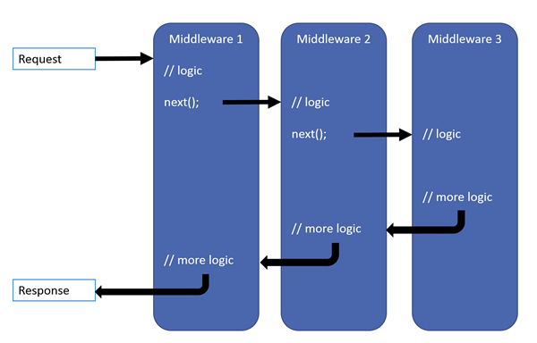

# 目录

> 本文出自[《从零开始学 ASP.NET CORE MVC》目录](https://www.52abp.com/wiki/mvc/0.1.4/1.Intro) </br>
> 视频课程效果更佳：[从零开始学 Asp.Net Core MVC](https://study.163.com/course/courseMain.htm?courseId=1209215803&share=2&shareId=400000000309007) </br>
> 推荐文章：[ASP.NET Core 中的中间件](https://www.52abp.com/wiki/mvc/latest/10.MiddlewareIntro)

# 配置 ASP.NET Core 请求(Request)处理管道

在本视频中，我们将讨论使用中间件组件为 asp.net core 应用程序配置请求处理管道。

作为应用程序启动的一部分，我们要在`Configure()`方法中设置**请求处理管道**。

```csharp
public class Startup
{
    public void ConfigureServices(IServiceCollection services)
    {
    }

    public void Configure(IApplicationBuilder app, IHostingEnvironment env)
    {
        if (env.IsDevelopment())
        {
            app.UseDeveloperExceptionPage();
        }

        app.Run(async (context) =>
        {
            await context.Response.WriteAsync("Hello World!");
        });
    }

}
```

目前我们的代码中有 2 个中间件在管道中 ：**UseDeveloperExceptionPage()方法**和**Run()方法**

UseDeveloperExceptionPage 中间件：顾名思义，如果存在异常并且环境是`Development`，此中间件会被调用，显示**开发异常页面**。 我们将在后面的视频中讨论这个**DeveloperExceptionPage 中间件**和**环境变量的使用**。

第二个中间件是注册`Run()`方法到管道中,它只能处理将一个信息传入`Response`对象。 目前，它是一个响应每个请求的中间件，返回 Hello world。
在这种情况下，无论您的请求路径是什么。 所有请求都会被这个中间件所处理，我们得到的返回值都是这个中间件调用`Response`对象,返回的 string 类型的字符串。
返回的值是纯文本而不是 html。 我们可以通过检查页面源代码来确认这一点。
可以看到，我们在源代码中没有任何 html 标记。 只是纯文本。

即使您现在创建一个为`52abp.html`的文件，并且您在请求中包含该文件的路径，我们的应用程序也无法返回该静态文件。 这是因为，目前我们的请求处理管道没有可以提供静态文件的中间件，如`html文件，图像，CSS和JavaScript文件`。
在后面的课程中，我们将添加所需的中间件以便能够提供静态文件。

## 研究下 **Configure()方法**中的代码。

```csharp
app.Run(async (context) =>
{
    await context.Response.WriteAsync("Hello World!");
});
```

**代码说明**:

- 我们调用 Run() 方法添加中间件到请求处理管道中。
- 如果将鼠标悬停在 Run()方法上，则可以从 智能提示中看到`Run()`方法是作为`IApplicationBuilder`接口的扩展方法实现的。这就是我们能够在`IApplicationBuilder`对象应用程序上调用此`Run()`方法的原因。
- 我们传递给`Run()`方法的参数是一个`RequestDelegate`，我们可以从智能提示中看到它。
- `RequestDelegate`是一个作为`HttpContext`对象的参数委托。
- 通过这个`HttpContext`对象，中间件可以访问传入的 http 请求和传出的 http 响应。
- 目前，我们使用`lambda`将请求，它通过委托内联的方式作为匿名方法传递,所以很多人都说 lambda 表达式是一种特殊的委托。如果你听不明白 lambda 表达式，委托，及内联，你可以参考学习:
  - 委托（delegate）
  - Lambda 简介 ,或者等我录制 C#的基础视频吧。
- 使用`Run()`扩展方法，我们只能将一个`终端中间件`添加到请求管道。
- `终端中间件`是我们之前已经说到过，他会使管道短路，不会去调用下一个中间件。

## 研究下面的代码

```
app.Run(async (context) =>
{
    await context.Response.WriteAsync("从第一个中间件中打印Hello World");
});

app.Run(async (context) =>
{
    await context.Response.WriteAsync("从第二个中间件中打印Hello World");
});
```

- 我们使用`Run()`方法注册了 2 个中间件。
- 运行此项目时，我们只看到第一个中间件的响应，有返回值。
- 我们没有看到第二个中间件的响应。
- 这是因为，使用`Run()`方法注册的中间件无法调用管道中的下一个中间件。
- 因此，我们使用`Run()`方法注册的中间件是`终端中间件`

如果您希望中间件能够调用管道中的下一个中间件，则使用`Use()`方法注册中间件，如下所示。

```
app.Use(async (context, next) =>
{
    await context.Response.WriteAsync("从第一个中间件中打印Hello World");
    await next();
});

app.Run(async (context) =>
{
    await context.Response.WriteAsync("从第二个中间件中打印Hello World");
});
```

注意，`Use()`方法有 2 个参数。第一个参数是`HttpContext`上下文对象，第二个参数是`Func`类型，即它是代表管道中下一个中间件的通用委托。

## 我们再看看以下代码

```
public void Configure(IApplicationBuilder app, IHostingEnvironment env,
                ILogger<Startup> logger)
{
    app.Use(async (context, next) =>
    {
        logger.LogInformation("MW1:传入请求");
        await next();
        logger.LogInformation("MW1:传出响应");
    });

    app.Use(async (context, next) =>
    {
        logger.LogInformation("MW2: 传入请求");
        await next();
        logger.LogInformation("MW2: 传出响应");
    });

    app.Run(async (context) =>
    {
        await context.Response.WriteAsync("MW3: 处理请求并生成响应");
        logger.LogInformation("MW3: 处理请求并生成响应");
    });
}
```

- `ILogger < Startup >`被注入到`Configure()`方法中
- `Main()`方法调用的`CreateDefaultBuilder()`配置日志记录
- 您可以通过查看在 GitHub 的源代码验证这一点
  [：https：//github.com/aspnet/MetaPackages/blob/release/2.2/src/Microsoft.AspNetCore/WebHost.cs](https://github.com/aspnet/MetaPackages/blob/release/2.2/src/Microsoft.AspNetCore/WebHost.cs)
- 检查方法`ConfigureLogging()`,\* 您会发现，ILogger 配置了`Console，Debug和EventSource`三种.
- 我们使用`依赖注入`的方式将`ILogger`记录到系统中。
- 如果使用.NET Core CLI 运行项目，则可以在“控制台”窗口中查看记录的信息
- 如果直接从`Visual Studio`运行项目，则可以在`输出窗口中`查看记录的信息。从输出窗口的下拉列表中选择 ASP.NET Core Web Server。
- 您将看到，信息按以下顺序记录
  - **MW1：传入请求**
  - **MW2：传入请求**
  - **MW3：处理请求并生成响应**
  - **MW2：传出响应**
  - **MW1：传出响应**

现在将上面的输出与微软的官方文档中的下图集合起来，是不是就清晰明了啊。吐槽下，微软的文档有粗糙。




- 请记住，asp.net Core 中的中间件可以访问传入请求和传出响应
- 请求先到达`Middleware1`，它记录**（MW1：传入请求）**，因此我们首先看到此消息。
- 然后`Middleware1`调用`next()`。`next()`会调用管道中的`Middleware2`。
- `Middleware2` 记录**（MW2：传入请求）**。

- 然后 `Middleware2` 会调用`next()`再调用 `Middleware3`.

- `Middleware3`处理请求并生成响应。因此，我们看到的下一条消息是`（MW3：处理请求并生成响应)`
- 此时管道开始逆转。
- 此时控制权将，交回到`Middleware2`，并将`Middleware3`生成的响应传递给它。`Middleware2`记录**（MW2：传出响应）**，这是我们接下来看到的。
- 最后, `Middleware2`将控制权交给 `Midleware1`。
- `Middleware1` 记录 (MW1: 传出响应), 这是我们最后看到的。

## 请求处理管道的中 3 个非常重要的知识点：

- 所有的`请求`都会在每个中间件组件调用`next()方法`之前触发。`请求`按照图中箭头的所示方向，依次穿过所有管道。
- 当中间件处理请求并产生响应时，请求处理流程在管道中开始反向传递。
- 所有的`响应`都会在每个中间件组件`调用next()方法`之前触发。`响应`按照图中箭头的所示方向，依次穿过所有管道。

# 小结

Response 为抽象类

乱码问题

```
                context.Response.ContentType = "text/plain; charset=utf-8";

```

# 文章说明

> 如果您觉得我的文章质量还不错，欢迎打赏，也可以订阅我的视频哦 </br>
> 未得到授权不得擅自转载本文内容,52abp.com 保留版权 </br>
> 【收费】腾讯课堂:[https://ke.qq.com/course/392589?tuin=2522cdf3](https://ke.qq.com/course/392589?tuin=2522cdf3) </br>
> 【免费】youtube 视频专区：[http://t.cn/Ei0F2EB](http://t.cn/Ei0F2EB) </br>
> 感谢您对我的支持

## 关注微信公众号：角落的白板报


