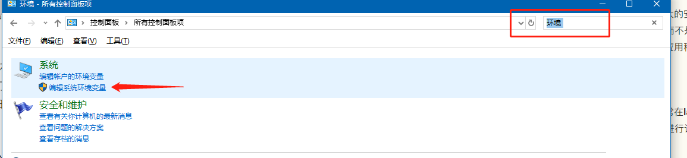
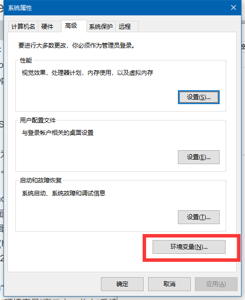
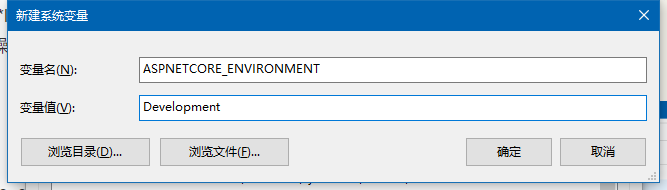

# 目录

> 本文出自[《从零开始学 ASP.NET CORE MVC》目录](https://www.52abp.com/wiki/mvc/0.1.4/1.Intro) </br>
> 视频课程效果更佳：[从零开始学 Asp.Net Core MVC](https://study.163.com/course/courseMain.htm?courseId=1209215803&share=2&shareId=400000000309007) </br>
> 推荐文章：[ASP.NET Core 开发异常页面](https://www.52abp.com/wiki/mvc/latest/13.DeveloperException)

# Asp.Net Core 中的环境变量

在本视频中，我们将讨论使用环境变量配置 asp.net Core 应用程序。

**软件开发环境**在大多数软件开发组织中，我们通常具有以下开发环境。

- 开发环境--Development
- 演示（模拟、临时）环境--Staging
- 生产环境-- Production

**为什么我们需要不同的开发环境，如开发，演示，生产等等环境。**

**开发环境：**我们的软件开发人员通常将此环境用于我们的日常开发工作。我们希望在开发环境中加载非缩小的 JavaScript 和 CSS 文件，以便于调试。类似地，如果存在未处理的异常，我们需要开发人员异常页面，以便我们可以理解异常的根本原因并在需要时进行修复。

**演示环境：**许多组织或者公司尝试使其演示环境尽可能与实际生产环境保持一致。此环境的主要原因是识别任何与部署相关的问题。此外，如果您正在开发 B2B（企业对企业）应用程序，您可能正在与其他服务提供商系统连接。许多组织通常设置其临时环境以与服务提供商进行交互，以进行完整的端到端测试。
我们通常不会在演示环境中进行故障排除和调试，同时为了获得更好的性能，我们需要加载缩小的 JavaScript 和 CSS 文件。
如果存在未处理的异常，则显示用户友好的错误页面而不是开发人员异常页面。用户友好的错误页面不包含任何技术细节。它包含如下通用消息   :“出现问题，请使用下面的联系方式发送电子邮件，聊天或致电我们的应用程序支持”

**生产环境：**我们用于日常业务的实际环境。应配置生产环境以获得最大的安全性和性能。因此，加载缩小的 JavaScript 和 CSS 文件以提高性能。为了更好的安全性，请显示用户友好错误页面而不是开发人员异常页面。Developer Exception 页面上的技术细节对最终用户没有意义，恶意用户可以使用它们进入您的应用程序。

## **配置 ASPNETCORE_ENVIRONMENT 变量**

使用此变量为应用程序设置环境。在我们的本地开发机器上，我们通常在**launchsettings.json**文件中设置此环境变量。如果需要，我们也可以在操作系统中进行设置。在 Windows 操作系统上进行设置

1.  打开 Windows 控制面板
2.  在“控制面板”窗口中，在右上角的“搜索控制面板”文本框中键入“环境”
3.  单击“编辑系统环境变量”链接



4.  在弹出的“系统属性”窗口中，单击“环境变量”按钮




5.  在弹出的“环境变量”窗口中，单击“系统变量”部分下的“ 新建”按钮
6.  在 弹出的“新建系统变量”窗口中，在 “变量名称”文本框中输入值**ASPNETCORE_ENVIRONMENT**，. 在“变量值”文本框中输入**Development**



7.  单击“确定”关闭所有弹出窗口

在`staging` 或`production`环境中，我们通常在操作系统中设置此环境变量。
我们通常将此变量设置为以下值之一，具体取决于托管和运行应用程序的环境：

- Development
- Staging
- Production

## 访问`ASPNETCORE_ENVIRONMENT`变量值

开箱即用，ASP.NET Core 提供了 IHostingEnvironment 服务，我们可以使用它来访问 ASPNETCORE_ENVIRONMENT 变量值。
看一下我们一直在使用的示例应用程序，注意 Startup.cs 文件中的 Configure()方法。
IHostingEnvironment 服务已经注入到此方法。
现在修改 Configure()方法中的代码，如下所示。
注意，我们使用**IHostingEnvironment**服务的 EnvironmentName 属性来访问环境名称。

```csharp

  public void Configure(IApplicationBuilder app, IHostingEnvironment env)
        {
            if (env.IsDevelopment())
            {
                app.UseDeveloperExceptionPage();
            }

            app.UseStaticFiles();

            app.Run(async (context) =>
            {
                await context.Response.WriteAsync("Hosting Environment: " + env.EnvironmentName);
            });
        }
```

如果在两个位置（即 launchsettings.json 文件和操作系统中）都设置了环境变量，则 launchsettings.json 文件中的值将覆盖操作系统级别指定的值。

> 请注意：如果您的操作系统设置的环境没有生效，请重新启动 Visual Studio 试试。

如果我们没有明确设置`ASPNETCORE_ENVIRONMENT`变量，则默认为生产。这样做是为了更好的安全性和性能。

想象一下，在生产服务器上，我们忘记将`ASPNETCORE_ENVIRONMENT`变量设置为 Production。如果默认值为`Development`，则应用程序可能会显示`Developer Exception Page`，并且恶意用户可能利用它来入侵您的应用程序。

此外，他加载非缩小的文件，而不是加载压缩后的 JavaScript 和 CSS 文件。因此，为了获得更好的性能和安全性，如果我们没有明确设置`ASPNETCORE_ENVIRONMENT`变量，则默认为 Production 值。

## IHostingEnvironment 服务的中常用的方法介绍:

使用 IHostingEnvironment 服务的以下方法来标识运行应用程序的环境。

- IsDevelopment()
- IsStaging()
- IsProduction()

如果您拥有 UAT（用户验收测试）或 QA（质量保证）环境等自定义环境，该怎么办？

> 开发环境(development)、集成环境(integration)、测试环境(testing)、QA 验证，模拟环境(staging)、生产环境(production)。

那么，ASP.NET Core 也支持这些自定义环境。例如，要检查环境是否为 UAT，请使用 IsEnvironment()方法，如下所示。
`env.IsEnvironment（“UAT”）`

```csharp
//如果环境是Development serve Developer Exception Page
if（env.IsDevelopment()）
{
    app.UseDeveloperExceptionPage();
}
//else提供具有应用程序支持的用户友好错误页面联系信息
   else if (env.IsStaging() || env.IsProduction() || env.IsEnvironment("UAT")){
                app.UseExceptionHandler("/Error");
            }
```

Tag Helpers 是 ASP.NET Core 中的新功能。在一个 Razor 视图里面，也可以在.CSHTML 页面中进行使用，称为环境标记助手。

此环境标记帮助程序支持根据`ASPNETCORE_ENVIRONMENT`变量的值呈现不同的内容。在我们学习本课程并为我们的应用程序创建模型，视图和控制器时，我们将详细讨论 Tag Helpers，包括环境标记助手(Environment Tag Helper)。

# 文章说明

> 如果您觉得我的文章质量还不错，欢迎打赏，也可以订阅我的视频哦 </br>
> 未得到授权不得擅自转载本文内容,52abp.com 保留版权 </br>
> 【收费】腾讯课堂:[https://ke.qq.com/course/392589?tuin=2522cdf3](https://ke.qq.com/course/392589?tuin=2522cdf3) </br>
> 【免费】youtube 视频专区：[http://t.cn/Ei0F2EB](http://t.cn/Ei0F2EB) </br>
> 感谢您对我的支持

## 关注微信公众号：角落的白板报


