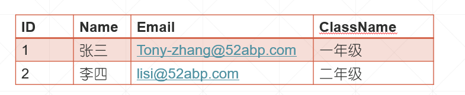

# 目录

> 本文出自[《从零开始学 ASP.NET CORE MVC》目录](https://www.52abp.com/wiki/mvc/0.1.4/1.Intro) </br>
> 视频课程效果更佳：[从零开始学 Asp.Net Core MVC](https://study.163.com/course/courseMain.htm?courseId=1209215803&share=2&shareId=400000000309007) </br>

## ASP.NET Core MVC 中的 Model

在本视频中，我们将通过一个示例讨论 ASP.NET Core MVC 中的 Model。

我们希望最终从 Student 数据库表中查询特定的学生详细信息并显示在网页上，如下所示。




MVC 中的模型包含一组表示数据的类和管理该数据的逻辑。 因此，为了表示我们想要显示的学生数据，我们使用以下 Student 类。

```csharp
public class Student
    {
        public int Id { get; set; }
        public string Name { get; set; }
        public string ClassName { get; set; }
    }
```

ASP.NET Core 中的模型类不必位于 Models 文件夹中，但将它们保存在名为 Models 的文件夹中是一种很好的做法，因为以后更容易找到它们。

除了表示数据的 Student 类之外，模型还包含管理模型数据的类。 为了管理数据，即检索和保存学生数据，我们将使用以下**IStudentRepository**服务。 目前，我们只有一个方法**GetStudent()**通过 ID 查询学生。 随着课程的进行，我们将添加创建，更新和删除方法。

```csharp
 public interface IStudentRepository
    {
        Student GetStudent(int id);

    }

```

以下**MockStudentRepository**类提供了**IStudentRepository**接口的实现。 目前，我们正在对**MockStudentRepository**类中的**Student **数据进行硬编码。 在我们即将发布的视频中，我们将为**IStudentRepository**接口提供另一种实现，该实现将从 SQL Server 数据库中检索数据。

```csharp
 public class MockStudentRepository : IStudentRepository
    {
        private List<Student> _studentList;

        public MockStudentRepository()
        {
            _studentList = new List<Student>()
            {
            new Student() { Id = 1, Name = "张三", ClassName = "一年级", Email = "Tony-zhang@52abp.com" },
            new Student() { Id = 2, Name = "李四", ClassName = "二年级", Email = "lisi@52abp.com" },
            new Student() { Id = 3, Name = "王二麻子", ClassName = "二年级", Email = "wang@52abp.com" },
            };
        }


        public Student GetStudent(int id)
        {
            return _studentList.FirstOrDefault(a => a.Id == id);
        }
    }
```

在我们的应用程序中，我们将针对 IStudentRepository 接口进行编程，而不是具体实现 MockStudentRepository。 这种接口抽象化是允许我们使用依赖注入，这反过来也使我们的应用程序灵活且易于单元测试。

> 我们将在下一个视频中详细讨论依赖注入。

# 文章说明

> 如果您觉得我的文章质量还不错，欢迎打赏，也可以订阅我的视频哦 </br>
> 未得到授权不得擅自转载本文内容,52abp.com 保留版权 </br>
> 【收费】腾讯课堂:[https://ke.qq.com/course/392589?tuin=2522cdf3](https://ke.qq.com/course/392589?tuin=2522cdf3) </br>
> 【免费】youtube 视频专区：[http://t.cn/Ei0F2EB](http://t.cn/Ei0F2EB) </br>
> 感谢您对我的支持

## 关注微信公众号：角落的白板报


