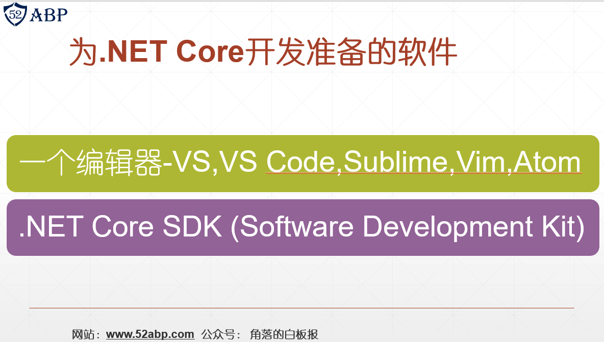
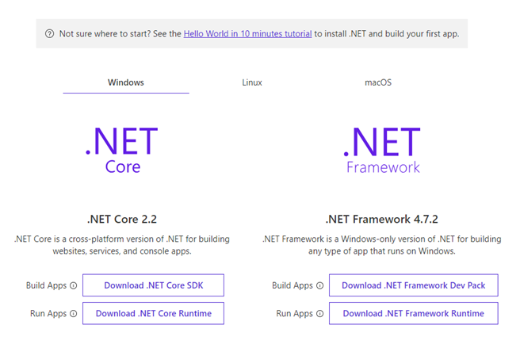

# 目录

> 本文出自[《从零开始学 ASP.NET CORE MVC》目录](https://www.52abp.com/wiki/mvc/0.1.4/1.Intro)  
> 视频课程效果更佳：[从零开始学 Asp.Net Core MVC](https://study.163.com/course/courseMain.htm?courseId=1209215803&share=2&shareId=400000000309007)  

# 软件准备

在本期视频中，我们将安装所序言的软件，并为我们的电脑配置.NET Core 开发环境。
我们需要安装如下 2 个软件：

- 一个编辑器
- .NET Core SDK（Software Development Kit）

# 下载并安装.NET Core 开发编辑器

我的是 Windows 操作系统，因此，我将使用 Visual Studio 作为.NET Core 应用程序开发的编辑器。
当然您可以使用您选择的任何编辑器，不过我推荐你还是使用 windows 系统下的 Visual Studio。

- Visual Studio
- Visual Studio Code
- Sublime
- Vim
- Atom
- 等.

# 下载并安装 Visual Studio

- Visual Studio Community Edition 是免费的
- 截至本录制时，最新版本为 Visual Studio 2019，可从[https://visualstudio.microsoft.com/](https://visualstudio.microsoft.com/)下载
- 要在 Visual Studio 2019 中开发.NET Core 应用程序，请选择**.NET Core 跨平台开发**

- 通过此选择，安装了.NET Core SDK 2.1
- 您可以通过创建新的.NET Core 应用程序来验证这一点
- 请注意，在.NET Core 下拉列表中，我们只有 ASP.NET Core 2.1
- 截至本录制时，.NET Core 的最新稳定版本为 2.2

# 下载并安装.NET Core SDK 

- 导航到[https://dotnet.microsoft.com/download](https://dotnet.microsoft.com/download)

- 根据您拥有的操作系 ​​ 统，下载并安装 SDK。
- SDK 包含构建和运行.NET Core 应用程序所需的一切。
- 在** .NET Core Runtime**已经包含在 SDK 中。因此，如果您已安装 SDK，则无需安装** .NET Core Runtime**
- .NET Core Runtime 仅包含运行现有.NET Core 应用程序所需的资源。
  安装.NET Core SDK 2.2 后，创建一个新的.NET Core 应用程序。请注意，在.NET Core 下拉列表中，除了 ASP.NET Core 2.1 之外，我们现在还拥有 ASP.NET Core 2.2。

在下一篇文章中，我将讨论[**使用 Visual Studio 创建第一个 ASP.NET Core Web 应用程序**]

# 小结

在本文中，我讨论了开发 ASP.NET Core 应用程序所需的 ASP.NET Core 开发环境安装。我希望这篇文章可以帮助您满足您的需求。我想收到你的反馈意见。请发布您对本文的反馈，问题或意见。

# 文章说明

> 如果您觉得我的文章质量还不错，欢迎打赏，也可以订阅我的视频哦  
> 未得到授权不得擅自转载本文内容,52abp.com 保留版权  
> 【收费】腾讯课堂:[https://ke.qq.com/course/392589?tuin=2522cdf3](https://ke.qq.com/course/392589?tuin=2522cdf3)  
> 【免费】youtube 视频专区：[http://t.cn/Ei0F2EB](http://t.cn/Ei0F2EB)  
> 感谢您对我的支持

## 关注微信公众号：角落的白板报

