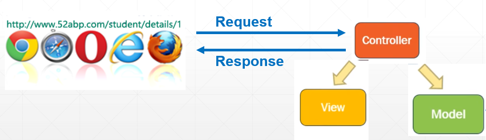

# 目录

> 本文出自[《从零开始学 ASP.NET CORE MVC》目录](https://www.52abp.com/wiki/mvc/0.1.4/1.Intro) </br>
> 视频课程效果更佳：[从零开始学 Asp.Net Core MVC](https://study.163.com/course/courseMain.htm?courseId=1209215803&share=2&shareId=400000000309007) </br>

# Controller in ASP.NET Core MVC

在本视频中，我们将讨论 Controller 是什么以及它在 ASP.NET Core MVC 中的作用。

## Fiddler

需要大家提前装一个工具，[https://www.telerik.com/fiddler](https://www.telerik.com/fiddler)

Fiddler 是一个 http 协议调试代理工具，它能够记录并检查所有你的电脑和互联网之间的 http 通讯，设置断点，查看所有的“进出”Fiddler 的数据（指 cookie,html,js,css 等文件）。 Fiddler 要比其他的网络调试器要更加简单，因为它不仅仅暴露 http 通讯还提供了一个用户友好的格式。

我们会通过他来演示，如何抓包获取请求。

## Controller




- MVC 中的控制器是一个类，它继承自`Microsoft.AspNetCore.Mvc.Controller`
- 控制器类名称后缀为**“Controller”**。例如 HomeController，StudentController。
- 当来自浏览器的请求到达我们的应用程序时，作为 MVC 中的控制器，它会处理传入的 http 请求并响应用户操作。
- Controller 类包含一组公共方法。Controller 类中的这些公共方法称为**操作方法**( action methods)。正是这些控制器的操作方法处理传入的 http 请求。
- 假设用户在浏览器地址栏中键入了以下 URL 并按 ENTER 键`http://localhost:12345/home/details`
- URL`"/home/details”`会映射到 HomeController 中的“Details”公共操作方法。此映射是由我们应用程序中的**路由规则**定义完成。
- 我们将在即将发布的视频中详细讨论 ASP.NET Core MVC 中的路由。
- 请求到达控制器动作方法。作为处理该请求的一部分，控制器创建**模型-Model**。
- 控制器通过依赖的服务，来查询模型数据，。
- 例如，我们要查询学生的数据，就需要通过 HomeController 依赖的**IStudentRepository**服务。
- **IStudentRepository**服务使用构造函数注入 HomeController。这称为依赖注入。
- 我们在之前的[ASP.NET Core 教程](https://study.163.com/course/courseMain.htm?courseId=1209215803&share=2&shareId=400000000309007)视频中讨论了**[依赖注入]**
- 请注意，我们将注入的依赖项分配给**readonly**字段。这是一个很好的做法，因为它可以防止在方法中意外地为其分配另一个值。
- 当控制器拥有所需的模型数据，比如我们正在提供服务或 RESTful API，它就可以简单地返回该模型数据。

## Controller 返回 JSON 数据

以下示例返回 JSON 数据。请注意，Details()方法的返回类型设置为 **JsonResult**，因为我们显式返回 JSON 数据。在这种情况下，Details()方法始终返回 JSON 数据。它不接受内容协商并忽略**Accept Header**。

```csharp
  public class HomeController:Controller
    {
        private readonly IStudentRepository _studentRepository;
        public HomeController(IStudentRepository studentRepository)
        {
            _studentRepository = studentRepository;
        }
        public JsonResult Details()
        {
            Student model = _studentRepository.GetStudent(1);
            return Json(model);

        }
    }

```

## Controller 返回 ObjectResult

以下示例遵循内容协商查看请求头中的** Accept Header**，如果它设置为**application/xml**，则返回 XML 数据。如果 Accept header 设置为**application/json**，则返回 JSON 数据。

```csharp
public class HomeController:Controller
    {
        private readonly IStudentRepository _studentRepository;
        public HomeController(IStudentRepository studentRepository)
        {
            _studentRepository = studentRepository;
        }
       public ObjectResult Details()
        {
            Student model = _studentRepository.GetStudent(1);
            return new ObjectResult(model);

        }
    }

```

> 请注意：为了能够以 XML 格式返回数据，我们必须通过调用 Startup.cs 文件中的 ConfigureServices()方法中的 AddXmlSerializerFormatters()的方法。

```csharp
public void ConfigureServices(IServiceCollection services)
{
    services.AddMvc().AddXmlSerializerFormatters();
}
```

## Controller 返回 View

以下示例返回 View。请注意，我们在返回视图时将 ViewResult 设置为 Details 方法的返回类型。

```csharp
public class HomeController:Controller
    {
        private readonly IStudentRepository _studentRepository;
        public HomeController(IStudentRepository studentRepository)
        {
            _studentRepository = studentRepository;
        }
          public ViewResult Details()
        {
            Student model = _studentRepository.GetStudent(1);
            return   View(model);
        }
    }
```

此时如果我们运行应用程序并导航到`http://localhost:49119/home/details`，我们会收到以下错误。这是因为:我们还没有创建所需的 View 文件。我们将在下一个视频中讨论 MVC 中的视图。

`InvalidOperationException: The view 'Details' was not found. The following locations were searched: /Views/Home/Details.cshtml /Views/Shared/Details.cshtml /Pages/Shared/Details.cshtml`

# 小结：

- 当来自浏览器的请求到达我们的应用程序时，作为 MVC 中的控制器，它会处理传入的 http 请求并响应用户操作。
- 控制器构建模型(Model)
- 如果我们正在构建 API, 则将模型数据返回给调用方
- 或者选择 "View 视图" 并将模型数据传递到视图,然后视图生成所需的 HTML 来显示数据

关于内容协商的文章延伸学习：http://www.cnblogs.com/supersnowyao/p/8593828.html

# 文章说明

> 如果您觉得我的文章质量还不错，欢迎打赏，也可以订阅我的视频哦 </br>
> 未得到授权不得擅自转载本文内容,52abp.com 保留版权 </br>
> 【收费】腾讯课堂:[https://ke.qq.com/course/392589?tuin=2522cdf3](https://ke.qq.com/course/392589?tuin=2522cdf3) </br>
> 【免费】youtube 视频专区：[http://t.cn/Ei0F2EB](http://t.cn/Ei0F2EB) </br>
> 感谢您对我的支持

## 关注微信公众号：角落的白板报


