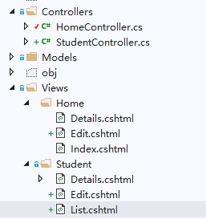

# 目录

> 本文出自[《从零开始学 ASP.NET CORE MVC》目录](https://www.52abp.com/wiki/mvc/0.1.4/1.Intro) </br>
> 视频课程效果更佳：[从零开始学 Asp.Net Core MVC](https://study.163.com/course/courseMain.htm?courseId=1209215803&share=2&shareId=400000000309007) </br>

# ASP.NET Core MVC 中的视图--master

在这个视频中，我们将讨论什么是视图及其在 MVC 设计模式中的作用。

## MVC 中的视图

- 用于显示**Controller**提供给它的 **Model** 的业务数据。
- 视图是带有嵌入 Razor 标记的 HTML 模板。
- 如果编程语言是 C＃，则视图文件具有.cshtml 扩展名。

## 举个栗子

例如，在我们的 MVC 项目中，我们有 2 个控制器 - **HomeController**和**StudentController**

**HomeController**具有以下 3 个操作方法：

- Index()
- Details()
- Edit()

**StudentController**具有以下 3 种操作方法:

- List()
- Details()
- Edit()

## 视图文件夹结构


 

- 对于每个**Controller**，我们在“Views”文件夹中有一个单独的文件夹。
- 所有**HomeController**的视图都位于“Views”文件夹中的**Home**文件夹中。
- 所有**StudentController**的视图都位于“Views”文件夹中的**Student**文件夹中。
- 每个视图文件都有一个相同名称的控制器操作方法。

## 视图(View)发现

查看 HomeController，里面只有一个操作方法**Details()**，这个**Details()**方法会调用**View()**方法返回一个视图。**View()**方法是由基类**Controller**提供。

```csharp
public class HomeController : Controller
{
    public ViewResult Details()
    {
        return View();
    }
}
```

**Details()** 操作方法会返回一个视图,因此默认情况下 MVC 会查找具有相同名称且扩展名为.cshtml 的视图文件。所以在这种情况下，它会查找 Details.cshtml。它按指定的顺序在以下 3 个位置查找此文件 。
因为 Controller 名称是 HomeController，所以

- 首先在“/ Views / Home /”文件夹中，
- 然后在“/ Views / Shared /”文件夹中
- 最后在“/ Pages / Shared /”文件夹中
  如果找到视图文件，则视图生成的 HTML 将发送回发出请求的客户端。如果找不到视图文件，我们会收到以下错误。

```
InvalidOperationException: The view 'Details' was not found. The following locations were searched:
/Views/Home/Details.cshtml
/Views/Shared/Details.cshtml
/Pages/Shared/Details.cshtml

```

# 文章说明

> 如果您觉得我的文章质量还不错，欢迎打赏，也可以订阅我的视频哦 </br>
> 未得到授权不得擅自转载本文内容,52abp.com 保留版权 </br>
> 【收费】腾讯课堂:[https://ke.qq.com/course/392589?tuin=2522cdf3](https://ke.qq.com/course/392589?tuin=2522cdf3) </br>
> 【免费】youtube 视频专区：[http://t.cn/Ei0F2EB](http://t.cn/Ei0F2EB) </br>
> 感谢您对我的支持

## 关注微信公众号：角落的白板报


